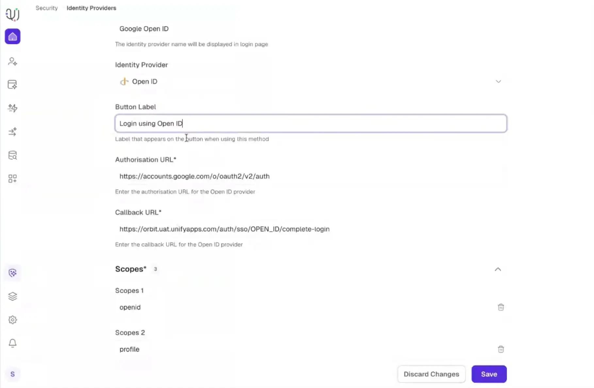
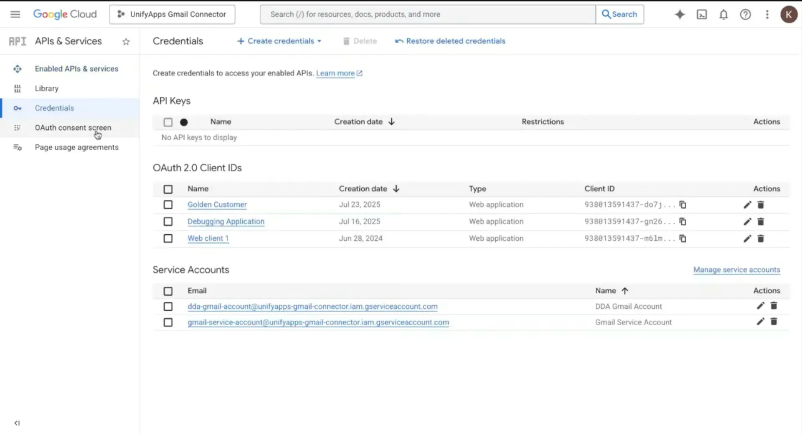
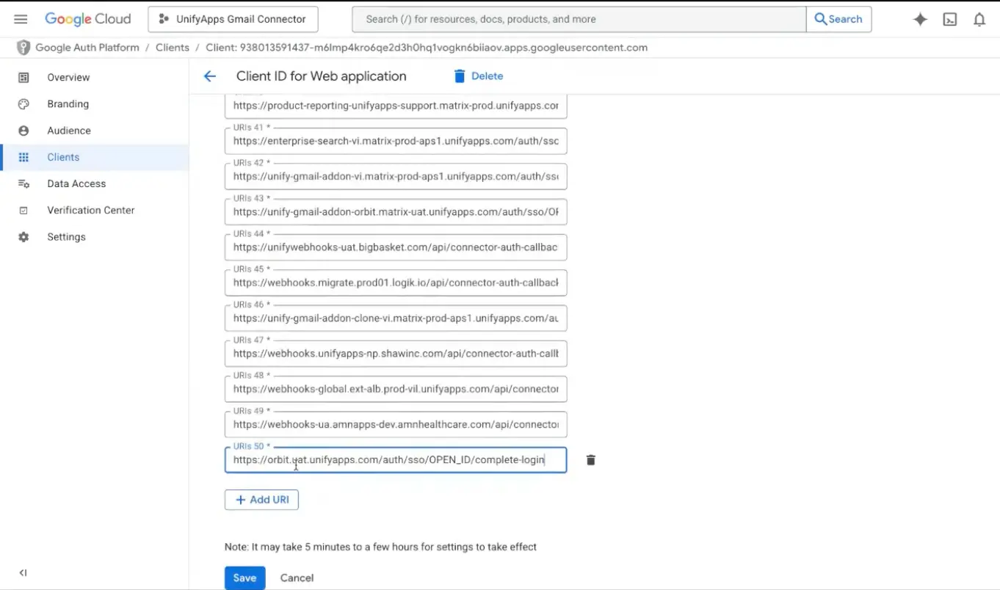
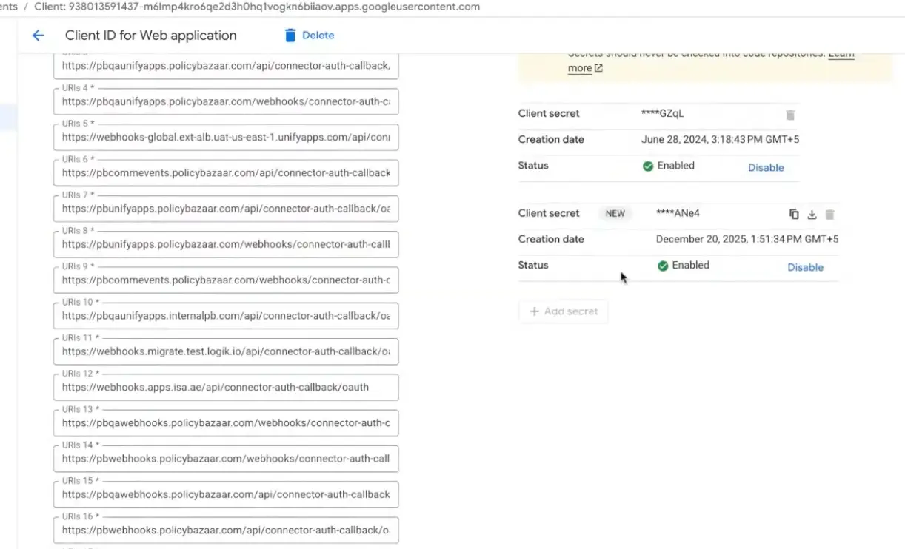

# Google OpenID SSO Configuration

Source: https://www.unifyapps.com/docs/governance/google-openid-sso-configuration
Section: governance

---

# **1. Configure Identity Provider in UnifyApps**

Follow the steps below to establish a Single Sign-On (SSO) connection using OpenID between UnifyApps and Google Cloud Platform

**STEP 1 · Open Identity Provider Settings**

Navigate to your specific environment in UnifyApps and go to: **Platform Tools** → **Security** → **Identity Providers**.

**STEP 2 · Select OpenID & Copy Callback URL**

Select **OpenID** from the Identity Provider dropdown menu. Locate the **Callback URL** generated and copy it to your clipboard.

**STEP 3 · Configure the Scope and Attribute Mapping**

Add the required authentication scopes to specify the level of data access granted to UnifyApps. Next, fill out the **Default Attribute Mapping** to properly pair Azure user claims with UnifyApps user profiles.

**Scopes -**

| **Scopes** | **Select** |
|---|---|
| **Scope 1** | openid |
| **Scope 2** | profile |
| **Scope 3** | email |

**Default Attribute Mapping -**

| **Field** | **Value** |
|---|---|
| **Username JSON Path** | /email |
| **Email JSON Path** | /email |

# **2. Generate Credentials in Google Cloud**

**STEP 4 · Navigate to APIs & Services**

Log into the **Google Cloud Console**, select your organization's project, and navigate to the navigation menu: **APIs & Services** → **Credentials**.

**STEP 5 · Create OAuth 2.0 Credentials**

If you haven't already configured your OAuth consent screen, complete that step first. Then, click **Create Credentials** at the top of the page and select **OAuth client ID**. Set the Application type to **Web application**.

**STEP 6 · Configure Authorized Redirect URIs**

Scroll down to the **Authorized redirect URIs** section. Click **Add URI** and paste the **Callback URL**. Click **Save**.

**Sample Redirect URL** : [https://orbit.uat.unifyapps.com/auth/sso/OPEN_ID/complete-login](https://orbit.uat.unifyapps.com/auth/sso/OPEN_ID/complete-login)

# **3. Complete Setup in UnifyApps**

**STEP 7 · Link Credentials to UnifyApps**

A dialog box will appear in Google Cloud displaying your newly created **Client ID** and **Client Secret**. Copy the **Client Secret** value.

**STEP 8 · Save and Finalize**

Return to your open UnifyApps Identity Provider setup page. Paste the copied value directly into the **Client Secret Key** field, fill out any remaining standard Google OpenID endpoints, and save your configurations.
