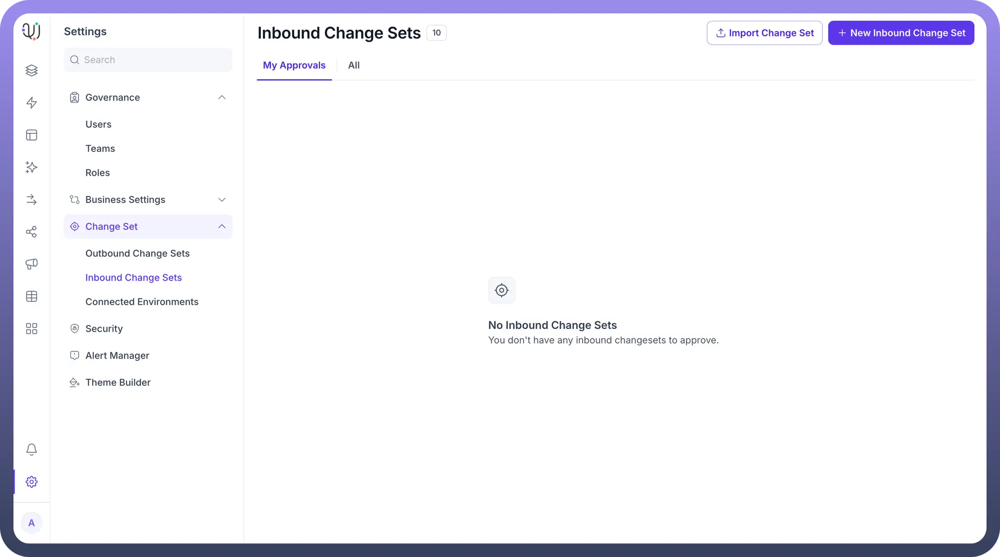
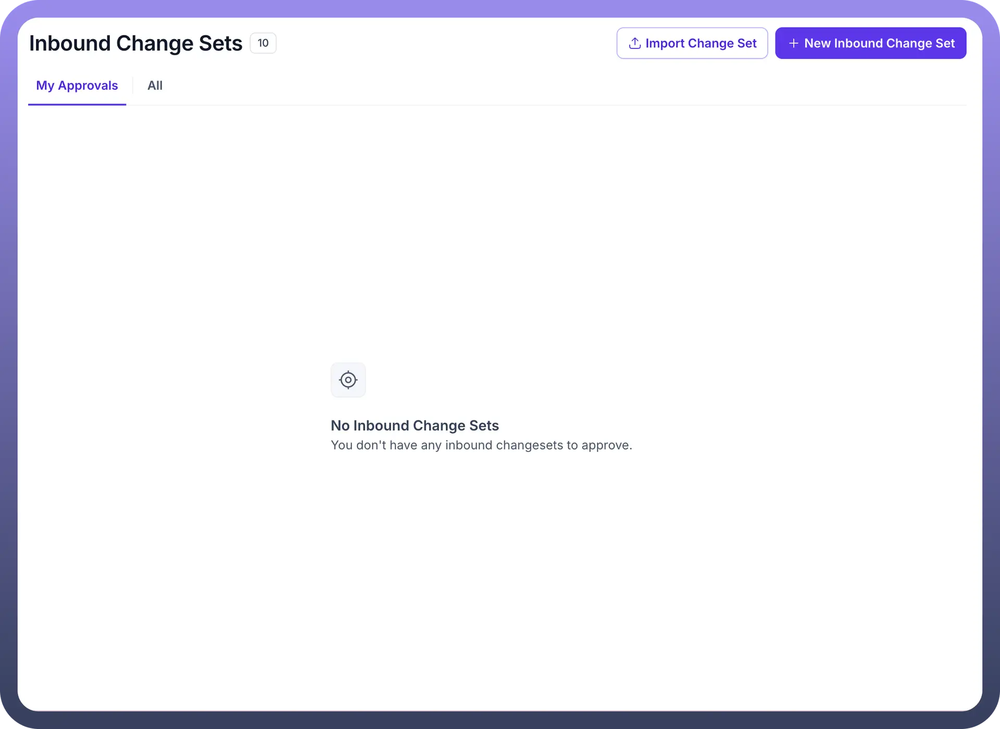
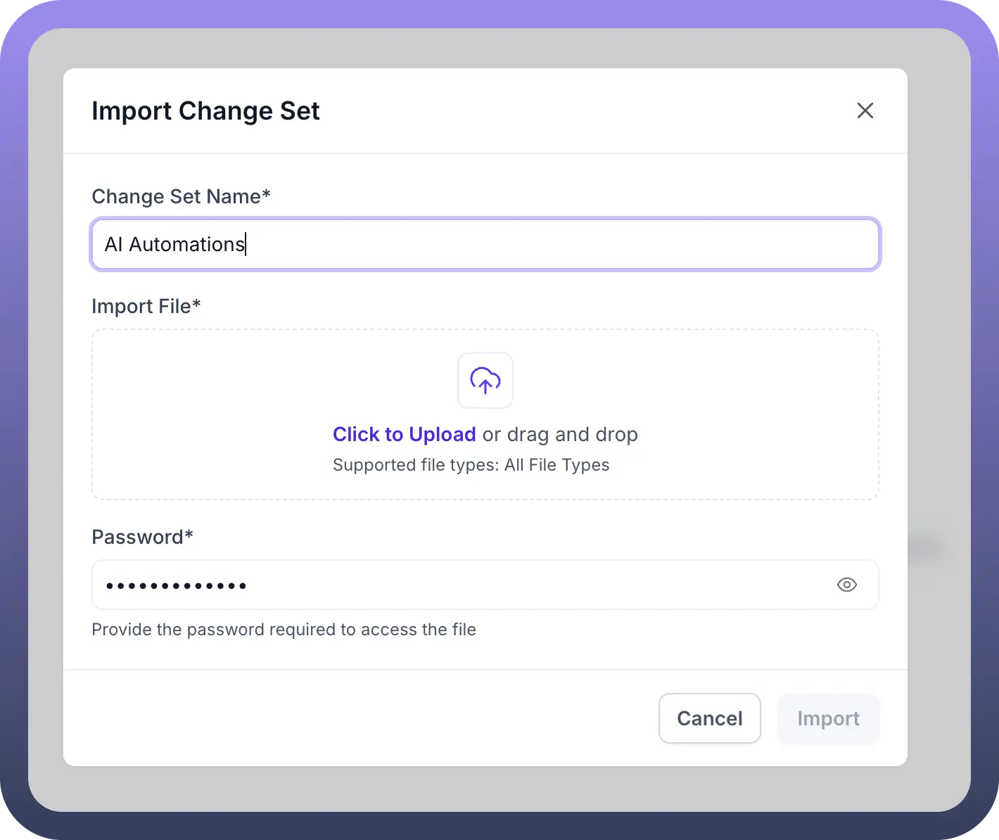
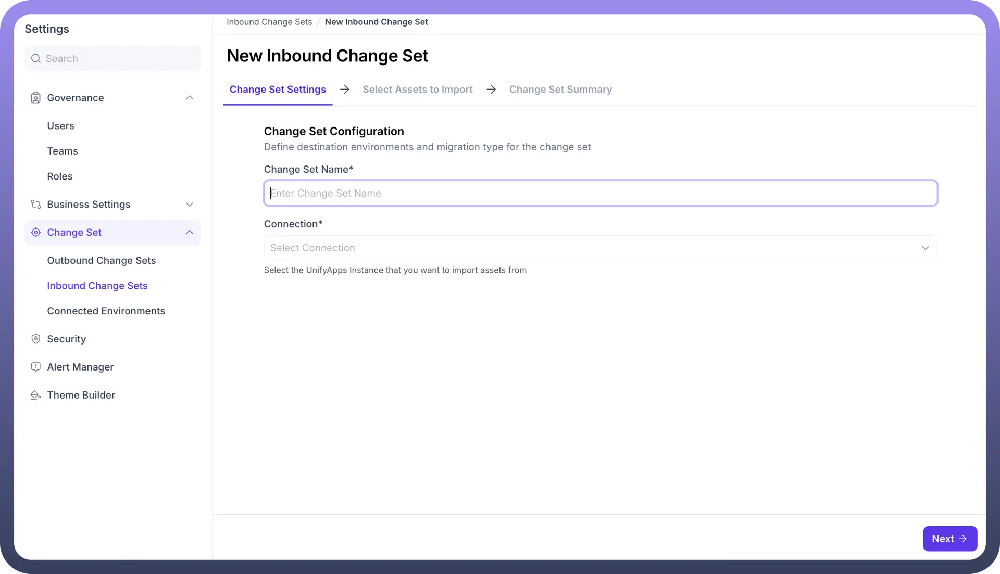
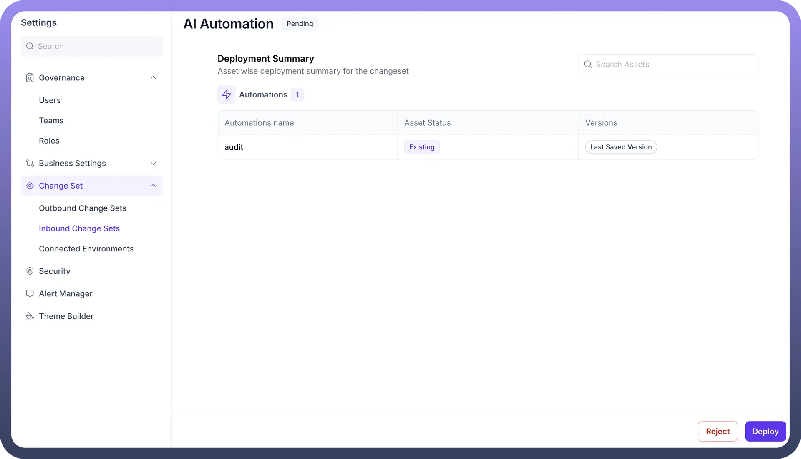
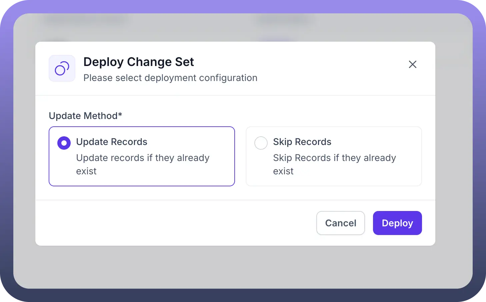
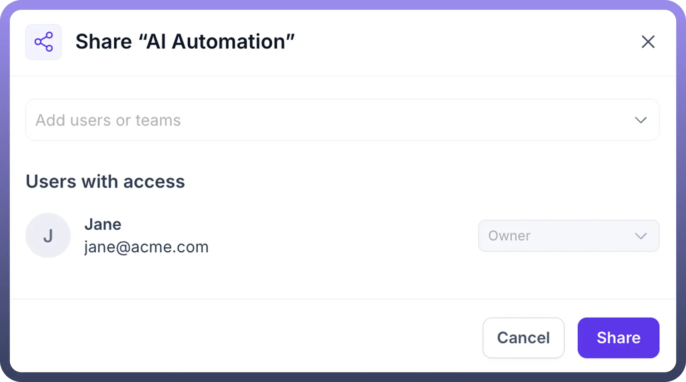

# Inbound Changeset

Source: https://www.unifyapps.com/docs/governance/inbound-changeset
Section: governance

---

## Overview

Change Set by UnifyApps provides powerful tools for managing and deploying changes across different environments within your UnifyApps instance. This functionality allows teams to package configurations, automations, and assets into change sets that can be imported, reviewed, and deployed in a controlled manner, ensuring seamless updates and migrations with proper governance.

## Use Cases

**Cross-Environment Deployments:** Package automations, configurations, and assets from development environments and deploy them to testing and production environments using inbound and outbound change sets. This ensures consistent implementation of changes across your entire UnifyApps ecosystem.

**Release Management:** Create and manage change sets for scheduled releases, allowing teams to bundle multiple changes together for coordinated deployment. Track approvals, review changes, and maintain version control throughout the deployment lifecycle.

**Team Collaboration:** Share change sets with team members for review and approval before deployment. Define user access and permissions to ensure proper governance of which team members can create, approve, or deploy change sets.

**Configuration Migration:** Migrate configurations between separate UnifyApps instances, allowing for consistent implementation across development, testing, and production environments.

## Managing Change Sets

### Inbound Change Sets

Inbound Change Sets are packages of changes that can be imported and deployed into your current environment. They provide a structured way to receive and implement changes from other environments or team members.

**Key Features:**

- View all inbound change sets requiring approval
- Filter by "`My Approvals`" or view "`All`" change sets
- Import new change sets via file upload or direct connection
- Create new inbound change sets from scratch
- Track the status of change sets (Pending, Approved, Rejected)

### Importing Change Sets

The Import Change Set feature allows you to bring pre-configured change sets into your environment for review and deployment.

**Input Fields:**

- `Change Set Name`: Provide a descriptive name for the imported change set
- `Import File`: Upload a change set file via click or drag-and-drop
  - Supported file types: All file types
- `Password`: Optionally provide a password if the change set file is password-protected

### Creating New Change Sets

Creating a new inbound change set allows you to define which assets to import from connected environments and configure how they should be deployed.

**Configuration Steps:**

1. **Change Set Settings**:
  - `Change Set Name`: Provide a meaningful name for the change set
  - `Connection`: Select the UnifyApps instance to import assets from
2. **Select Assets to Import**:
  - Choose which assets (automations, configurations, etc.) to include
3. **Change Set Summary**:
  - Review selected assets before finalization

## Deployment and Review

**Deployment Summary** Before deploying a change set, you can review a detailed summary of all included assets and their current status.

**Key Information:**

- `Asset Types`: Categorized list of assets (Automations, Configurations, etc.)
- `Asset Status`: Whether assets are new or existing in the target environment
- `Versions`: Which version of each asset will be deployed
- `Search`: Filter assets for easier review in large change sets

**Deployment Configuration**

When ready to deploy, you can configure how the deployment should handle existing assets.

**Update Methods:**

- `Update Records`: Overwrites existing records with the versions in the change set
- `Skip Records`: Preserves existing records and only adds new assets

### Sharing and Access Control

Change Sets can be shared with users or teams to enable collaborative review and approval.

**Sharing Options:**

- Add individual users or entire teams
- Define access levels (Owner, Editor, Viewer)
- View all users with current access
- Manage permissions after sharing

## Implementation Steps

1. **Access Change Set Settings**:
  - Navigate to `Settings`
  - Expand the "`Change Set`" section in the sidebar
  - Select "`Inbound Change Sets`"
2. **Import or Create a Change Set**:
  - Click "`Import Change Set`" or "`New Inbound Change Set`"
  - Follow the configuration steps as outlined above
3. **Review and Approve**:
  - Examine the deployment summary
  - Share with stakeholders for review if needed
  - Make any necessary adjustments
4. **Deploy the Change Set**:
  - Select deployment options
  - Confirm deployment
  - Monitor for successful implementation
