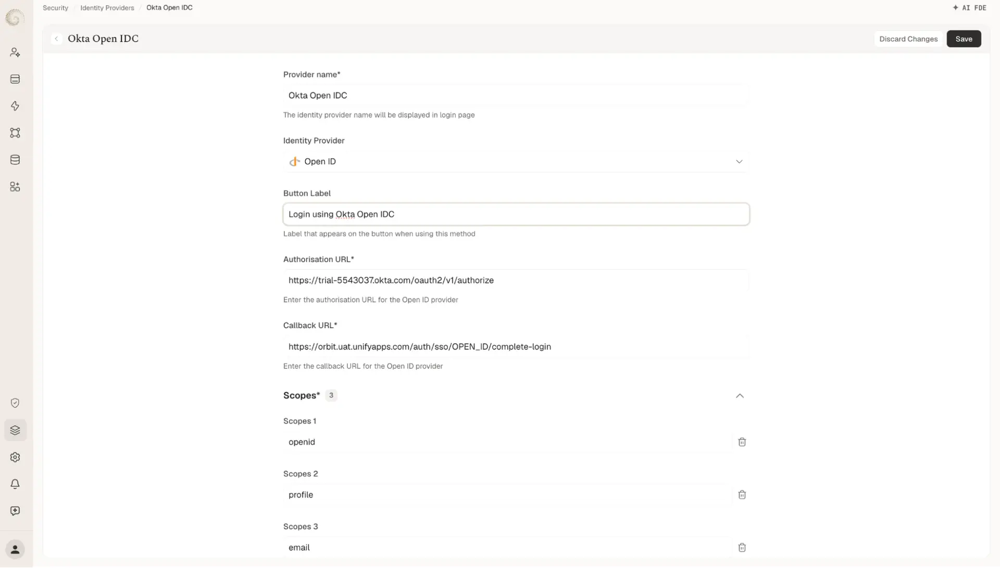
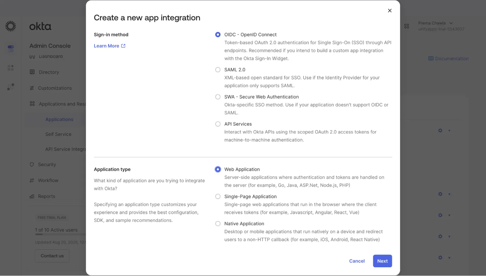
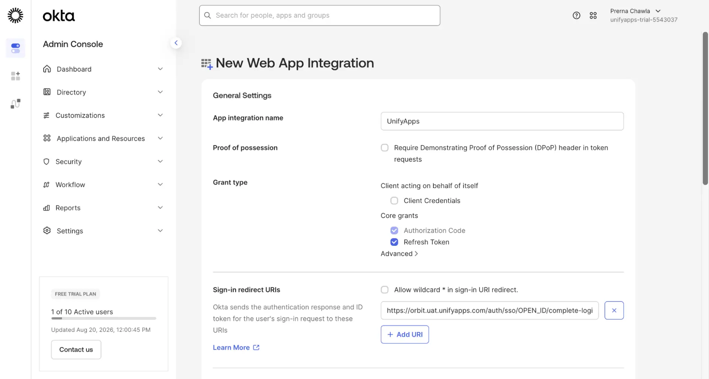
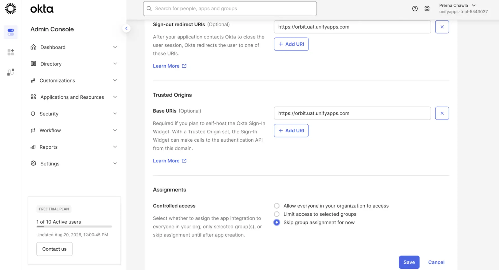
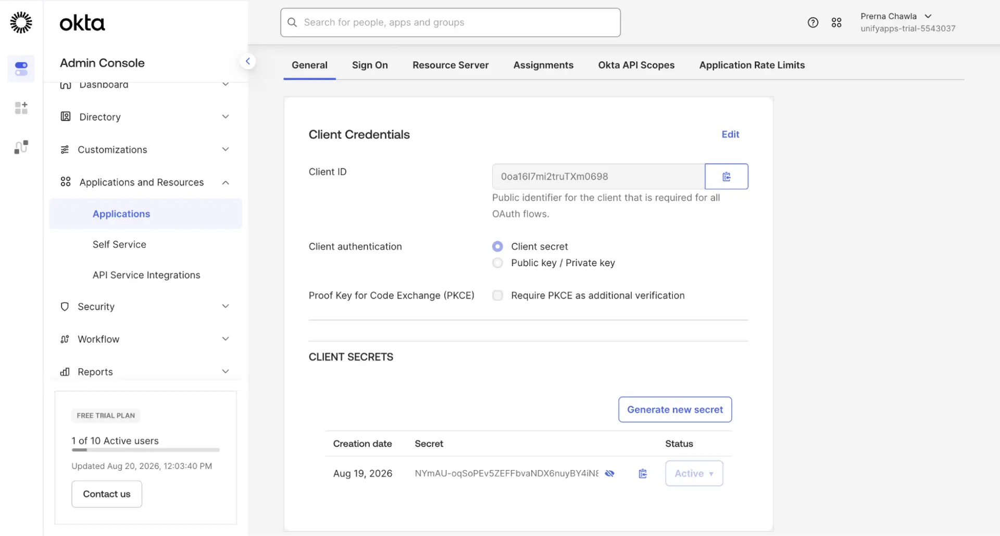
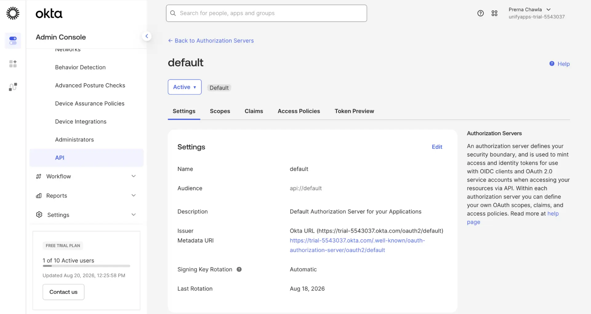
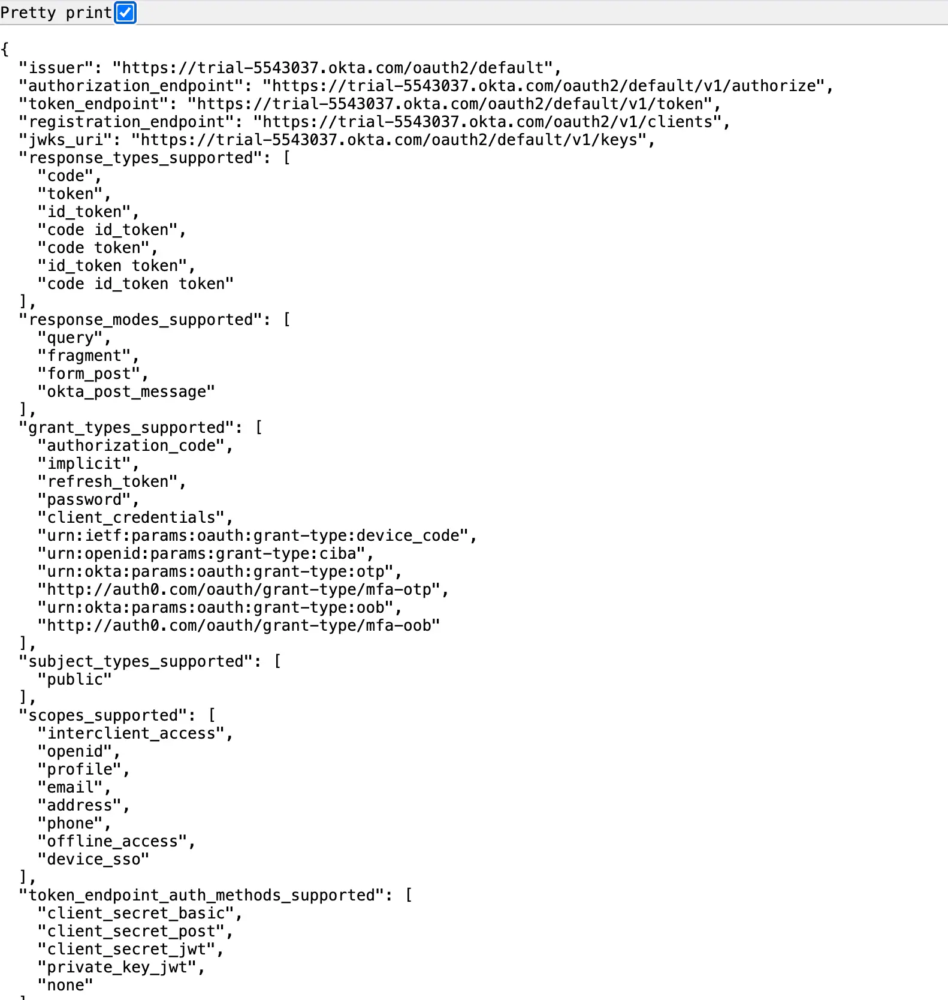
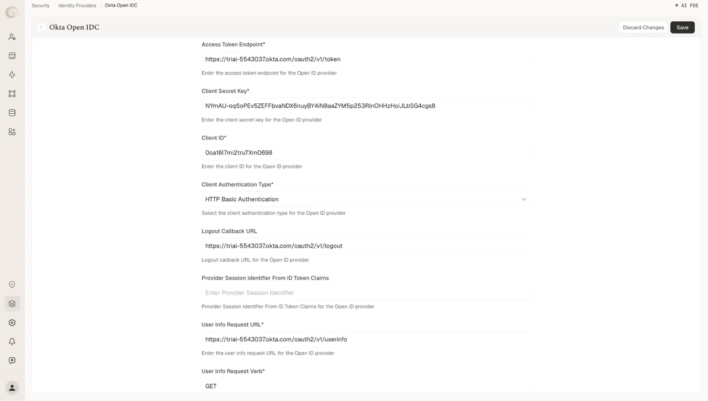
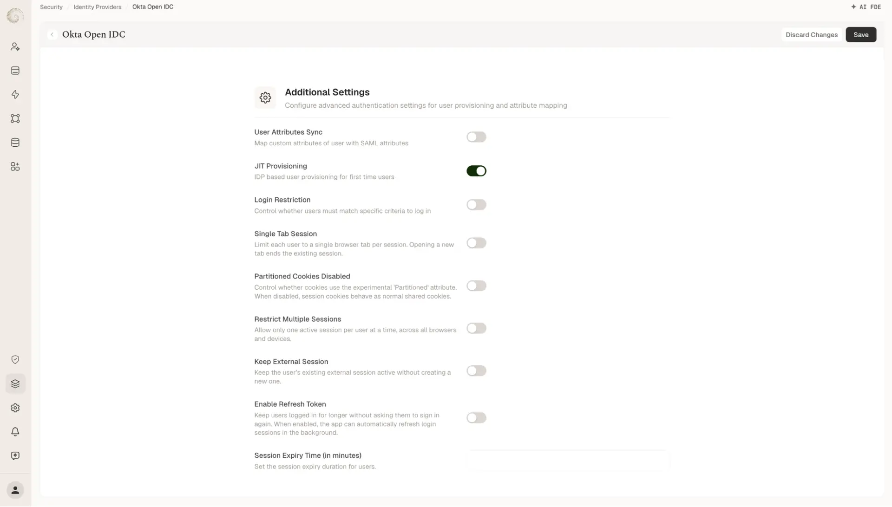

# Okta OpenID SSO Configuration

Source: https://www.unifyapps.com/docs/governance/okta-openid-sso-configuration
Section: governance

---

**Okta OpenID SSO Configuration Guide**

UnifyApps · Identity Provider Configuration & Automation

## **1. Configure Identity Provider in UnifyApps**

Follow the steps below to establish a Single Sign-On (SSO) connection using OpenID between UnifyApps and Okta Console Platform.

### **STEP 1 · Open Identity Provider Settings**

Navigate to your specific environment in UnifyApps and go to: **Platform Tools** → **Security** → **Identity Providers**.

### **STEP 2 · Select OpenID & Copy Callback URL**

Select **OpenID** from the Identity Provider dropdown menu. Locate the **Callback URL** generated and copy it to your clipboard.

### **STEP 3 · Configure the Scope and Attribute Mapping**

Add the required authentication scopes to specify the level of data access granted to UnifyApps. Next, fill out the **Default Attribute Mapping** to properly pair Okta user claims with UnifyApps user profiles.

**Scopes -**

| **Scopes** | **Select** |
|---|---|
| **Scope 1** | openid |
| **Scope 2** | profile |
| **Scope 3** | email |

**Default Attribute Mapping -**

| **Field** | **Value** |
|---|---|
| **Username JSON Path** | /email |
| **Email JSON Path** | /email |

## **2. Configuring the Open IDC in Okta**

Now, you will create and configure a new OIDC - OpenID Connect application in your Okta admin console.

### **STEP 4 · Create a New OIDC - OpenID Connect App Integration:**

Log into your Okta admin dashboard. In the side navigation menu, go to **Applications and Resources > Applications**. Click the **Create App Integration** button. In the “Create a new app integration” dialog, select **OIDC - OpenID Connect** as the sign-in method. Choose **Web-Based Application** and then click **Next.**

### **STEP 5 · General Settings**

- **App integration name:** Enter a clear, recognizable name for the application (e.g., *UnifyApps*).
- **Proof of possession:** Check *Require Demonstrating Proof of Possession (DPoP) header in token requests* if your application requires DPoP-bound tokens.
- **Grant type:** Select the appropriate OAuth 2.0 grant types. For standard web applications, select **Authorization Code** and **Refresh Token** under *Core grants*.

### **STEP 6 · Configure Authorized Redirect URIs & Origins**

Scroll down to the **Authorized redirect URIs** section. Click **Add URI** and paste the **Callback URL**.

- **Sign-in redirect URIs:** Enter the full callback URL where Okta sends authentication responses and ID tokens (e.g., [https://orbit.uat.unifyapps.com/auth/sso/OPEN_ID/complete-login](https://orbit.uat.unifyapps.com/auth/sso/OPEN_ID/complete-login) ). Check *Allow wildcard * in sign-in URI redirect* only if dynamic redirect patterns are needed.
- **Sign-out redirect URIs (Optional):** Enter the URL where users should be redirected after logging out of the application (e.g., [https://orbit.uat.unifyapps.com](https://orbit.uat.unifyapps.com/auth/sso/OPEN_ID/complete-login) ).
- **Base URIs (Optional):** Specify your application's domain under *Trusted Origins*. This is required if you plan to self-host the Okta Sign-In Widget to allow cross-origin API requests.

Click **Save**.

## **3. Complete Setup in UnifyApps**

### **STEP 7 · Link Credentials to UnifyApps**

A dialog box will appear in Okta Admin Console Applications General Tab displaying your newly created **Client ID** and **Client Secret**. Copy the **Client Secret** value.

### **STEP 8 · Retrieving OAuth Endpoints**

Return to your open UnifyApps Identity Provider setup page. Paste the copied value directly into the **Client Secret Key** field and fill out any remaining standard Okta OpenID endpoints.

- **Navigate to API Settings:** In the Okta Admin Console sidebar, go to **Security** > **API**.
- **Access the Authorization Server:** Select the **Authorization Servers** tab and click on the **default** server entry.

- **Open Metadata:** Click the **Metadata URI** link to open the server’s openid-configuration JSON in your browser.
- **Format JSON:** Click **Pretty Print** (or enable JSON view) in your browser to display the formatted endpoint details.

- **Locate Endpoints:** Locate the necessary OAuth/OIDC URLs (e.g., authorization_endpoint, token_endpoint).

*Raw endpoint format:* https://trial-5543037.okta.com/oauth2/default/v1/authorize

**Adjust URL Path:** Remove default/ from each copied URL to format the final endpoint URIs.

*Final endpoint format:* [https://trial-5543037.okta.com/oauth2/v1/authorize](https://trial-5543037.okta.com/oauth2/v1/authorize)

- **Configure Endpoints and Credentials:** Return to your open UnifyApps Identity Provider setup page.Fill in the configuration fields using the adjusted Okta endpoints:

**Access Token Endpoint:** Enter [https://trial-5543037.okta.com/oauth2/v1/token](https://trial-5543037.okta.com/oauth2/v1/authorize)

**Client Secret Key:** Enter the Client Secret generated from your Okta app integration.

**Client ID:** Enter the Client ID generated from your Okta app integration.

**Client Authentication Type:** Select **HTTP Basic Authentication**.

**Logout Callback URL:** Enter [https://trial-5543037.okta.com/oauth2/v1/logout](https://trial-5543037.okta.com/oauth2/v1/logout)

**User Info Request URL:** Enter https://trial-5543037.okta.com/oauth2/v1/userinfo

**User Info Request Verb:** Set this field to GET .

### **STEP 9 · Save and Finalise**

Scroll down to **Additional Settings** and toggle on **JIT (Just-In-Time) Provisioning** to automatically create user profiles in UnifyApps upon their first successful sign-in. Click **Save** in the top-right corner to apply the changes.

