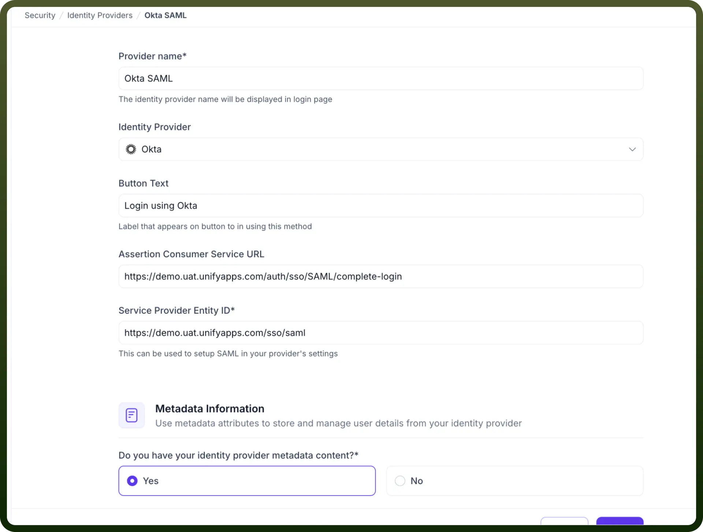
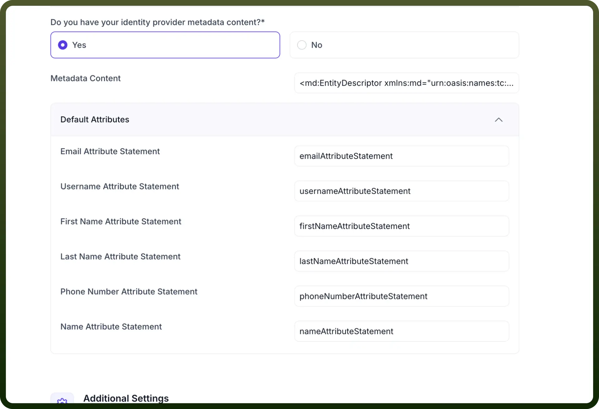
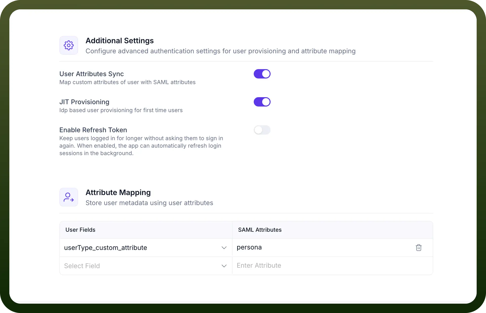
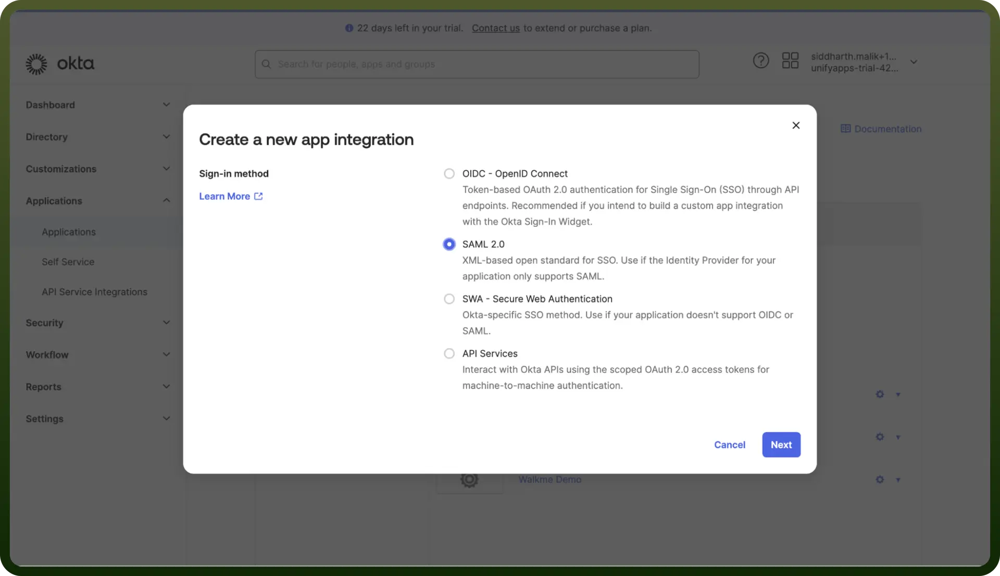
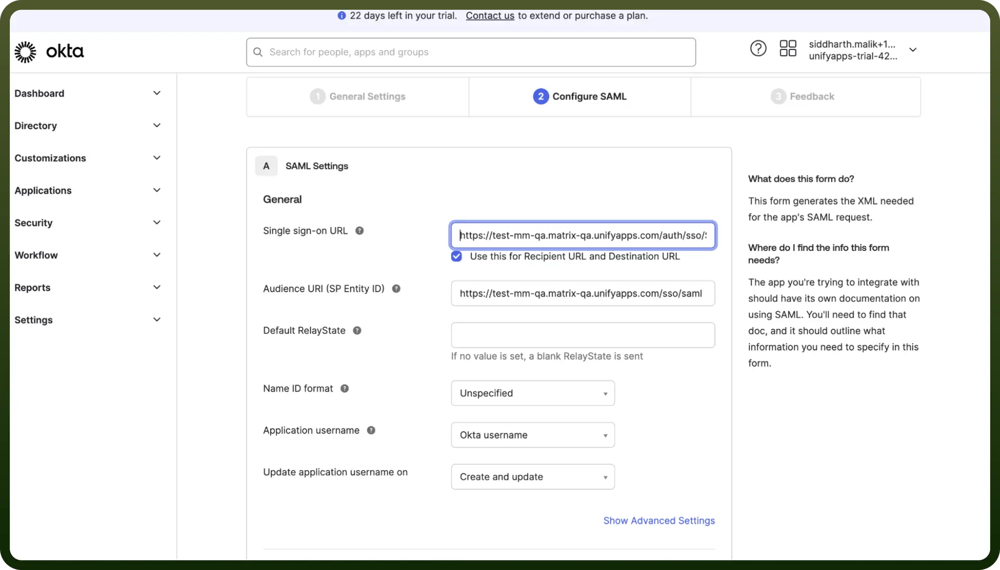
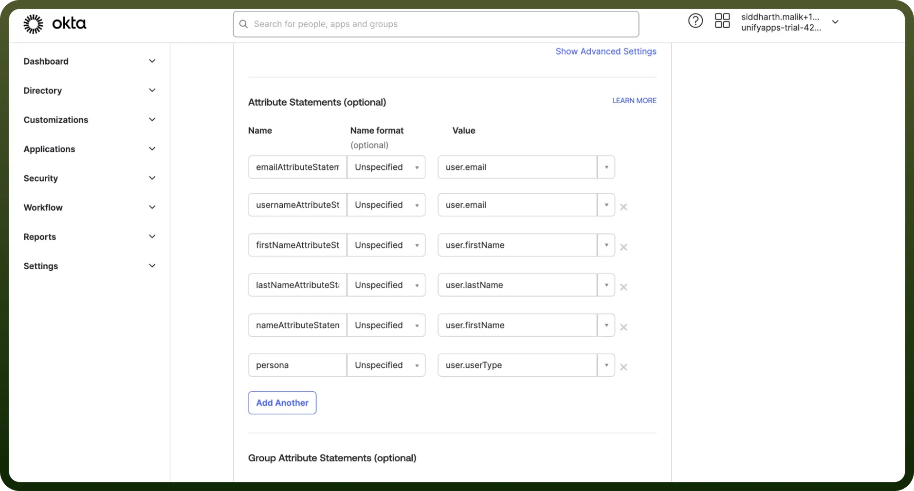
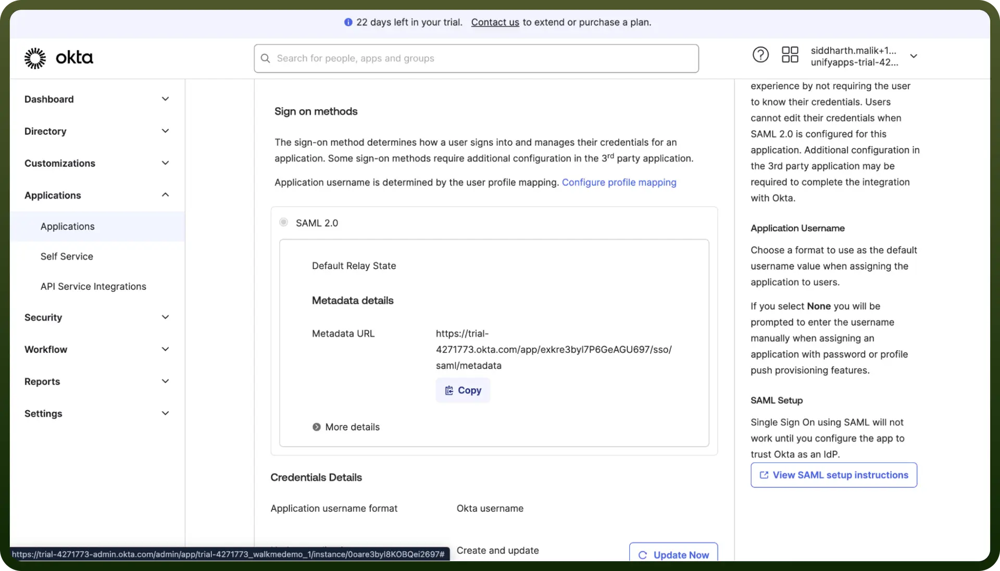
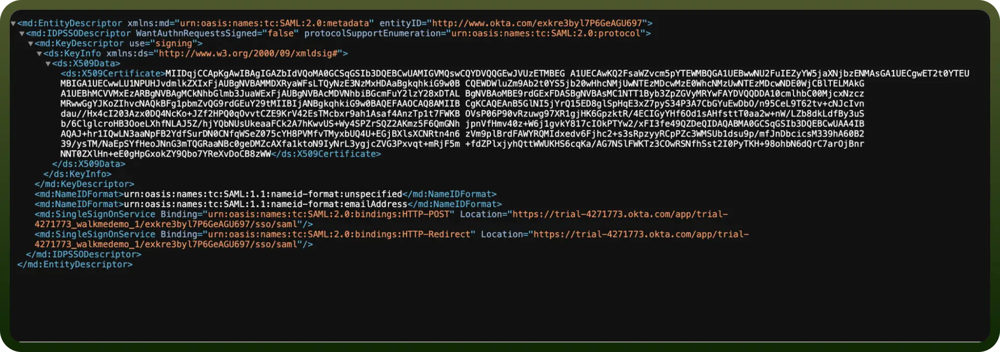
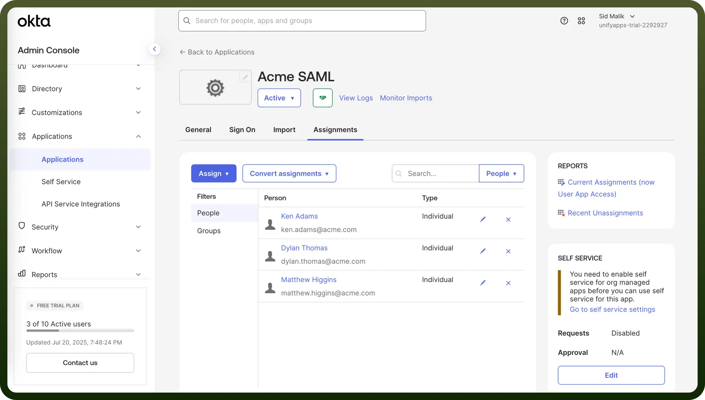
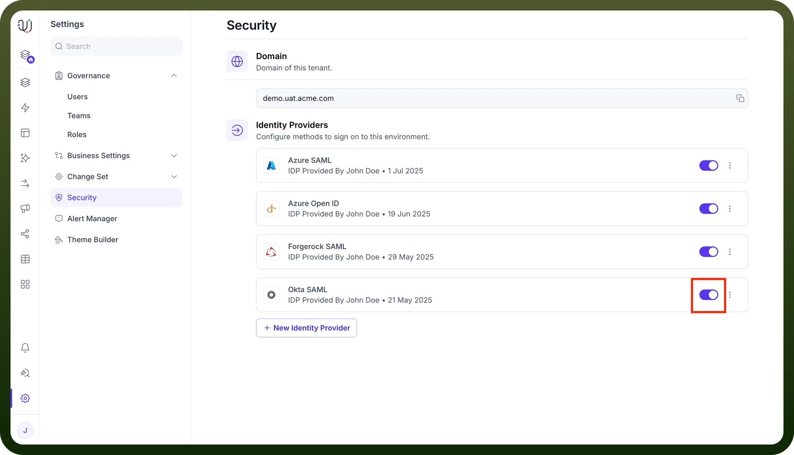

# Okta SAML IDP Configuration

Source: https://www.unifyapps.com/docs/governance/okta-saml-idp-configuration
Section: governance

---

This guide outlines configuring Okta as a SAML 2.0 Identity Provider (IDP) for Single Sign-On (SSO) with UnifyApps. You will need administrator access to your Okta organization.

The configuration process involves three main stages:

## Step 1: Initial Configuration on UnifyApps

In this section, you will start the SAML configuration process on **UnifyApps** and obtain the necessary URLs that Okta will require.

1. **Access Identity Provider Settings:**
  - Navigate to `Settings`.
  - Select `Security` from the settings menu.
  - Under the "`Identity Providers`" section, click on `+ New Identity Provider`

    

2. **Basic Details & Service Provider Information:**
  - `Provider name`: Enter a descriptive name for this configuration (e.g., Okta SAML).
  - `Identity Provider`: Select **Okta** from the dropdown list.
  - `Button Text`: Specify the text that will appear on the SSO login button (e.g., Login using Okta).
  - **Important: Note the following URLs.** You will need these for the Okta
    - `Assertion Consumer Service URL (ACS URL)`**:** This is the endpoint on **UnifyApps** where Okta will send the SAML assertion. (Example: https://demo.uat.unifyapps.com/auth/sso/SAML/complete-login)
    - `Service Provider Entity ID (SP Entity ID)`**:** This is the unique identifier for **UnifyApps** as the Service Provider. (Example: https://demo.uat.unifyapps.com/sso/saml)

      

3. **Prepare for Metadata & Define Attributes:**
  - For the question, **"**`Do you have your identity provider metadata content?*`**"**, select `Yes`. This will reveal a `Metadata Content` text field where you will paste Okta's XML metadata later.
  - Review the `Default Attributes` section. The attribute names listed here (e.g., **emailAttributeStatement**, **usernameAttributeStatement**, **firstNameAttributeStatement**, **lastNameAttributeStatement**, **phoneNumberAttributeStatement**, **nameAttributeStatement**) are what are expected to receive from Okta.

    

4. **Additional Settings (Optional):**
  - `User Attributes Sync`: Enable if you wish to map custom attributes from Okta to user fields within **UnifyApps.**
  - `JIT Provisioning (Just-In-Time Provisioning)`: Enable to automatically create user accounts when they first log in via Okta.
  - `Enable Refresh Token`: Configure according to your organization's session management requirements.
  - If you enable `User Attributes Sync`, proceed to the `Attribute Mapping` section. Here, you will map `User Fields` to the `SAML Attributes` that will be sent by Okta (e.g., mapping a userType_custom_attribute field to a SAML attribute named persona). **Note:** Keep the UnifyApps configuration page open in your browser. You will return to it after configuring Okta. Do not save changes yet.

    

## Step 2: Configuring the SAML Application in Okta

Now, you will create and configure a new SAML 2.0 application in your Okta admin console.

1. **Create a New SAML App Integration:**
  - Log in to your Okta admin dashboard.
  - In the side navigation menu, go to `Applications` > `Applications`.
  - Click the `Create App Integration` button.
  - In the "`Create a new app integration`" dialog, select `SAML 2.0` as the sign-in method.
  - Click `Next`.

    

2. **General Settings:**
  - `App name`: Provide a recognizable name for the application and click `Next`.
3. **Configure SAML Settings:**
  - `Single sign on URL`: Paste the **Assertion Consumer Service URL (ACS URL)** and ensure the checkbox "Use this for Recipient URL and Destination URL" is selected.
  - `Audience URI (SP Entity ID)`: Paste the **Service Provider Entity ID**.
  - `Default RelayState`: This can usually be left blank unless your application requires a specific post-login redirect within its own context.
  - `Name ID format`: Select an appropriate format. EmailAddress is a common and recommended choice.
  - `Application username`: Choose how Okta usernames are determined for this application. Email or Okta username are typical selections.

    

4. **Attribute Statements (Crucial for User Data):**
  - This section defines which user attributes Okta will include in the SAML assertion sent to UnifyApps.
  - The `Name` of each attribute statement configured here *must exactly match* the corresponding attribute name expected.
  - Configure the attributes based on the UnifyApps attributes.

    

  - For any custom attributes (e.g., persona mapped to userType_custom_attribute on your platform):
  - Click `Next` after configuring all the necessary attributes.
5. **Feedback:**
  - Okta will ask for feedback on the integration. Select "I'm an Okta customer adding an internal app" and click `Finish`.
6. **Obtain Okta Identity Provider Metadata:**
  - Once the application is created, you will be on its configuration page in Okta.
  - Navigate to the `Sign On` tab for this application.
  - In the "`Settings`" or "`SAML 2.0`" section, locate the link labeled **"**`Identity Provider metadata`**"** or a field showing a **"**`Metadata URL`**"**.
  - Click the "`Copy`" button and open the URL in a new browser tab which will display an XML document.

    

  - **Copy the entire content of this XML page**. This is Okta's SAML metadata.

    

7. **Assign Users and Groups (Essential for Access):**
  - While still in the Okta application settings, navigate to the `Assignments` tab.
  - Assign the relevant Okta users or groups who should be granted access to UnifyApps via this SSO configuration. Users not assigned here will be unable to log in.

    

## Step 3: Finalizing Configuration in UnifyApps

Return to the **UnifyApps** IDP configuration page you left open.

1. **Paste Okta Metadata:**
  - Paste the entire Okta XML metadata in the `Metadata Content` field.
  - Click the `Save` and turn on the toggle for the IDP.

    
