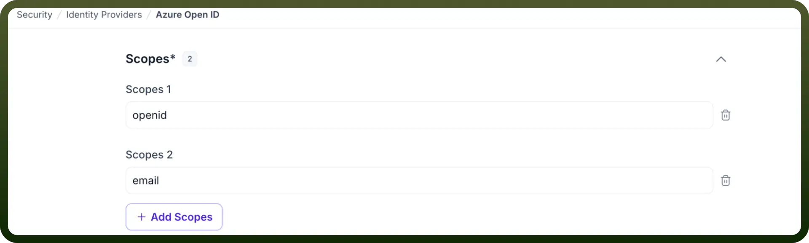
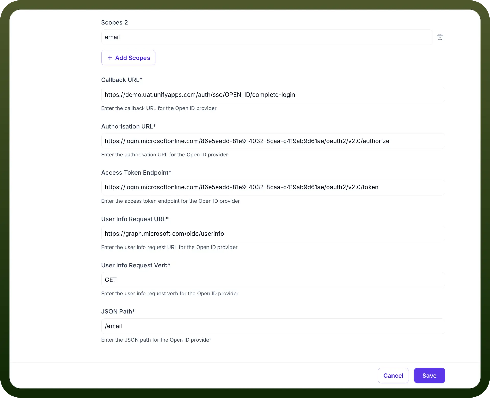
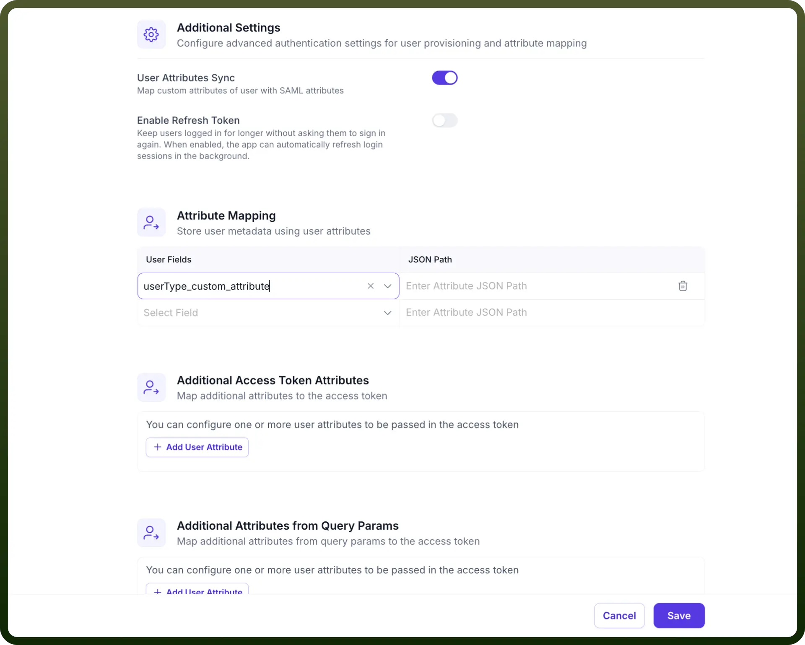
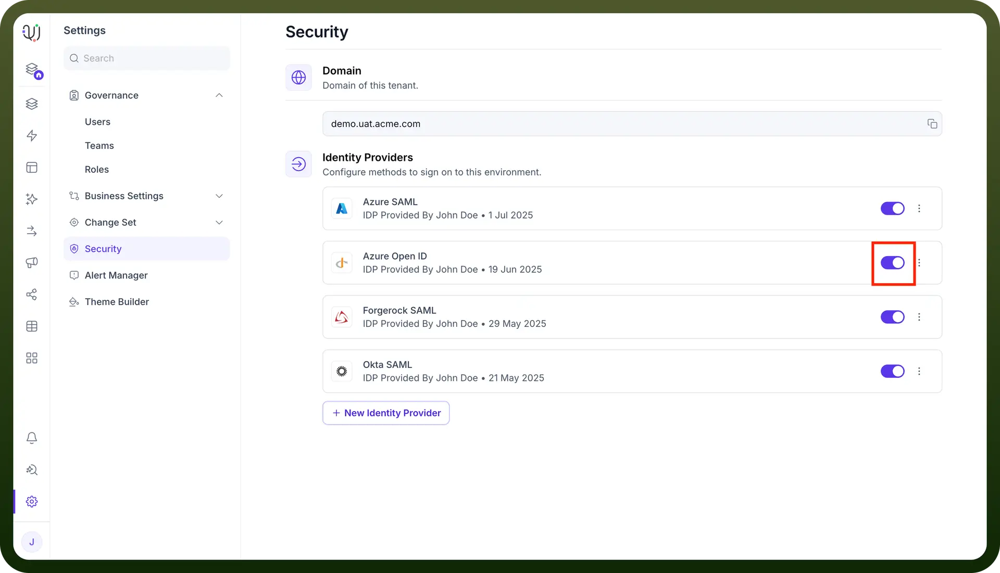

# OpenID Connect (OIDC) IdP Configuration

Source: https://www.unifyapps.com/docs/governance/openid-connect-oidc-idp-configuration
Section: governance

---

This guide details how to configure OpenID Connect (OIDC) to enable robust Single Sign-On (SSO) for any application within the UnifyApps platform, supporting integrations with Identity Providers like Azure AD, Okta, and other OIDC-compliant services.

The configuration process involves three main stages:

## Step 1: Initial Configuration on UnifyApps

In this section, you will start the OIDC configuration process on **UnifyApps** and obtain the necessary URLs that your IdP will require.

1. **Access Identity Provider Settings:**
  - Navigate to `Settings`.
  - Select `Security` from the settings menu.
  - Under the "Identity Providers" section, click on `+ New Identity Provider`

    

2. **Basic Details & Service Provider Information:**
  - `Provider name`: Enter a descriptive name for this configuration (e.g., Azure Open ID).
  - `Identity Provider`: Select `Open ID` from the dropdown list.
  - `Button Text`: Specify the text that will appear on the SSO login button (e.g., Login using Open ID).
  - **Important: Note the following URL.** You will need these for the Open ID application setup in Part 2.
    - `Callback URL`**:** This is the redirect URI, it should be like: https://**{your-domain}**/auth/sso/OPEN_ID/complete-login (Example: https://demo.uat.unifyapps.com/auth/sso/OPEN_ID/complete-login)
3. **Define the Scopes:**
  - For this you need to define the OAuth scopes to request (must include at least "**email**" and "**openid**").

    

## Step 2: Configuring the OpenID Connect

Now, you will create and configure a new registration in your admin portal.

1. **Create a New OpenID Integration.**
2. **Configure Settings:**
  - Consume the `Callback URL`**(The URL where the identity provider should redirect after authentication)**.
  - Also add the required scopes(if needed).
3. Generate the `Client ID`, and the `Client Secret Key`.

## Step 3: Finalizing Configuration in UnifyApps

Return to the **UnifyApps** IdP configuration page you left open.

1. **Paste the required details from your OpenID provider configuration page:**
  - `Client ID`**:** The OAuth client ID provided by your identity provider.
  - `Client Secret Key`**:** The OAuth client secret provided by your identity provider.
  - `Authorization URL`: The OAuth authorization endpoint URL.
  - `Access Token Endpoint`: The OAuth token endpoint URL.
  - `User Info Request URL`: The endpoint URL to retrieve user information.
  - `User Info Request Verb`: HTTP method for retrieving user details (typically "**GET**").
  - `JSON Path for email`.

    

2. **Additional Settings (Optional):**
  - **User Attributes Sync**: Enable if you wish to map **custom attributes** **from your IdP**, **access token**, or **query params** to user fields within **UnifyApps.**
  - **JIT Provisioning (Just-In-Time Provisioning)**: Enable it if you want to automatically create user accounts when they first log in via Custom IdP.
  - **Enable Refresh Token**: Configure according to your organization's session management requirements. **Note:** If you enable `User Attributes Sync`, proceed to the `Attribute Mapping` section. Here, you will map `User Fields` to the `Attributes` that will be sent by **your IDP, Access Token, or Query Params** (e.g., mapping a userType_custom_attribute field to an attribute named persona).

    

3. Click the `Save` and turn on the toggle for the IDP.

  
