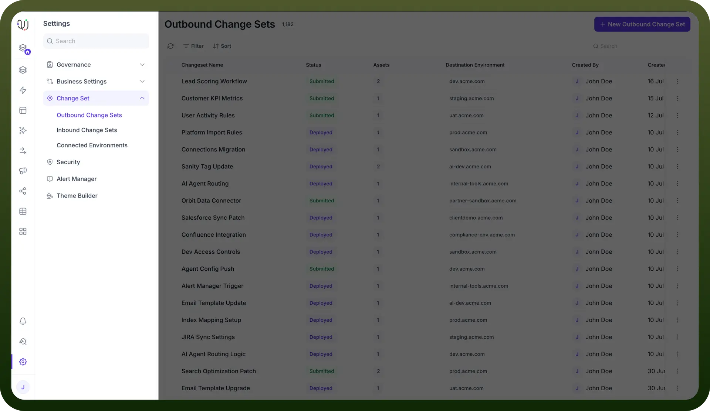
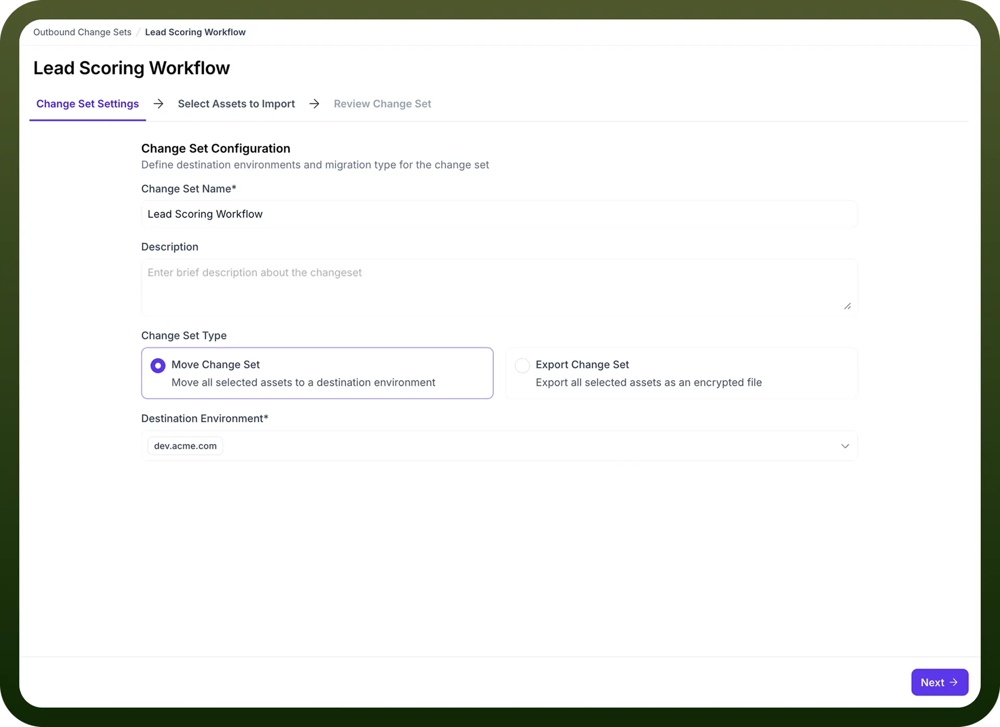
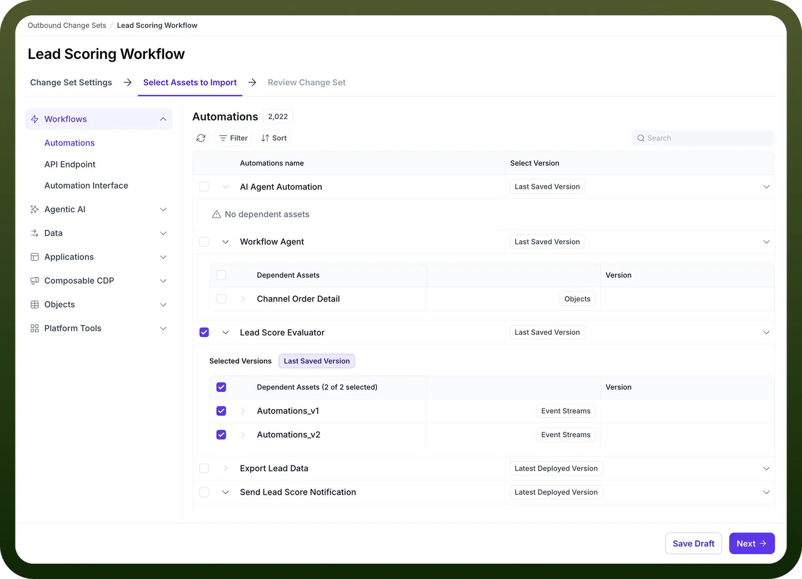
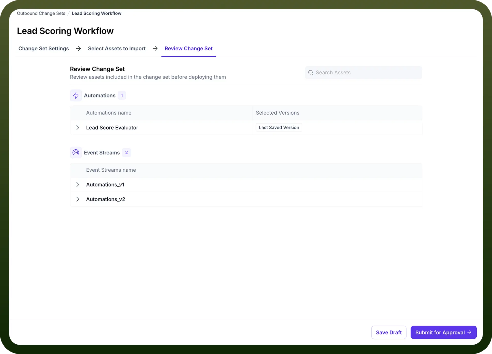

# Outbound Changeset

Source: https://www.unifyapps.com/docs/governance/outbound-changeset
Section: governance

---

## Overview

Outbound Change Sets provide a structured approach to migrate assets (automations, applications, objects, data sources, etc.) between different environments in your platform. This functionality ensures seamless transitions from development to testing to production environments while maintaining dependencies and configurations.

## What is an Outbound Change Set?

An Outbound Change Set is a package that contains components you want to move from one environment to another. These components can include:

- Automations
- Data Sources
- API Endpoints
- Applications
- Objects
- Platform Tools
- Connected Environments

Change Sets ensure that migrations maintain integrity across environments and provide a governed approach to deployment.

## Types of Change Sets

The platform offers two primary types of change sets:

1. **Move Change Set**: Transfers selected assets to a destination environment, either creating new assets or updating existing ones.
2. **Export Change Set**: Packages all selected assets as an encrypted file that can be imported elsewhere.

## Key Benefits

- **Dependency Management**: Automatically identifies and includes dependent assets required for your selected components to function properly.
- **Version Control**: Allows you to select specific versions of assets to migrate.
- **Governed Deployment**: Includes an approval workflow to ensure proper review before deployment.
- **Environment Consistency**: Maintains consistent configurations across environments.
- **Bulk Migration**: Efficiently moves multiple assets simultaneously.

## Creating and Using an Outbound Change Set

**Step 1: Access Change Set Settings**

1. Navigate to `Settings` in the main navigation.
2. Under the `Change Set` section, select `Outbound Change Sets`.
3. Click on `New Outbound Change Set` to begin the creation process.

  

**Step 2: Configure the Change Set**

Provide essential configuration details:

- `Change Set Name`: Enter a descriptive name (required)
- `Description`: Add a brief description about the purpose of the change set
- `Change Set Type`: Select either "Move Change Set" or "Export Change Set"
- `Destination Environment`: Choose the target environment where assets will be migrated (e.g., QA Active, Production)

**Step 3: Select Assets to Import**

1. Navigate to the `Select Assets to Import` tab.
2. Browse through categories such as:
  - Workflows/Automations
  - API Endpoints
  - Automation Interfaces
  - Data
  - Applications
  - Composable CDP
  - Objects
  - Platform Tools
3. Select the specific assets you wish to migrate by checking the boxes next to them.
4. For each asset, choose the appropriate version (e.g., Latest Deployed Version, Last Saved Version).
5. Note that dependent assets will be automatically identified and can be included in the migration.

  

**Step 4: Review Change Set**

1. Navigate to the `Review Change Set` tab.
2. Review all assets included in the change set before deployment.
3. Verify that all components and their dependencies are correctly included.
4. Use the search functionality to locate specific assets in larger change sets.

  

**Step 5: Deploy the Change Set**

1. Click `Save Draft` to save your change set configuration for later use.
2. When ready to proceed, click `Submit for Approval` to initiate the approval workflow.
3. Once approved, the assets will be migrated to the destination environment according to your configuration.

## Handling Dependencies

The platform automatically identifies dependencies between assets. For example, if you select an automation that relies on a specific data source, the data source will be flagged as a dependency.

You can view these dependencies during the asset selection process, and ensure they are included in your change set for proper functionality in the destination environment.

## Best Practices

1. **Use Descriptive Names**: Give your change sets clear, descriptive names that indicate their purpose and destination.
2. **Include Detailed Descriptions**: Add comprehensive descriptions to help reviewers understand the purpose and scope of the change set.
3. **Review Dependencies Thoroughly**: Always verify that all necessary dependencies are included to prevent functionality issues after migration.
4. **Test After Migration**: After deploying a change set, test the migrated assets in the destination environment to ensure everything functions as expected.
5. **Use Change Sets for Related Components**: Group related components in a single change set to maintain functional integrity.
6. **Version Management**: Be deliberate about which versions of assets you choose to migrate.
7. **Regular Migrations**: Establish a regular cadence for migrations to keep environments in sync and reduce large, complex change sets.

## Troubleshooting

- **Missing Dependencies**: If functionality is broken after migration, check for missing dependencies that may not have been included in the change set.
- **Version Conflicts**: Ensure you've selected the correct versions of assets to migrate to avoid unexpected behavior.
- **Approval Delays**: If change sets are stuck in approval, follow up with the designated approvers.
- **Failed Migrations**: If a migration fails, check the error logs and verify that the destination environment meets all prerequisites for the migrated assets.

## Conclusion

Outbound Change Sets provide a powerful mechanism for managing the lifecycle of your platform assets across different environments. By following the structured approach outlined above, you can ensure smooth, controlled migrations while maintaining the integrity and functionality of your automations, applications, and other components.
