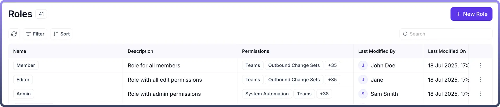
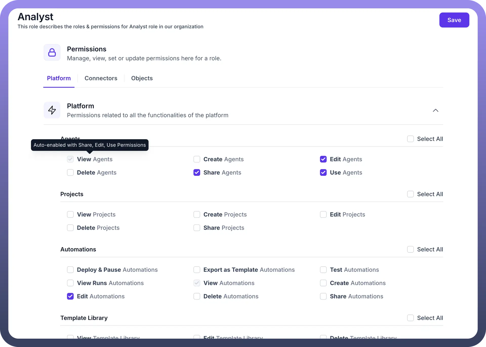
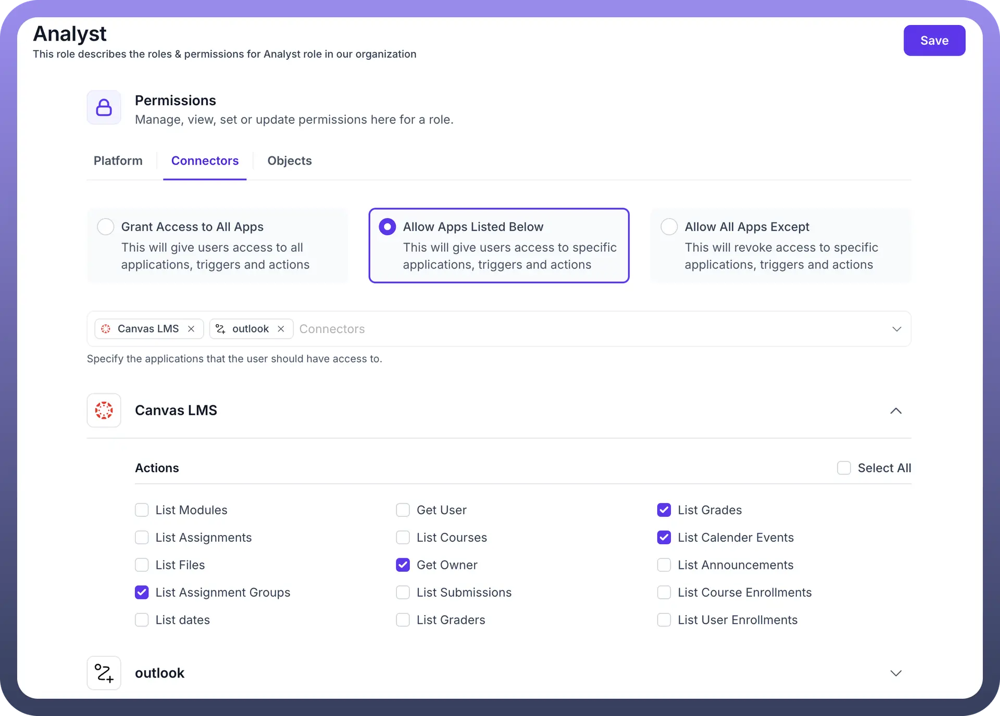
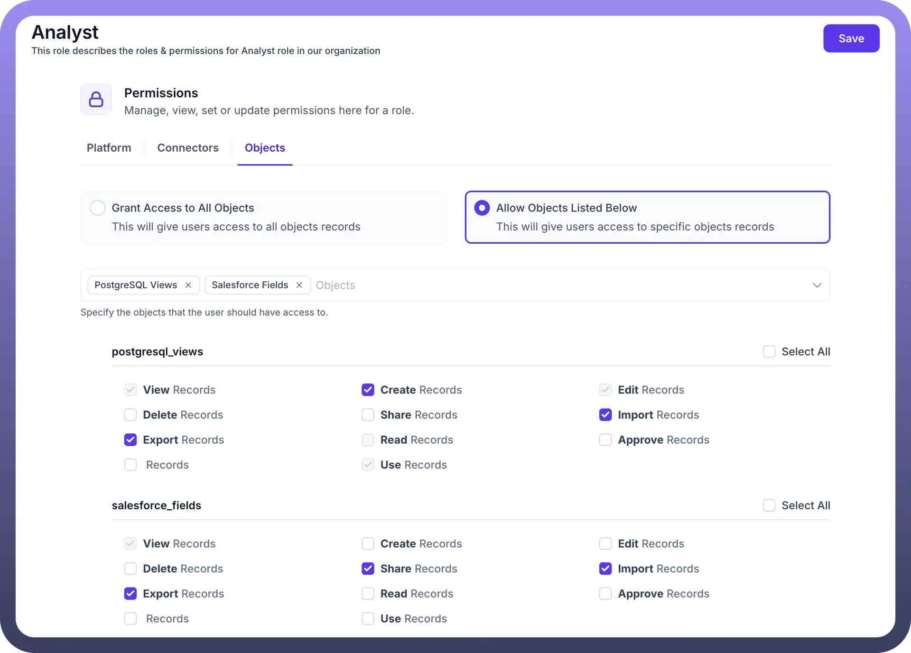

# Roles

Source: https://www.unifyapps.com/docs/governance/role
Section: governance

---

## Overview

**Roles & Permissions** is a fundamental module within UnifyApps that empowers users to manage and control access to various functionalities, data, and assets within the platform.

By defining specific roles and assigning granular permissions, organizations can ensure robust security, maintain data integrity, and streamline operational workflows. Implementing a well-structured roles and permissions framework is crucial for secure and efficient platform usage, ensuring that users only have access to the resources necessary for their responsibilities

## Configuring Roles & Permissions:

**Step 1: Access Roles & Permissions Settings**

- Navigate to Settings in the main navigation.
- Under the Governance section, select `Roles`.
- You will now see a list of all Roles created in your environment

**Step 2: Create a New Role**

- Click on `New Role`
- Provide the following details
  - ROle Name Add a unique name for the role
  - Description Provide a detailed description to give an overview of this role

**Step 3: Define Permissions for the Role**

Once a new role is created (or an existing one is selected for editing), you can manage, view, set, or update its permissions. Permissions are categorized into three main sections:

**Category 1**: Platform

**Category 2:** Connectors

**Category 3:** Objects

##### **Explanation of each type of permissions:**

| **Permission Type** | **Description** | **Special condition** |
|---|---|---|
| `View` | Allows to only view the entity with no permissions to make any edits |  |
| `Edit` | Allows to edit any already created entity | When selected, it auto enables : View |
| `Delete` | Allows to delete already created entities |  |
| `Create` | Allows to create new entities | When selected, it auto enables : View, Edit, Use |
| `Use` | Allows to use already created entities | When selected, it auto enables : View |
| `Share` | Allows to share already created entities | When selected, it auto enables : View |

### Category 1: Platform Permissions

Platform permissions are related to all functionalities available within the UnifyApps platform. These are further subdivided into:

- **Platform**
  - **Agents**: Control access to Agents.
    - View Agents
    - Create Agents
    - Edit Agents
    - Delete Agents
    - Share Agents
    - Use Agents
  - **Projects**: Define permissions for Projects.
    - View Projects
    - Create Projects
    - Edit Projects
    - Delete Projects
    - Share Projects
  - **Automations**: Manage access to Automations.
    - Deploy & Pause Automations
    - Export as Template Automations
    - Test Automations
    - View Runs Automations
    - View Automations
    - Create Automations
    - Edit Automations
    - Delete Automations
    - Share Automations
  - **Template Library**: Control permissions for the Template Library.
    - View Template Library
    - Edit Template Library
    - Delete Template Library
    - Share Template Library
  - **Automation Interfaces**: Define permissions for Automation Interfaces.
    - View Automation Interfaces
    - Create Automation Interfaces
    - Edit Automation Interfaces
    - Delete Automation Interfaces
    - Share Automation Interfaces
  - **Pipelines**: Manage access to Pipelines.
    - View Pipelines
    - Create Pipelines
    - Deploy & Pause Pipelines
    - Delete Pipelines
    - Export Pipelines
  - **Copilot**: Control access to Copilot features.
    - View Copilot
  - **Object Manager**: Define permissions for managing Objects.
    - View Object Manager
    - Create Object Manager
    - Edit Object Manager
    - Delete Object Manager
    - Share Object Manager
  - **Applications**: Manage access to Applications.
    - View Applications
    - Create Applications
    - Edit Applications
    - Delete Applications
    - Share Applications
    - Manage Localization Applications
  - **Data Catalog**: Control permissions for the Data Catalog.
    - View Data Catalog
- **API Manager**: Permissions related to API Manager across the app.
  - **API Group**: Define access for API Groups.
    - View API Group
    - Create API Group
    - Edit API Group
    - Delete API Group
    - Share API Group
    - Export API Group
  - **API Report**: Manage permissions for API Reports.
    - View API Report
  - **API Client**: Control access to API Clients.
    - View API Client
    - Create API Client
    - Edit API Client
    - Delete API Client
    - Share API Client
  - **API Policy**: Define permissions for API Policies.
    - View API Policy
    - Delete API Policy
    - Share API Policy
    - Edit API Policy
- **Platform Tools**: Permissions related to Platform Tools across the app.
  - **Teams**: Control access to Teams.
    - View Teams
    - Create Teams
    - Edit Teams
    - Delete Teams
  - **Outbound Change Sets**: Manage permissions for Outbound Change Sets.
    - View Outbound Change Sets
    - Create Outbound Change Sets
    - Edit Outbound Change Sets
    - Delete Outbound Change Sets
    - Publish Outbound Change Sets
  - **Linked Environment**: Define access to Linked Environments.
    - View Linked Environment
    - Create Linked Environment
    - Edit Linked Environment
    - Delete Linked Environment
    - Share Linked Environment
  - **Template Manager**: Control permissions for the Template Manager.
    - View Template Manager
    - Create Template Manager
    - Edit Template Manager
    - Delete Template Manager
    - Test Template Manager
  - **Inbound Change Sets**: Manage permissions for Inbound Change Sets.
    - View Inbound Change Sets
    - Create Inbound Change Sets
    - Edit Inbound Change Sets
    - Deploy & Pause Inbound Change Sets
    - Rollback Inbound Change Sets
    - Delete Inbound Change Sets
  - **Unified Entity Model**: Define access for the Unified Entity Model.
    - View Unified Entity Model
    - Create Unified Entity Model
    - Edit Unified Entity Model
    - Delete Unified Entity Model
    - Share Unified Entity Model
  - **Decision Table**: Control permissions for Decision Tables.
    - View Decision Table
    - Create Decision Table
    - Edit Decision Table
    - Delete Decision Table
    - Share Decision Table
  - **Business Hours**: Manage access to Business Hours settings.
    - View Business Hours
    - Create Business Hours
    - Edit Business Hours
    - Delete Business Hours
  - **Segment Manager**: Define permissions for the Segment Manager.
    - View Segment Manager
    - Create Segment Manager
    - Edit Segment Manager
    - Delete Segment Manager
    - Share Segment Manager
  - **Connectors SDK**: Control access to the Connectors SDK.
    - View Connectors SDK
    - Create Connectors SDK
    - Edit Connectors SDK
    - Delete Connectors SDK
    - Share Connectors SDK
    - Deploy & Pause Connectors SDK
  - **User**: Manage user-related permissions.
    - View User
    - Create User
    - Edit User
    - Delete User
    - Reset Password User
  - **Environment Variables**: Define access to Environment Variables.
    - View Environment Variables
    - Read Environment Variables
    - Create Environment Variables
    - Edit Environment Variables
    - Delete Environment Variables
    - Share Environment Variables
  - **Campaign Manager**: Control permissions for the Campaign Manager.
    - View Campaign Manager
    - Create Campaign Manager
    - Edit Campaign Manager
    - Delete Campaign Manager
    - Share Campaign Manager
  - **Tenants**: Manage permissions related to Tenants.
    - Switch Tenant Tenants
  - **Roles**: Define permissions for managing Roles themselves.
    - View Roles
    - Create Roles
    - Edit Roles
    - Delete Roles
  - **Connections Manager**: Control access to the Connections Manager.
    - View Report Connections Manager
    - View Connections Manager
    - Create Connections Manager
    - Edit Connections Manager
    - Delete Connections Manager
    - Share Connections Manager
  - **Business Holidays**: Manage permissions for Business Holidays.
    - View Business Holidays
    - Create Business Holidays
    - Edit Business Holidays
    - Delete Business Holidays
  - **Code Snippets**: Define access to Code Snippets.
    - View Code Snippets
    - Create Code Snippets
    - Edit Code Snippets
    - Delete Code Snippets
    - Share Code Snippets
  - **Streams**: Control permissions for Streams.
    - View Streams
    - Create Streams
    - Edit Streams
    - Delete Streams
    - Share Streams

### Category 2: Connectors

This section allows you to specify the connectors that the user should have access to. You have three options for defining connector access:

- Grant Access to All Apps: This option gives users access to all applications, triggers, and actions.
- Allow Apps Listed Below: This option provides users access to specific applications, triggers, and actions that you select from a list.
- Allow All Apps Except: This option revokes access to specific applications, triggers, and actions that you select, while granting access to all others.

### Category 3: Objects

This section allows you to specify the objects that the user should have access to. You have two options for defining object access:

- Grant Access to All Objects: This option gives users access to all object records.
- Allow Objects Listed Below: This option gives users access to specific object records that you select from a list.

Once you have configured the permissions, click Save to apply the changes to the role.

## Best Practices for Roles & Permissions

- **Use Descriptive Names:** Give your roles clear, descriptive names that indicate their purpose and the level of access they grant (e.g., "Marketing Content Editor," "Finance Data Viewer").
- **Principle of Least Privilege:** Always grant users only the minimum permissions necessary to perform their assigned tasks. This reduces the risk of unauthorized access or accidental data modification.
- **Regular Review:** Periodically review and update roles and permissions to ensure they align with current organizational needs, changes in job responsibilities, and evolving security policies.
- **Audit Trails:** Leverage audit trails and logs (if available in UnifyApps) to monitor user activities and identify any unauthorized actions or suspicious behavior.
- **Test Role Assignments:** After configuring new roles or modifying existing ones, thoroughly test them with sample users to ensure they function as intended and prevent unintended access issues.
