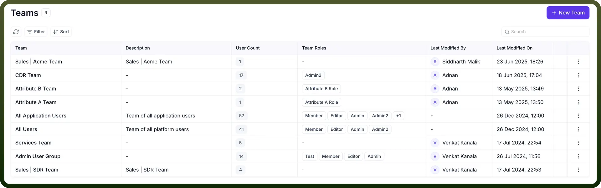
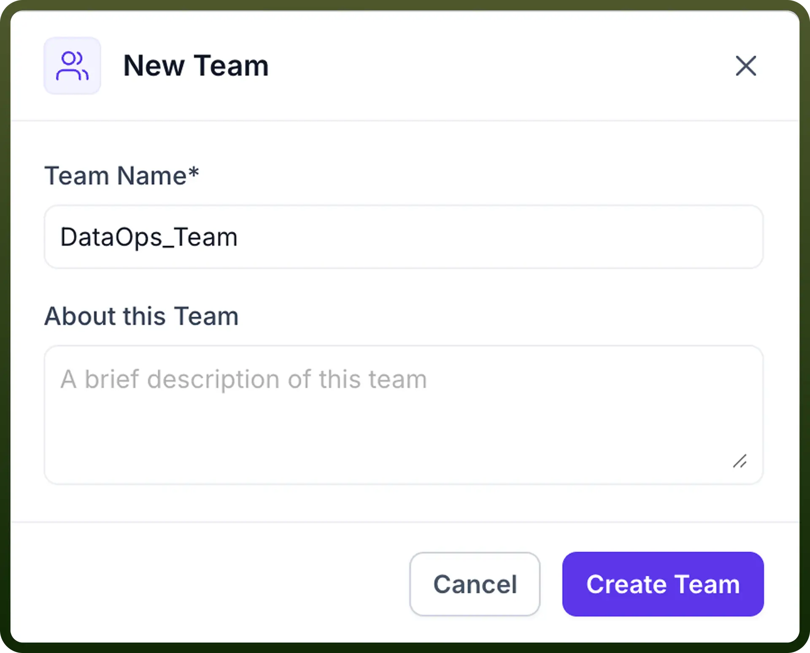
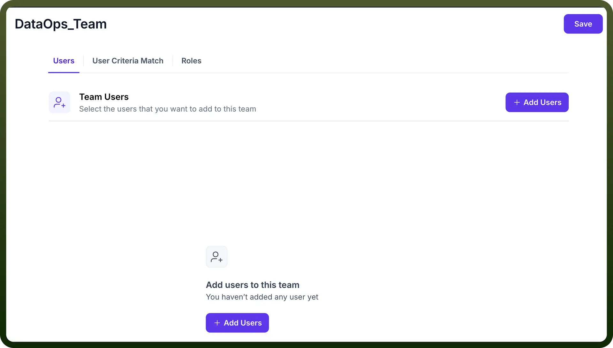
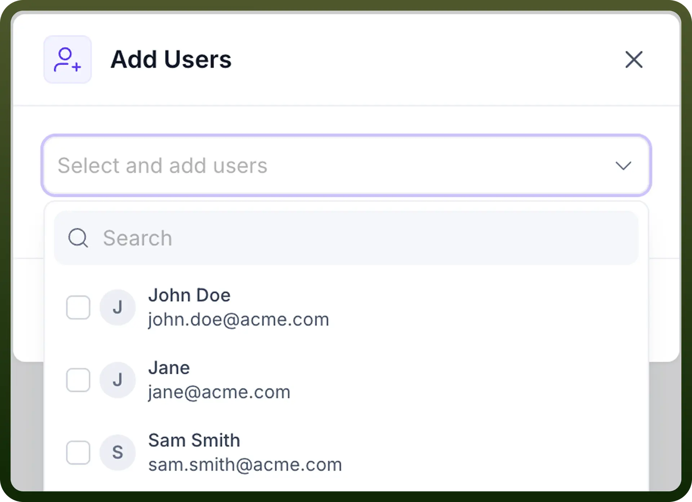
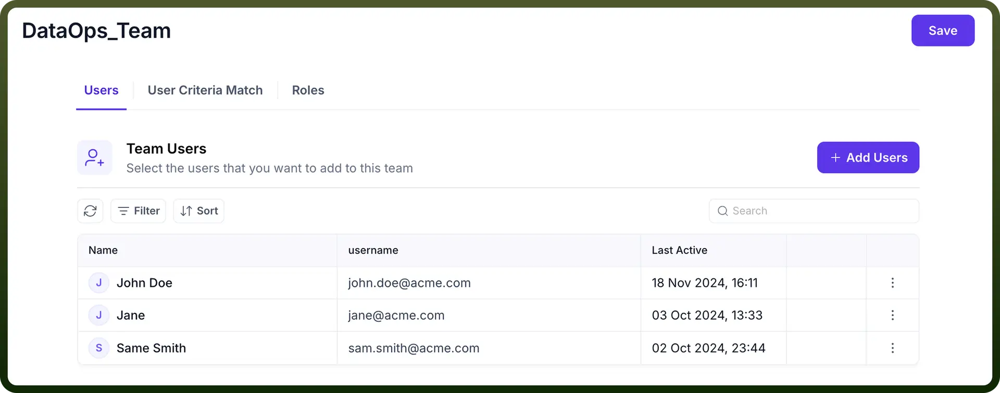
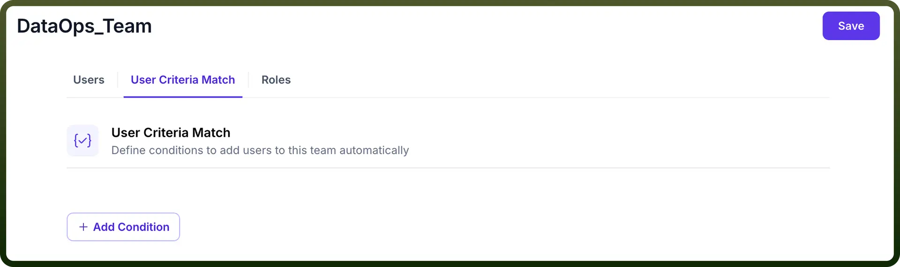
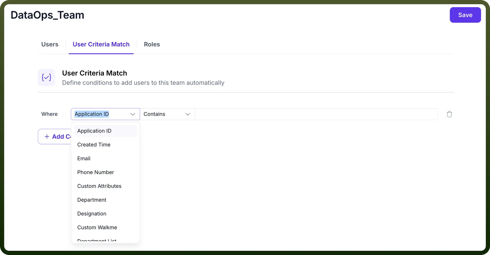
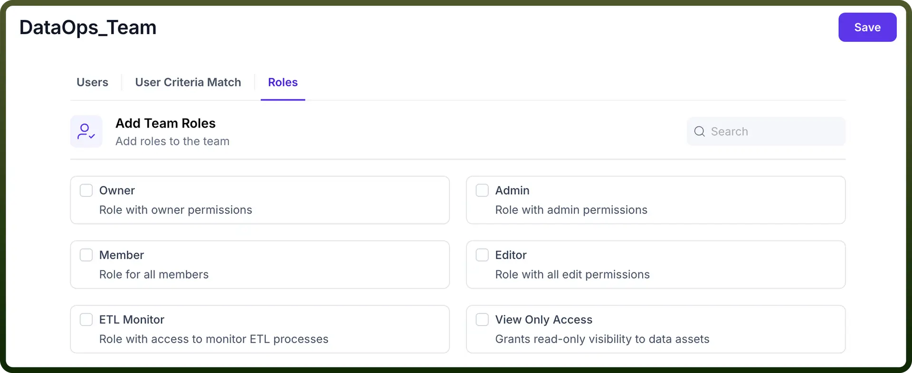

# Teams

Source: https://www.unifyapps.com/docs/governance/teams
Section: governance

---

## Overview

Teams in UnifyApps represent groups of users that are organized based on specific functions, departments, or projects. Teams help categorize users according to their responsibilities, ensuring proper organization and efficient collaboration within the platform.

## Team Information

When viewing the Teams page in UnifyApps, teams are displayed in a table format with the following details:

`Team`: The name assigned to the team, used to label and identify the group within the system.

`Description`**:** A brief explanation of the team's purpose or function, providing context about its role within the organization.

`User Count`**:** The number of users associated with the team, indicating the team's size.

`Team Roles`**:** The roles assigned to the team that define the permissions and access levels for team members. Roles can include Member, Admin, and custom roles.

`Last Modified By`**:** The date and time when the team was last updated, providing tracking for administrative changes.

`Last Modified On`**:** The date and time when the team was last updated, providing tracking for administrative changes.

You can use the Filter, Sort, and Search functions to manage and find teams efficiently.

## How to Create a Team in UnifyApps?

To create a new team in UnifyApps, follow these steps:

1. **Click on the "**`New Team`**" Button** Navigate to the Teams section and click on the "`New Team`" button in the top-right corner. A modal will open with the following fields:

  

  - `Team Name (Required)`**:** Enter a unique name for the team.
  - `About this Team`**:** Add a brief description of the team's purpose or function. Click "`Create Team`" to proceed to the team configuration page.
2. **Configure Team Settings** After creating the team, you'll be directed to the team's configuration page, which contains three tabs:
  - **In Users Tab** This tab allows you to manage the users assigned to the team:

    

    - View existing team users with their name, username, and last active time
    - Click "`Add Users`" to select users to add to the team

      

    - Use Filter, Sort, and Search options to manage larger team lists

      

    - Remove users from the team as needed
  - **In User Criteria Match Tab** This tab allows you to set up automatic user assignment based on specific criteria:

    

    - Define conditions that will automatically add users to the team when those conditions are met
    - Click "`Add Condition`" to create a new condition

      

    - For each condition, you can specify:
      - **Where:** Select the user attribute to evaluate (options include Application ID, Created Time, Email, Phone Number, Custom Attributes, Test Boolean, Deployment Notes, Deployment Tag, Entity Type, and more)
      - **Operator:** Choose from operators like "Contains" or other logical operators
      - **Value:** Define the specific value that will trigger the condition
    - Multiple conditions can be added to create complex automatic assignment rules
    - This feature helps manage which users are added to teams based on user attributes, eliminating the need for manual updates.
  - **In Roles Tab** This tab allows you to configure the permissions for team members:

    

    - **Add Team Roles:** Select roles to assign to the team members
    - Search functionality is available to find specific roles in large role lists
    - Available role options include:
      - **Member:** Basic role for all team members with standard permissions
      - **Admin:** Role with administrative permissions for managing the team
      - **Editor:** Role with all edit permissions for team content
      - **Custom roles:** Additional roles specific to your needs
    - Each role has a specific set of permissions that determine what actions team members can perform
    - You can select multiple roles for a team, providing different levels of access to different team members
    - Roles assigned at the team level are combined with each user's individual roles to determine their overall permissions within the platform. These role assignments help maintain proper access control and permission management across the platform, ensuring users have appropriate permissions based on their team.
3. **Save Your Changes**

After configuring the team settings, click the "`Save`" button in the top-right corner to apply your changes.

## Conclusion

The Teams section in UnifyApps is essential for organizing users into functional groups, streamlining collaboration, and managing permissions. By creating well-structured teams with clear purposes and appropriate user assignments, administrators can ensure effective user organization and maintain appropriate access controls throughout the platform.
