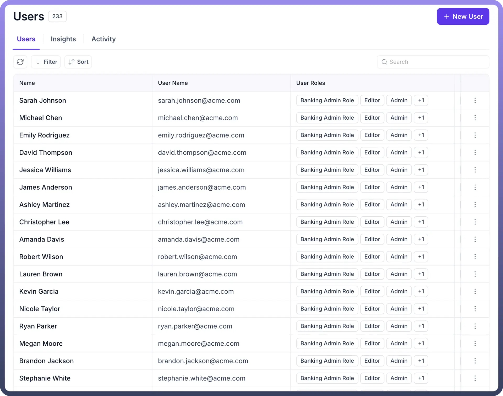
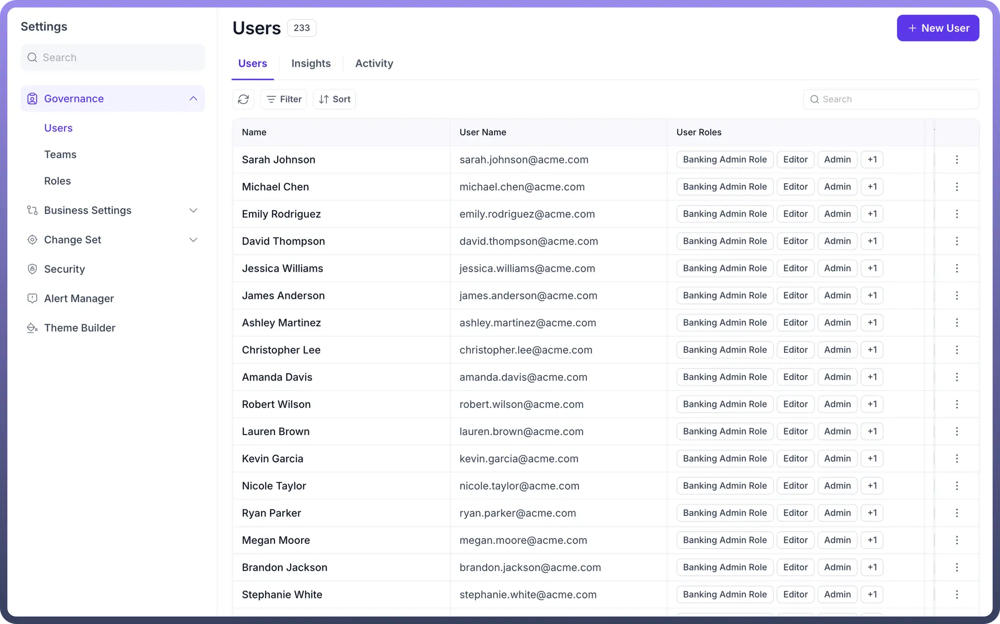
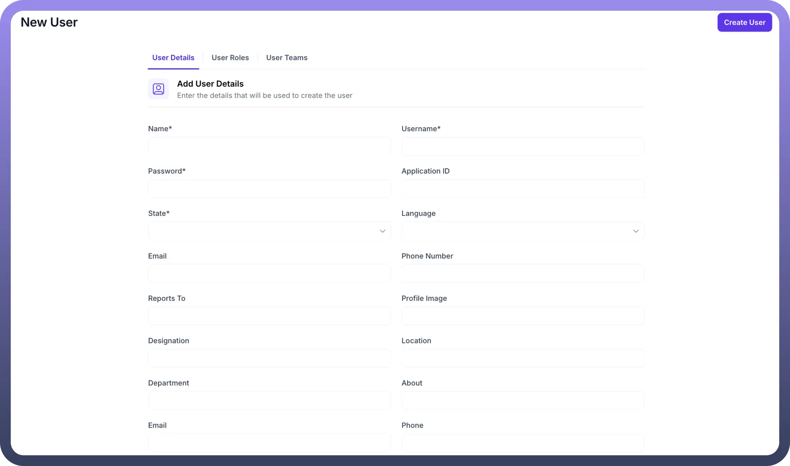
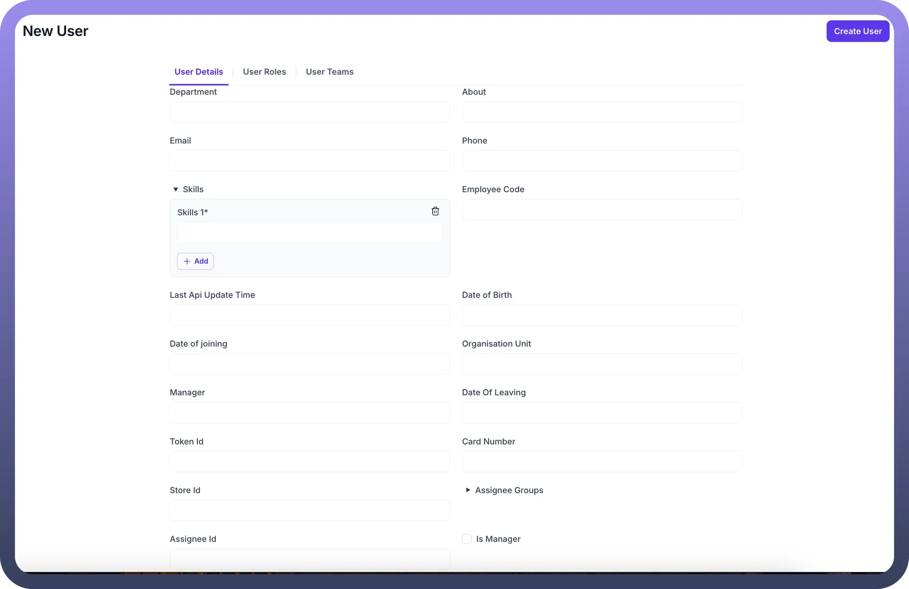
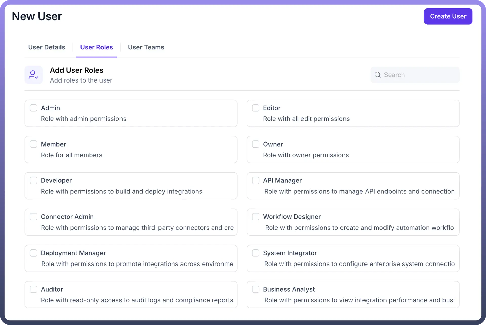
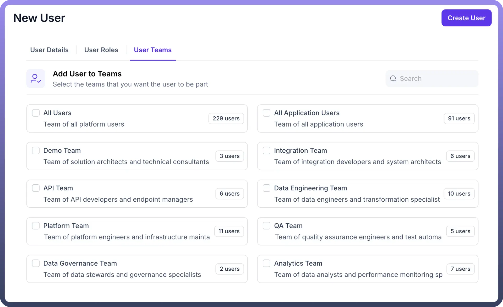

# User

Source: https://www.unifyapps.com/docs/governance/user
Section: governance

---

## Overview

**Users** represent the accounts created for a specific unifyapps environment. Users are individuals who interact with the platform and its various applications. Each user has specific roles and permissions that define their access to the system.

## User Information

When viewing a user's profile in UnifyApps, the following details are displayed:

1. `User ID`: A unique identifier assigned to each user within the environment. This ID helps in distinguishing users across the system and is essential for managing user-specific data.
2. `Username`: The unique login identifier for the user. This is typically used for authentication and system identification.
3. `Name`: The full name of the user, as provided during account creation. This helps in identifying the individual associated with the user account.
4. `User Role`: The role assigned to the user that defines their level of access and permissions. Roles could range from administrators to regular users, and each role comes with different capabilities within the platform.
5. `Teams`: The team(s) the user is associated with. Teams help categorize users based on their functional responsibilities or departments, ensuring proper organization within UnifyApps.
6. `Last Active`: The most recent activity time of the user. This indicates when the user last interacted with the system, providing insights into user engagement.
7. `State`: The **state** indicates the current status of a user account and can be one of the following:
  - **Active**: The account is fully functional.
  - **Disabled**: Access is restricted.
  - **Locked**: The account is locked due to security or policy reasons.
  - **Dormant**: The account is inactive for an extended period.
  - **Deleted**: The account has been permanently removed.

## How to Create a User in UnifyApps?

To create a new user in UnifyApps, follow these steps:

1. Click on the **"**`New User`**"** Button Navigate to the user management section and click on the **"**`New User`**"** button. A new page will open up with three tabs:

  

  - User Details
  - User Roles
  - User Teams
2. In **User Details Tab** This tab contains the following fields, which need to be filled in:

  

  

  - `Name`*(Required)*: The full name of the user. (*Required*)
  - `Username`*(Required*): The unique identifier for the user to log in.
  - `Password`*(Required*): Set a secure password for the user. (*Required*)
  - `Application ID`: The identifier for the application this user will have access to.
  - `State`*(Required*): The current status of the user. Options include:
    - **Active**
    - **Disabled**
    - **Locked**
    - **Dormant**
    - **Deleted**
  - `Language`: Select the preferred language for the user. Options include:
    - English
    - French
    - Arabic
    - Spanish
  - `Email`*(Required)*: User's email address.
  - `Phone Number`: Contact number for the user.
  - `Reports To`: The user the new user reports to.
  - `Profile Image`: URL of the user's profile image.
  - `Designation`: The user's job title or role.
  - `Location`: The physical location or office of the user.
  - `Department`: The department the user belongs to.
  - `About`: A brief description or bio about the user.
  - `Skills`: Add multiple skills relevant to the user.
  - `Employee Code`: The unique employee code for the user.
  - `Last API Update Time`: Time of the last API update in epoch milliseconds.
  - `Date of Birth`: User’s birthdate in epoch milliseconds.
  - `Date of Joining`: The date the user joined the organization in epoch milliseconds.
  - `Organization Unit`: The organizational unit the user is part of.
  - `Manager`: The manager of the user.
  - `Date of Leaving`: The date the user left the organization (if applicable).
  - `Token ID`: A unique token assigned to the user.
  - `Card Number`: If relevant, add the user’s card number.
  - `Store ID`: If relevant, add the store ID the user is associated with.
  - `Assignee Groups`: Add multiple assignee groups the user is part of.
  - `Assignee ID`: The unique ID of the assignee group.
  - `Is Manager`: Tick this box if the user is a manager.
3. In **User Roles Tab** Select one or more user roles from the available options.

  

4. In **User Teams Tab** Select one or more user teams from the available options.

  

5. Click **"**`Create User`**"** to complete the process.

The Users section in UnifyApps plays a crucial role in managing user accounts, roles, and permissions within the platform. By defining user-specific details such as roles, teams, and access levels, we can efficiently control system interactions and maintain structured user management.

With features like user state tracking, role-based access, and team assignments, we can ensure a well-organized and secure environment. The ability to create and manage users with detailed attributes allows for better administration, enhanced security, and seamless collaboration across teams.
