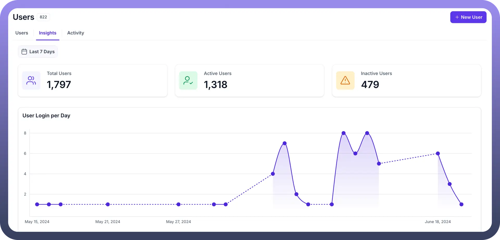
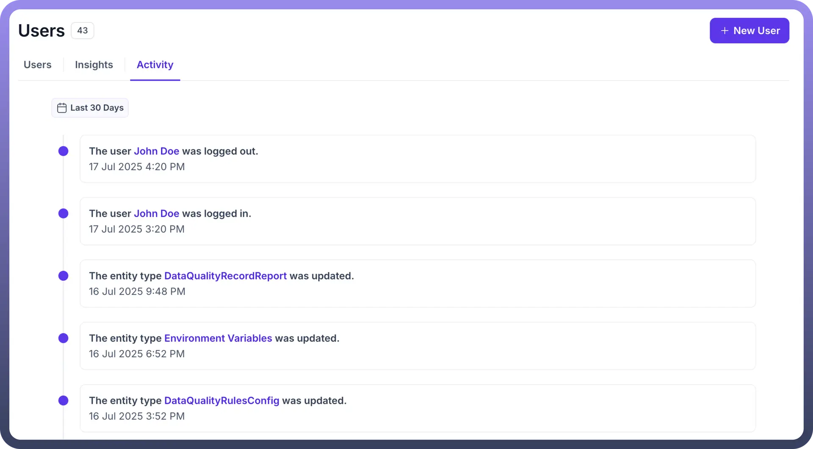
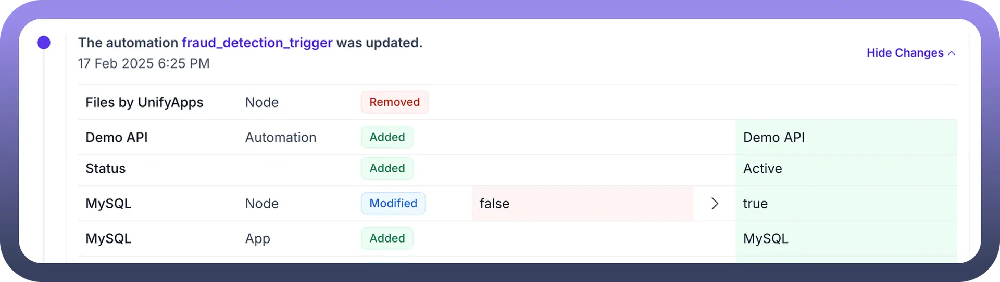
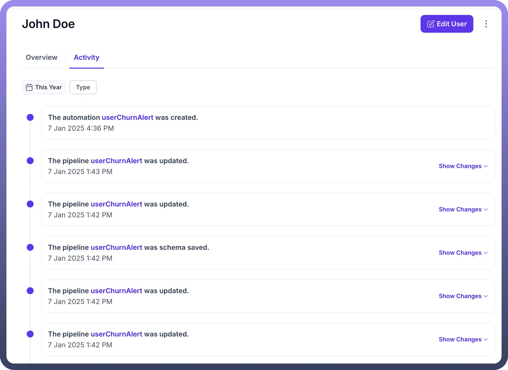
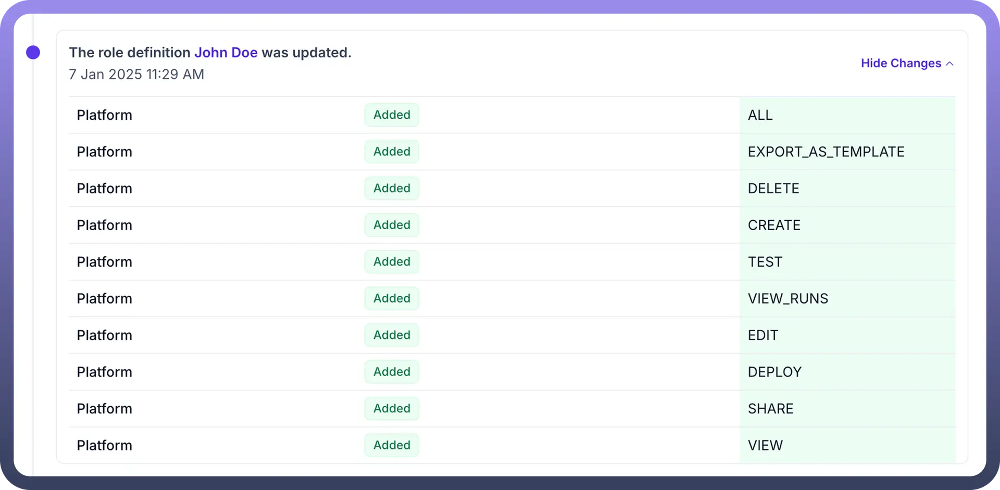

# Users - Insights, Activities

Source: https://www.unifyapps.com/docs/governance/users-insights-activities
Section: governance

---

## Insights

The **Insights** section provides an overview of user statistics and login trends. It is divided into two key components:

1. **User Statistics Cards**
  - **Total Users**: Displays the total number of users of the selected environment.
  - **Active Users**: Shows the total count of active users of the selected environment.
  - **Inactive Users**: Indicates the number of inactive users of the selected environment.
2. **User Logins Per Day**
  - **Line Graph**: Visual representation of daily user logins of the selected environment.

**→ Date Filter:** Allows filtering insights based on a selected date range.

## Activity

1. **Platform Level User Activity** The Platform Level User **Activity** section tracks and logs platform level user actions. It includes filtering options and a detailed activity timeline.

  

  - **Filters Available**
    - **Date Filter**: Filter activities based on a specific date range.
    - **Type Filter**: Filter by activity type such as Created, Updated, Deleted, Shared, Deployed, Paused, Unpaused, or Rolled Back.
    - **User Filter**: Select one or more users to view only their activities.
  - **Activity Timeline** Displays activities in chronological order, showing:
    - The **user, role, connection, automation, or pipeline** associated with the activity (linked to relevant pages).
    - **Activity Type**, along with date and time.

      

    - **Show Changes Button**: Available for roles, connections, automations, and pipelines, allowing users to view all updates made.
2. **User Level Activity:** The **User Level Activity** section captures a chronological log of actions performed by an individual user—such as logins, creations, updates, deletions, and more—across automations, connections, and roles, with linked entities and a "Show Changes" option for detailed visibility. Tracks activities of a specific user, with the following filtering and tracking options.

  

  - **Filters Available**
    - **Date Filter**: Filter activities by a selected date range.
    - **Type Filter**: Filter by activity type (Created, Updated, Deleted, Shared, Deployed, Paused, Unpaused, or Rolled Back).
  - **User Activity Timeline**
    - Displays a specific user’s actions related to roles, connections, automations, or pipelines (linked to respective pages).
    - Shows the **activity type, date, and time**.

      

    - Includes the **Show Changes Button** for connections, roles, automations, and pipelines to review updates made.

## Conclusion

The **Users** section provides insights into user statistics, login trends, and activity tracking within the platform. It is divided into two key areas:

- **Insights**: Offers a high-level view of user metrics, including total users, active users, inactive users, and daily login trends. A date filter allows users to refine insights based on a selected time range.
- **Activity**: Tracks user interactions, providing detailed logs of actions such as creation, updates, deletions, and deployments. Users can filter activities by date, type, or specific users. The activity timeline presents events in chronological order, linking relevant items (roles, connections, automations, and pipelines) to their respective pages.
  - Additionally, User Level Activity offers a clear and filterable audit trail of a specific user’s interactions on the platform. It improves accountability and transparency by detailing what actions were taken, when, and on which components.
