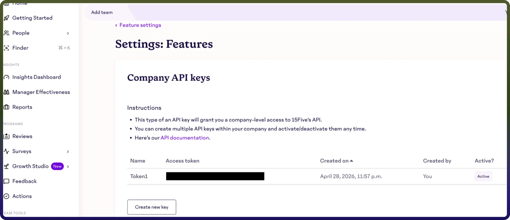

# 15Five

Source: https://www.unifyapps.com/docs/unify-integrations/15five
Section: integrations

---

Integrating your application with 15Five enhances performance management by enabling you to track employee progress, gather feedback, and manage check-ins seamlessly within your workflows. 15Five provides APIs to handle objectives, reviews, check-ins, and engagement data efficiently, helping organizations improve team alignment and drive continuous performance improvement.

## Authentication**:**

Connecting your application to 15Five allows you to centralize employee feedback, monitor goal progress, and facilitate continuous performance conversations efficiently within your workflows. Before you begin, ensure you have the following information:

`Connection Name` : Choose a meaningful name for your connection. This name helps you identify the connection within your application or integration settings. It could be something descriptive like "MyApp15FiveIntegration".

### API Token Based:

1. Login into your 15Five account.
2. Navigate to Settings, then go to Integrations.
3. Click on Public API.
4. click on Create API Key to generate a new key.
5. Copy the generated API key and store it securely for further authentication purposes.

## Actions :

| **Action Name** | **Description** |
|---|---|
| `Get group` | Gets a group in 15Five |
| `Get high five` | Gets a high five in 15Five |
| `Get user` | Gets a user in 15Five |
| `List groups` | Lists groups in 15Five |
| `List high fives` | Lists high fives in 15Five |
| `List priorities` | Lists priorities in 15Five |
| `List users` | Lists users in 15Five |
