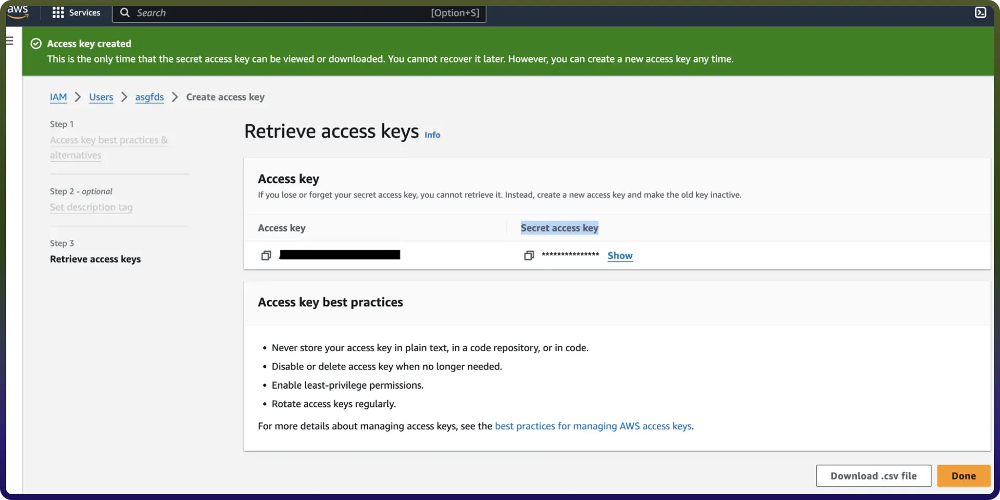
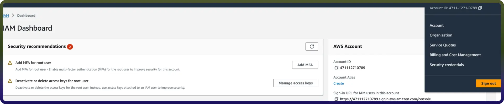
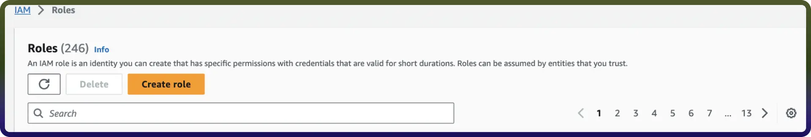

# Amazon Comprehend integration | connect with UnifyApps

Source: https://www.unifyapps.com/docs/unify-integrations/Amazon-Comprehend
Section: integrations

---

Integrating your application with Amazon Comprehend empowers you to extract valuable insights from text using natural language processing. It enables automatic analysis of sentiment, entities, key phrases, language, and topics at scale, helping you make data-driven decisions from unstructured content. Ensure you have the following information ready for a smooth and efficient integration process.

## Authentication

Connecting your application to Amazon Comprehend allows you to harness advanced natural language processing to analyze and understand text at scale. Before you begin, make sure you have the following information:

- `Connection Name`**:** Choose a meaningful name for your connection. This name helps you identify the connection within your application or integration settings. It could be something descriptive like "MyAppAmazonComprehendIntegration".
- `Region` : Enter your AWS account region. If your AWS account url starts with [https://us-east-1.console.aws.amazon.com](https://us-east-1.console.aws.amazon.com) , then your region will be us-east-1.
- `Authentication Type`**:** Select the type of authentication for connecting to your Amazon Comprehend account:

##### **Access Key Based**

1. Login into Amazon AWS Console and search for “Users” in the search bar present at the top of the console’s home page.
2. Click on “Create user” at the top right corner.
3. Sign in to the AWS Management Console by going to the AWS Management Console ([https://console.aws.amazon.com/](https://console.aws.amazon.com/)).
4. Navigate to the IAM (Identity and Access Management) dashboard by searching in the "IAM" search bar.
5. Provide the username and select permissions policies by selecting “Attach policies directly” and click on create user button.
6. Once the user is created, click on the username of the user created and under the summary section click on create access key.
7. Select “Command Line Interface” as the use case and provide the description tag to the key and click on “create access key”.
8. Treat the access key and secret access key with high confidentiality, as it allows access to your Amazon Comprehend account.

##### **IAM Role Based**

1. Sign in to AWS Management Console ([https://console.aws.amazon.com/](https://console.aws.amazon.com/)) and select security credentials.

2. Navigate to the IAM dashboard and click "Roles" > "Create role". ([https://docs.aws.amazon.com/IAM/latest/UserGuide/id_roles.html](https://docs.aws.amazon.com/IAM/latest/UserGuide/id_roles.html)

3.Under "Trusted entity type," choose the AWS account option.

4.Select "Another AWS account" and input the UnifyApps AWS account ID (contact support to obtain this).

5.Check the "Require external ID" box and enter the External ID provided by UnifyApps.

6.Assign the necessary permissions for UnifyApps to operate automated workflows within your account.

7.Give the IAM role a name and description.

8.Click the "Select trusted entities" Edit button to modify trusted entity policies if needed. (Optional)

9.Click the "Add permissions" Edit button to adjust permissions. (Optional)

10.If using object tags, select an appropriate tag for the IAM role. (Optional)

11.Click on Create Role to finalise the process.

##### **Create an IAM permissions policy**

1. Go to the AWS Console and open the IAM console [https://console.aws.amazon.com/iam](https://console.aws.amazon.com/iam)
2. Navigate to Access management and select Policies.
3. Choose Create Policy.
4. Locate and choose the AWS service that UnifyApps will access.
5. Select the required permissions under the Actions field.
6. Define the resources that the role will have access to.
7. Continue clicking Next until you reach the Review policy page.
8. Provide a Name for the policy.
9. Click Create policy once done.

##### **Retrieve IAM role ARN**

1. Open the AWS Console and go to My Security Credentials > Roles.
2. Search for the IAM role you need for the connection.

3. Select the role to view its details.
4. Copy the Role ARN for use in the UnifyApps connection setup.

## Actions :

| **Action** | **Description** |
|---|---|
| `Describe PII Entities Detection Job` | Get the properties of a PII entities detection job |
| `Detect Dominant Language` | Analyze text to detect its dominant language in Amazon Comprehend |
| `Detect PII Entities` | Detect PII entities from text using Amazon Comprehend |
| `List PII Entities Detection Jobs` | Get a list of PII entity detection jobs that you have submitted |
| `Start PII Entities Detection Job` | Start an asynchronous PII entity detection job for a collection of documents |
