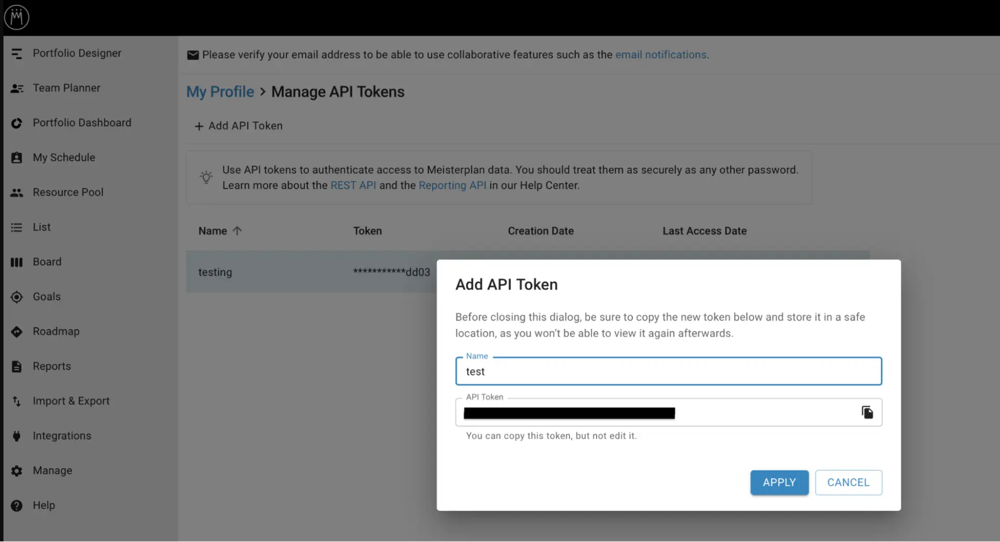

# Meisterplan connector

Source: https://www.unifyapps.com/docs/unify-integrations/Meisterplan
Section: integrations

---

## **Meisterplan**

Meisterplan is a cloud-based project portfolio and resource management platform designed to help organizations prioritize initiatives and allocate resources effectively. It provides a high-level view of projects, capacities, and investments, enabling better strategic planning. With interactive dashboards and scenario planning features, Meisterplan helps decision-makers balance workloads and align projects with business goals.

### **Authentication :**

Integrating your application with Meisterplan allows you to access data programmatically using the API. Before you begin, make sure you have the following information:

- Connection Name: Choose a meaningful name for your connection. This name helps you identify the connection within your application or integration settings, such as MyAppMeisterplanIntegration.
- Authentication type: Select the authentication type to connect to Meisterplan. Meisterpan supports API Token based authentication.
- Server: Select the server where your Meisterplan account is hosted:

### **API Key Based Authentication :**

1. Log in to your **Meisterplan** account.
2. Click on your **profile icon** in the top-right corner.
3. Select **Manage Apps**.
4. Go to the **API Token** section.
5. Click **Add API Token** to generate a new token.
6. Copy the generated API key and store it securely.
7. Use this generated token for authentication purposes.

### **Actions :**

| **Action Name** | **Description** |
|---|---|
| **Create project** | Creates a project from a specific scenario in Meisterplan |
| **Create resource** | Creates a resource in Meisterplan |
| **Create role** | Creates a role in Meisterplan |
| **Create task** | Create a task in a specific project in Meisterplan |
| **Create task management link** | Creates a task management link in a specific project in Meisterplan |
| **Delete project** | Deletes a project from a specific scenario in Meisterplan |
| **Delete resource** | Deletes a resource in Meisterplan |
| **Delete role** | Deletes a role in Meisterplan |
| **Delete task** | Deletes a task from a specific project in Meisterplan |
| **Get resources** | Get all the resources in Meisterplan |
| **Get portfolios** | Get all the portfolios in Meisterplan |
| **Get comments** | Get all the comments of a project in Meisterplan |
| **Get project** | Gets a project from a specific scenario in Meisterplan |
| **Get projects** | Get all the projects from a specific scenario in Meisterplan |
| **Get resource by ID** | Gets a resource by ID in Meisterplan |
| **Get roles** | Get all the roles in Meisterplan |
| **Get scenario by ID** | Gets a scenario by ID in Meisterplan |
| **Get scenarios** | Get all the scenarios in Meisterplan |
| **Get task by ID** | Gets a task from a specific project in Meisterplan |
| **Get tasks** | Get all the tasks from a specific project in Meisterplan |
| **Get teams** | Get all the teams in Meisterplan |
| **Get user by ID** | Gets user by ID in Meisterplan |
| **Get user details** | Gets user details in Meisterplan |
| **Get user group by ID** | Gets user group by ID In Meisterplan |
| **Get user groups** | Gets user groups in Meisterplan |
| **Get users** | Gets users in Meisterplan |
| **Update project** | Updates a project from a specific scenario in Meisterplan |
| **Update resource** | Updates a resource in Meisterplan |
| **Update role** | Updates a role in Meisterplan |
