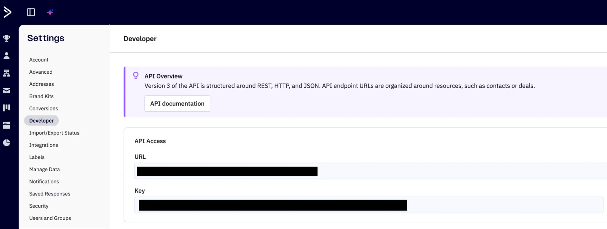

# Active Campaign integration | connect with UnifyApps

Source: https://www.unifyapps.com/docs/unify-integrations/active-campaign
Section: integrations

---

## **Active Campaign**

Integrating your application with Active Campaign enhances marketing automation by streamlining email campaigns, customer journeys, and lead nurturing workflows in one centralized platform. Active Campaign helps teams automate personalized communications, manage contacts and lists, and maintain campaign transparency with improved efficiency.

### **Authentication:**

Integrating your application to Active Campaign enables automated customer engagement, contact management, and dynamic automation workflows. Before you begin, ensure you have the following information:

**Connection Name :** Choose a meaningful name for your connection. This name helps you identify the connection within your application or integration settings. It could be something descriptive like "MyAppActiveCampaignIntegration".

**Active campaign account URL :** Enter your Active Campaign account URL. If your login url looks like https://unifyapps.activehosted.com, then your account URL is unifyapps.activehosted.com.

**API Token Based:**

1. Log in to your Active Campaign account.
2. Click Settings in the top right corner.
3. Navigate to and select the Developer section.
4. Copy the URL and Key and store them securely for authentication purposes.

### **ACTIONS**

| **Action Name** | **Description** |
|---|---|
| **Add contact to account** | Adds a contact to an Active Campaign account |
| **Add note to deal** | Adds a note to a deal in Active Campaign |
| **Add tag to account** | Adds a tag to an account in Active Campaign |
| **Create account** | Creates a new account in Active Campaign |
| **Create deal** | Creates a new deal in Active Campaign |
| **Delete contact** | Deletes contact by email in Active Campaign |
| **Fetch note** | Fetch note by id in Active Campaign |
| **Fetch tag** | Fetch tag by id in Active Campaign |
| **Find account** | Finds account by name in Active Campaign |
| **Find contact** | Finds a contact by email in Active Campaign |
| **Find deal** | Finds deal by name in Active Campaign |
| **Find user** | Finds user by username in Active Campaign |
| **Remove tag from account** | Removes the tag from an account in Active Campaign |
| **Update account** | Updates an account in your Active Campaign application |
| **Update deal** | Updates a deal in Active Campaign |
