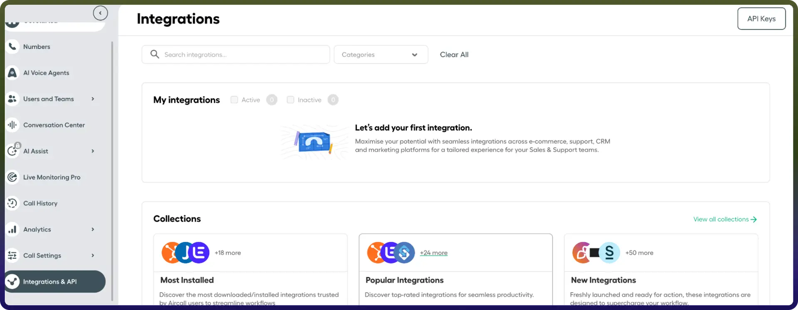

# Aircall connector

Source: https://www.unifyapps.com/docs/unify-integrations/aircall
Section: integrations

---

Aircall is a cloud-based phone system designed for sales and support teams. It enables businesses to manage inbound and outbound calls, track call activities, integrate with CRM and helpdesk platforms, and analyze team performance through real-time analytics and reporting. 
 By integrating Aircall APIs, you can access call logs, manage users, retrieve call recordings, track call activities, and automate workflows related to customer communication.

## Authentication

Before you begin, make sure you have the following information:

`Connection Name`: Choose a descriptive name for your connection, such as *“Aircall Connection”*. This helps you easily identify the connection within your integration settings.

`Authentication Type`: Aircall supports **Basic authentication**.

## Basic auth:

1. Log in to your **Aircall Dashboard**.
2. Click **Integrations & API** from the left sidebar.
3. Select **API Keys**.
4. Click **Create API Key**.
5. Copy the generated **API ID** and **API Token**.

## Actions:

| Action Name | Description |
|---|---|
| `Add User to a team` | Add User to a team in Aircall |
| `Check availability of a user` | Check the availability of a user |
| `Create a team` | Create a new team in aircall |
| `Create a user` | Create a new user in aircall |
| `Delete a User` | Delete an existing user in aircall |
| `Delete a team` | Delete a team in aircall |
| `List all Teams` | List all teams in aircall |
| `List all Users` | List all users in aircall |
| `Removes user from team` | Removes a user from a team in Aircall |
| `Retrieve a team` | Retrieve a team in aircall |
| `Update a User` | Update an existing user in aircall |
