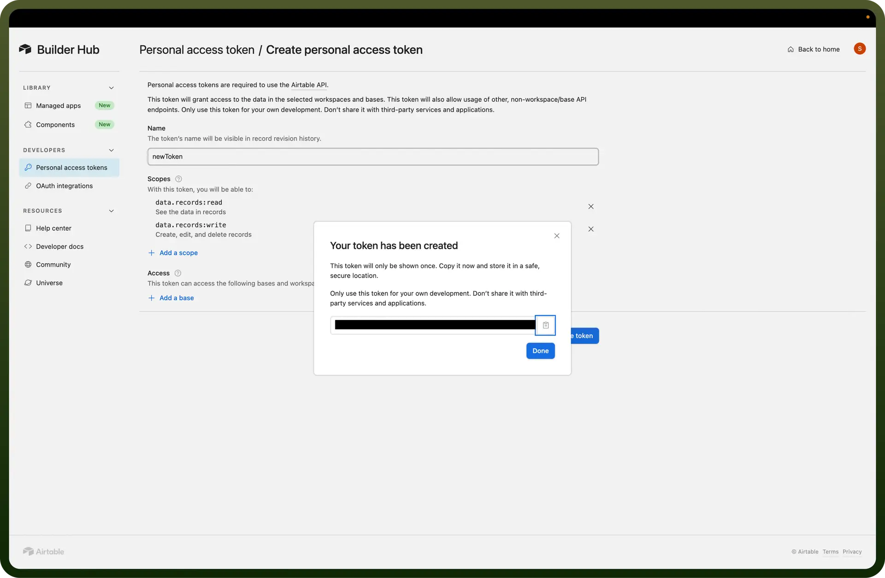
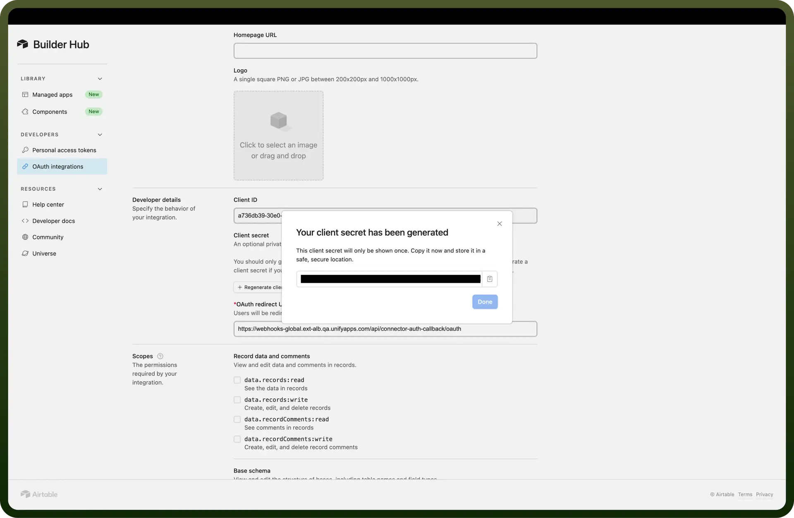

# Airtable connector

Source: https://www.unifyapps.com/docs/unify-integrations/airtable
Section: integrations

---

Airtable is a flexible platform that combines the simplicity of a spreadsheet with the power of a database for easy data organization and collaboration.

Integrating your application with Airtable empowers you to create custom databases, streamline data management, and collaborate seamlessly with your team.

## Authentication

Ensure you have the following information ready for a seamless integration process:

- `Connection Name`: Select a descriptive name for your connection, like "MyAppAirtableIntegration". This helps in easily identifying the connection within your application or integration settings.
- `Authentication Type`: Airtable supports the following type of authentication for connecting to your Airtable account:
  - API Token
  - OAUTH 2.0

### Access Token Based Authentication

- L ogin into Airtable account and click on the profile icon at the top right corner.
- Navigate to the builder hub
- In Personal Access token section, click on the “`Create new token`” button
- Provide the name and the required scopes for performing action based on your use case and click on “`Create Token`”
- Treat this token with high confidentiality, as it allows access to your Airtable account.

  

### OAUTH 2.0 Based Authentication

- L ogin into Airtable account and click on the profile icon at the top right corner.
- Navigate to the developer hub
- In Oauth Integrations section, click on the “`Register New OAuth integration`” button
- Provide the “`Name`” and the “`OAuth Redirect URL`” The OAuth Redirect URL is the destination to which users will be redirected after authorizing their integration. **Note:** Use the following callback URL to complete the OAuth flow with UnifyApps. For example If you are accessing through qa.unifyapps.com the callback URL would be this: [http://webhooks-golbal.ext-alb.qa.unifyapps.com/api/connector-auth-callback/oauth](http://webhooks-golbal.ext-alb.qa.unifyapps.com/api/connector-auth-callback/oauth)
- Then click on the “`Register integration`” button
- After registration fill out the details as mentioned, Note down the Client ID and also generate a client secret by clicking on the “`Generate client secret`” and save it to form a connection
- Then select the scopes you wish to expose through this connection

  

## Actions

| **Actions** | **Description** |
|---|---|
| `Create comment` | Create a comment on a record in Airtable |
| `Create field` | Create field in Airtable |
| `Create record` | Creates record in Airtable |
| `Delete comment` | Delete a comment on a record in Airtable |
| `Delete multiple records` | Delete multiple records in Airtable |
| `Delete record` | Deletes record in Airtable |
| `Get record` | Gets record from Airtable |
| `List records` | List records in Airtable |
| `Search records` | Search for records in Airtable |
| `Update comment` | Update a comment on a record in Airtable |
| `Update field` | Update field in Airtable |
| `Update record` | Updates a record in Airtable |
| `Upsert record` | Upsert a record in Airtable |
| `Upsert records (Batch)` | Upsert records in Airtable |

## Triggers

| **Triggers** | **Description** |
|---|---|
| `New record` | This trigger will be invoked when a new record is created in Airtable |
| `New/Updated Record` | This trigger will be invoked when a record is created or updated in Airtable |
| `Record and cell value changes` | This trigger will be invoked when a record and cell value changes in Airtable |
| `Field change` | Triggers when a field changes in Airtable |
