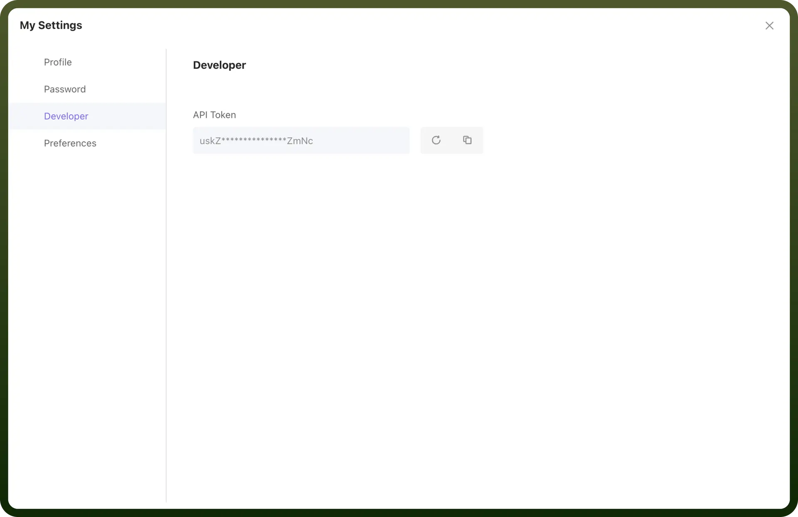

# AITable connector

Source: https://www.unifyapps.com/docs/unify-integrations/aitable
Section: integrations

---

AITable.ai is a next-generation collaborative data management platform that allows users to create, manage, and automate structured data workflows. It provides a flexible and efficient workspace for organizing information, collaborating in real-time, and integrating with various third-party applications.

Integrating AITable.ai streamlines data management by combining AI-powered automation with customizable spreadsheet functionality.

## Authentication

Before you begin, make sure you have the following information:

- `Connection Name`: Select a descriptive name for your connection, like "MyAppAITableIntegration". This helps in easily identifying the connection within your application or integration settings.
- `Authentication Type`: AITable.ai supports API Key-based authentication.

### API Key Based Authentication

1. Log in to your [AITable.ai](https://aitable.ai/) account.
2. Click on your profile avatar located at the bottom-left corner to enter the User Center.
3. Navigate to the Developer Configuration section.
4. Click the "`+`" button to generate a new API key.
5. Once generated, copy and securely store the API Key.

  

## Actions

| Actions | Description |
|---|---|
| `Create Datasheet` | Creates a datasheet in AITable.ai |
| `Create Field` | Creates a field in AITable.ai |
| `Create Record` | Creates a record in AITable.ai |
| `Delete Field` | Deletes a field in AITable.ai |
| `Delete Record` | Deletes a record in AITable.ai |
| `Find Records` | Finds a records in AITable.ai |
| `Get Fields` | Gets a fields in AITable.ai |
| `Update Record` | Updates a record in AITable.ai |

## Triggers

| Triggers | Description |
|---|---|
| `New record` | Triggers when a new record is added in AITable.ai |
