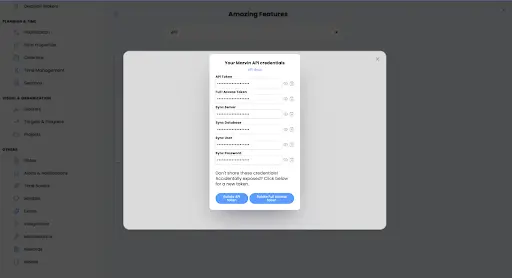

# Amazing-Marvin integration | connect with UnifyApps

Source: https://www.unifyapps.com/docs/unify-integrations/amazing-marvin
Section: integrations

---

## **Amazing Marvin**

Amazing Marvin is a powerful productivity and task-management platform that helps individuals and teams organize tasks, plan workflows, and track progress efficiently. With flexible customization and automation-friendly APIs, Amazing Marvin enables seamless integration with external systems to synchronize tasks, projects, and productivity data.

### **Authentication**

Integrating your application with Amazing Marvin enables secure access to task management workflows and productivity data through Amazing Marvin APIs. 
 Before starting, ensure you have the following information:

- **Connection Name :** Choose a meaningful name for your connection. This name helps identify the connection within your application or integration settings, such as MyAppAmazingMarvinIntegration.
- **Authentication Type:** Select the authentication method you want to use. Supported authentication types:
- API Token
- Full-Access Token

### **API Token Based****:**

1. Log in to your Amazing Marvin account.
2. Navigate to Settings.
3. Go to the API / Integrations section.
4. Generate or copy your API Token.
5. Copy the generated token and use it for further authentication purposes.

### **Full-Access Token Based:**

1. Log in to your Amazing Marvin account.
2. Navigate to Settings.
3. Open the Security / API Access section.
4. Generate or copy the Full-Access Token.
5. Paste the copied token into the Access Token field while creating the connection in UnifyApps.

### **Actions**

| **Action Name** | **Description** |
|---|---|
| **About Me** | Get information about self in Amazing Marvin |
| **Create Event** | Create an event to Amazing Marvin |
| **Create Project** | Create a new project in Amazing Marvin |
| **Create Task** | Create a new task in Amazing Marvin |
| **Get Child Tasks/Projects** | Get child tasks or projects of a category or project from Amazing Marvin |
| **Kudos Info** | Get information about kudos in Amazing Marvin |
| **List Categories** | List all Categories in Amazing Marvin |
| **List Labels** | List all labels in Amazing Marvin |
| **Mark Task as Done** | Mark a task as done in Amazing Marvin |
