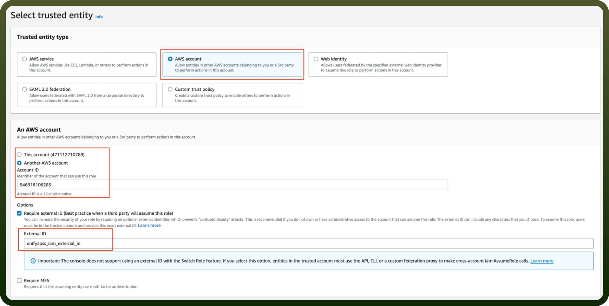
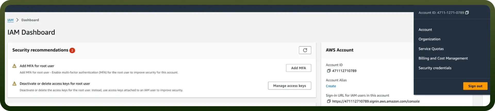

# Amazon Athena integration | connect with UnifyApps

Source: https://www.unifyapps.com/docs/unify-integrations/amazon-athena
Section: integrations

---

Amazon Athena is a serverless interactive query service that allows you to analyze data in Amazon S3 using standard SQL.

Integrating it with your application enhances data querying efficiency and provides powerful insights from your S3-stored data.

## Authentication

Before you begin, make sure you have the following information:

- `Connection Name`: Choose a meaningful name for your connection. This name helps you identify the connection within your application or integration settings. It could be something descriptive like "MyAppAmazonAthenaIntegration."
- `Authentication Type`: Select the type of authentication for connecting to your Amazon Athena account:
  - **IAM Role**
  - **Access Key**

### Access Key-Based Authentication

For **Access Key**-based authentication, you'll need to perform the following steps to generate access credentials:

1. **Login to the AWS Management Console**
  - Go to[AWS Console](https://console.aws.amazon.com/).
2. **Create a new user**
  - Search for `Users` in the top search bar of the AWS Console homepage.
  - Click `Create User` at the top right corner.
3. **Assign necessary permissions**
  - Attach the `AmazonAthenaFullAccess` and `AmazonS3ReadOnlyAccess` policies directly to the user. This ensures the user can query Athena and access the necessary S3 data.
4. **Create Access Key**
  - Once the user is created, click the username, navigate to the `Security credentials` section, and click the `Create access key`.
  - Use "`Command Line Interface`" as the **use case** for the access key.
  - Provide a description tag for the key and click `Create access key`.
5. **Store Access Credentials Securely**
  - Store the `Access Key` and `Secret Access Key` securely, as they will allow access to your Athena account.

    

### IAM Role-Based Authentication

For **IAM Role**-based authentication, follow these steps to set up an IAM role and grant the necessary permissions for Athena:

1. **Login to AWS Management Console**
  - Go to[AWS Console](https://console.aws.amazon.com/).
2. **Create an IAM Role**
  - Navigate to the IAM dashboard by searching `IAM` in the search bar.
  - Select `Roles` from the left-hand menu, and click on `Create role`.
3. **Trusted Entity**
  - Under the `Trusted entity type`, choose `AWS account`.
  - Select `Another AWS account` and input the `UnifyApps AWS account ID` (contact UnifyApps support to obtain this).
  - Check the `Require external ID` box and enter the `External ID` provided by UnifyApps.

    

4. **Assign Permissions to the Role**
  - Attach the `AmazonAthenaFullAccess` policy to the role. This will allow Athena queries.
  - Attach `AmazonS3ReadOnlyAccess` if the role needs to query data in S3.
5. **Configure the Role**
  - Provide a role name and description, and then click `Create role`.

### Create an IAM permissions policy

1. Go to the AWS Console and open the IAM console- [https://console.aws.amazon.com/iam](https://console.aws.amazon.com/iam)
2. Navigate to Access Management and select Policies.
3. Choose Create Policy.
4. Locate and choose the AWS service that UnifyApps will access.
5. Select the required permissions under the Actions field.
6. Define the resources that the role will have access to.
7. Continue clicking Next until you reach the Review policy page.
8. Provide a Name for the policy.
9. Click Create policy once done.

### Retrieve IAM Role ARN

To retrieve the **IAM Role ARN** for connecting Athena:

1. **Go to the AWS Console**
  - Open the **IAM** console:[IAM Console](https://console.aws.amazon.com/iam).
2. **Locate Role**
  - Navigate to `Roles` and search for the IAM role you created for Athena.

    

3. **Copy the ARN**
  - Select the role and copy the `Role ARN`. This ARN will be used to configure the connection in UnifyApps.

## Actions Supported

The following actions are supported in Amazon Athena:

| **Action** | **Description** |
|---|---|
| `Create Data Catalog` | Creates a new data catalogue in Amazon Athena. |
| `Create Work Group` | Creates a work group in Athena to manage queries and resources. |
| `Get Database` | Retrieves a database object from Amazon Athena. |
| `Get Query Result` | Fetches the results of a previously executed query. |
| `List Databases` | Lists all available databases in Athena. |
| `Start Query Execution` | Runs SQL queries against the data in Amazon S3. |
| `Stop Query Execution` | Stops an ongoing query execution in Amazon Athena. |
