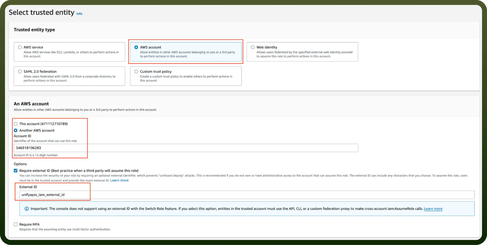

# Amazon Bedrock integration | connect with UnifyApps

Source: https://www.unifyapps.com/docs/unify-integrations/amazon-bedrock
Section: integrations

---

Using Amazon Bedrock makes it easier to build and deploy generative AI applications at scale. It allows you to access and integrate powerful foundation models from leading AI providers, customize them for specific use cases, and optimize your AI workloads with minimal effort. Amazon Bedrock ensures your AI applications are scalable, reliable, and secure with robust data privacy controls and AWS's enterprise-grade security features.

Connecting your application to Amazon Bedrock enables integration for cloud storage and various AWS functionalities.

## Authentication

Before you begin, make sure you have the following information:

- `Connection Name` **:** Choose a meaningful name for your connection. This name helps you identify the connection within your application or integration settings. It could be something descriptive like "MyAppAmazonBedrockIntegration".
- `Authentication Type` **:** Select the type of authentication for connecting to your Amazon Bedrock account:
  - Access Key
  - IAM Role

### Access Key Based Authentication

1. Login into Amazon AWS Console and search for “`Users`” in the search bar present at the top of the console’s home page.
2. Click on “`Create user`” at the top right corner.
3. Sign in to the AWS Management Console by going to the AWS Management ([https://console.aws.amazon.com/](https://console.aws.amazon.com/)).
4. Navigate to the IAM (Identity and Access Management) dashboard by searching in the "`IAM`" search bar.
5. Provide the username and select permissions(AmazonBedrockfullaccess) policies by selecting “`Attach policies directly`” and click on create user button.
6. Once the user is created, click on the username of the user created and under the summary section click on create access key.
7. Select “`Command Line Interface`” as the use case and provide the description tag to the key and click on “`create access key`”.
8. Treat the access key and secret access key with high confidentiality, as it allows access to your Amazon Bedrock account.

### IAM Role Based Authentication

1. Sign in to AWS Management Console ([https://console.aws.amazon.com/](https://console.aws.amazon.com/)) and select security credentials.
2. Navigate to the IAM dashboard and click "`Roles`" > "`Create role`". ([https://docs.aws.amazon.com/IAM/latest/UserGuide/id_roles.html](https://docs.aws.amazon.com/IAM/latest/UserGuide/id_roles.html))
3. Under "`Trusted entity type`", choose the AWS account option.
4. Select "`Another AWS account`" and input the UnifyApps AWS account ID (contact support to obtain this).
5. Check the "`Require external ID`" box and enter the External ID provided by UnifyApps.

  

6. Assign the necessary permissions for UnifyApps to operate automated workflows within your account.
7. Give the IAM role a name and description.
8. Click the "`Select trusted entities`" Edit button to modify trusted entity policies if needed. (Optional)
9. Click the "`Add permissions`" Edit button to adjust permissions. (Optional)
10. If using object tags, select an appropriate tag for the IAM role. (Optional)
11. Click on Create Role to finalize the process.

### Create an IAM permissions policy

1. Go to the AWS Console and open the IAM console- [https://console.aws.amazon.com/iam](https://console.aws.amazon.com/iam)
2. Navigate to Access management and select Policies.
3. Choose Create Policy.
4. Locate and choose the AWS service that UnifyApps will access.
5. Select the required permissions under the Actions field.
6. Define the resources that the role will have access to.
7. Continue clicking Next until you reach the Review policy page.
8. Provide a Name for the policy.
9. Click Create policy once done.

### Retrieve IAM role ARN

1. Open the AWS Console and go to My Security Credentials > Roles.
2. Search for the IAM role you need for the connection.
3. Select the role to view its details.
4. Copy the Role ARN for use in the UnifyApps connection setup.

## Actions

| **Action** | **Description** |
|---|---|
| `Analyse text` | Analyse text to answer user-provided questions in Amazon Bedrock |
| `Categorize text` | Classify text based on user-defined categories in Amazon Bedrock |
| `Draft email` | Generate an email based on user description in Amazon Bedrock |
| `Analyse text` | Generate or modify images using prompts or other images in AMazon Bedrock |
| `Generate text embedding` | Generates text embedding for the input text using Amazon Bedrock |
| `Send message` | Send a message to models in Amazon Bedrock |
| `Summarize text` | Get a summary of the input text in configurable length using Amazon Bedrock |
| `Translate text` | Translate text between languages using Amazon Bedrock |
