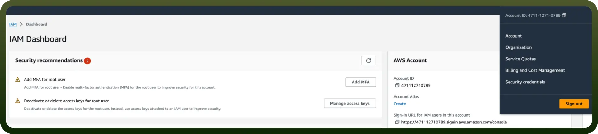

# Amazon KMS connector

Source: https://www.unifyapps.com/docs/unify-integrations/amazon-kms
Section: integrations

---

Amazon Key Management Service (KMS) is a managed service that enables you to easily create, control, and manage cryptographic keys used to encrypt data across AWS services. It integrates with AWS Identity and Access Management (IAM) to provide secure access and key management capabilities.

Integrating your application with Amazon Key Management Service (KMS) enhances security by using managed encryption keys for your data. Here are the steps you need to follow to ensure a smooth integration:

## Authentication

Before you begin, make sure you have the following information:

- `Connection Name`: Select a descriptive name for your connection, like "MyAppAmazonKMSIntegration". This helps in easily identifying the connection within your application or integration settings.
- `Authentication Type`: Select the type of authentication for connecting to your Amazon Kms account:
  - IAM Role
  - Access Key

### Access key-based Authentication

For Access Key-based authentication, you'll need to perform the following steps to generate access credentials:

1. Login to the AWS Management Console
  - Go to[AWS Console](https://console.aws.amazon.com/).
2. Create a new user
  - Search for Users in the top search bar of the AWS Console homepage.
  - Click `Create User` at the top right corner.
3. Assign necessary permissions
  - Attach the AWSKeyManagementServicePowerUser policy directly to the user. This ensures the user can query Kms.
4. Create Access Key
  - Once the user is created, click the username, navigate to the Security credentials section, and click the Create access key.
  - Use "`Command Line Interface`" as the use case for the access key.
  - Provide a description tag for the key and click Create access key.
5. Store Access Credentials Securely
  - Store the Access Key and Secret Access Key securely, as they will allow access to your Kms account.

### **IAM Role-Based Authentication**

For IAM Role-based authentication, follow these steps to set up an IAM role and grant the necessary permissions for Kms:

1. Login to AWS Management Console
  - Go to[AWS Console](https://console.aws.amazon.com/).
2. Create an IAM Role
  - Navigate to the IAM dashboard by searching IAM in the search bar.
  - Select `Roles` from the left-hand menu, and click on `Create role`.
3. Trusted Entity
  - Under the Trusted entity type, choose `AWS account`.
  - Select Another AWS account and input the UnifyApps AWS account ID (contact UnifyApps support to obtain this).
  - Check the Require external ID box and enter the External ID provided by UnifyApps.

    

4. Assign Permissions to the Role
  - Attach the AWSKeyManagementServicePowerUser policy to the role.
5. Configure the Role
  - Provide a role name and description, and then click `Create role`.

### **Create an IAM permissions policy**

1. Go to the `AWS Console` and open the `IAM console`- [https://console.aws.amazon.com/iam](https://console.aws.amazon.com/iam)
2. Navigate to `Access Management` and select `Policies`.
3. Choose `Create Policy`.
4. Locate and choose the AWS service that UnifyApps will access.
5. Select the required permissions under the Actions field.
6. Define the resources that the role will have access to.
7. Continue clicking Next until you reach the Review policy page.
8. Provide a Name for the policy.
9. Click Create policy once done.

### **Retrieve IAM Role ARN**

To retrieve the IAM Role ARN for connecting Athena:

1. Go to the AWS Console
2. Open the IAM console:[IAM Console](https://console.aws.amazon.com/iam).

  

3. Locate Role
  - Navigate to Roles and search for the IAM role you created for Athena.
4. Copy the ARN
  - Select the role and copy the Role ARN. This ARN will be used to configure the connection in UnifyApps.

## Actions

| Actions | Description |
|---|---|
| `Create key alias` | Creates an alias to identify key in Amazon KMS |
| `Create KMS Key` | Creates a key in Amazon KMS |
| `Decrypt data` | Decrypts ciphertext back into plaintext using a specified key in Amazon KMS |
| `Delete KMS alias` | Deletes a specific alias from Amazon KMS |
| `Describe KMS key` | Retrieves metadata about a specified key in Amazon KMS |
| `Encrypt data` | Encrypts plaintext into ciphertext using a specified key in Amazon KMS |
| `List KMS aliases` | Lists all aliases in the caller's AWS account and region associated with Amazon KMS |
| `List KMS keys` | Lists all customer master keys (CMKs) in the caller's AWS account and region in Amazon KMS |
| `Schedule key deletion` | Schedules the deletion of a specified customer master key (CMK) in Amazon KMS |
