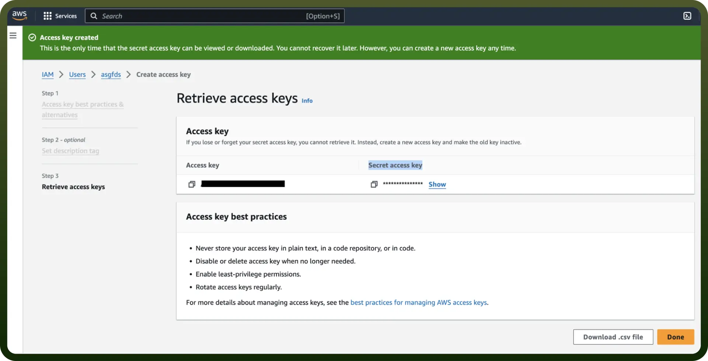

# Amazon Secrets Manager

Source: https://www.unifyapps.com/docs/unify-integrations/amazon-secrets-manager
Section: integrations

---

Amazon Secrets Manager is a service that securely stores, manages, and retrieves sensitive information like database credentials, API keys, and secrets. It helps automate secret rotation and access control to enhance security.

Integrating your application with Amazon Secrets Manager enables secure storage, management, and retrieval of credentials, API keys, and other secrets.

## Authentication

Before you begin, make sure you have the following information:

- `Connection Name`**:** Select a descriptive name for your connection, like "MyAppAmazonSecretsManagerIntegration". This helps in easily identifying the connection within your application or integration settings.
- `Authentication Type`**:** Amazon Secrets Manager supports Access Token Authentication and IAM Role based authentication.

### Access Key Based

- Login into Amazon AWS Console and search for “`Users`” in the search bar present at the top of the console’s home page.
- Click on “`Create user`” at the top right corner.
- Sign in to the AWS Management Console by going to the AWS Management Console ([https://console.aws.amazon.com/](https://console.aws.amazon.com/)).
- Navigate to the IAM (Identity and Access Management) dashboard by searching in the "`IAM`" search bar.
- Click on “`Create user`” button present at the top right corner of the page.
- Provide the username and select permissions (SecretsManagerReadWrite) policies by selecting “`Attach policies directly`” and click on create `user` button.
- Once the user is created, click on the username of the user created and under the summary section click on create access key.
- Select “`Command Line Interface`” as the use case and provide the description tag to the key and click on “create access key.”
- Treat the access key and secret access key with high confidentiality, as it allows access to your Secrets Manager account.

  

### IAM Role Based

1. Sign in to AWS Management Console ([https://console.aws.amazon.com/](https://console.aws.amazon.com/)) and select security credentials.
2. Navigate to the IAM dashboard and click "`Roles`" > "`Create role`". ([https://docs.aws.amazon.com/IAM/latest/UserGuide/id_roles.html](https://docs.aws.amazon.com/IAM/latest/UserGuide/id_roles.html))
3. Under "`Trusted entity type`," choose the AWS account option.
4. Select "`Another AWS account`" and input the UnifyApps AWS account ID (contact support to obtain this).
5. Check the "`Require external ID`" box and enter the External ID provided by UnifyApps.

  

6. Assign the necessary permissions for UnifyApps to operate automated workflows within your account.
7. Give the IAM role a name and description.
8. Click the "`Select trusted entities`" Edit button to modify trusted entity policies if needed. (Optional)
9. Click the "`Add permissions`" Edit button to adjust permissions. (Optional)
10. If using object tags, select an appropriate tag for the IAM role. (Optional)
11. Click on Create Role to finalize the process.

### Create an IAM Permissions Policy

1. Go to the AWS Console and open the IAM console ([https://console.aws.amazon.com/iam](https://console.aws.amazon.com/iam)).
2. Navigate to `Access management` and select `Policies`.
3. Choose `Create Policy`.
4. Locate and choose the AWS service that UnifyApps will access.
5. Select the required permissions under the Actions field.
6. Define the resources that the role will have access to.
7. Continue clicking Next until you reach the Review policy page.
8. Provide a Name for the policy.
9. Click `Create policy` once done.

### Retrieve IAM Role ARN

1. Open the AWS Console and go to `My Security Credentials` > `Roles`.
2. Search for the IAM role you need for the connection.

  

3. Select the role to view its details.
4. Copy the Role ARN for use in the UnifyApps connection setup.

## **Actions**

| Actions | Description |
|---|---|
| `Create secret` | Creates a new secret in Amazon Secrets Manager |
| `Delete secret` | Deletes a secret in Amazon Secrets Manager |
| `Describe secret` | Retrieves detailed information about a secret stored in Amazon Secrets Manager |
| `Get random password` | Fetches a randomly generated password in Amazon Secrets Manager |
| `Get resource policy` | Gets the resource policy in AWS Secrets Manager |
| `List secret versions` | Lists the versions of a secret in Amazon Secrets Manager |
| `List secrets` | Lists all secrets stored within the specified region in Amazon Secrets Manager |
| `List stored secrets` | Lists stored secrets in Amazon Secrets Manager |
| `Put secret value` | Stores a new secret value in an existing secret in Amazon Secrets Manager |
| `Retrieve secret value` | Retrieves the value of a secret stored in Amazon Secrets Manager |
| `Tag resource` | Tags a resource in AWS Secrets Manager |
| `Update secret` | Updates a secret in AWS Secrets Manager |
