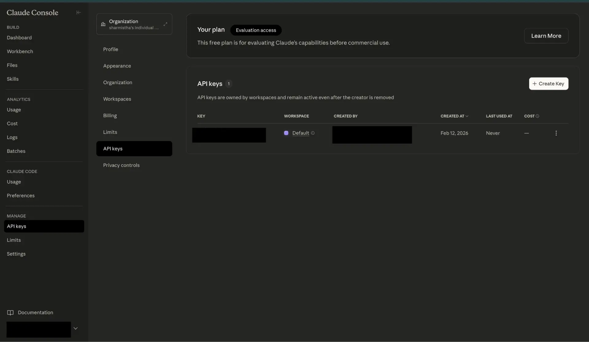

# Anthropic connector

Source: https://www.unifyapps.com/docs/unify-integrations/anthropic
Section: integrations

---

## Anthropic

Anthropic enables teams to integrate powerful AI capabilities using Claude models for text completion, chat, summarization, reasoning, and content generation. With a strong focus on safety, reliability, and enterprise readiness, Anthropic helps organizations build intelligent applications that enhance productivity, automate workflows, and deliver better user experiences through secure API-based integrations.

### Authentication

Integrating your application with Anthropic allows secure access to Claude models via API Key authentication. Before starting, ensure you have the following information from your Anthropic account:

`Connection Name`: Choose a meaningful name for your connection. This name helps you identify the connection within your application or integration settings. It could be something descriptive like “MyAppAnthropicIntegration”.

### API Token Based:

1. Go to[https://console.anthropic.com](https://console.anthropic.com)
2. Log in to your Anthropic account.
3. From the left menu, click on API Keys.
4. Click Create Key.
5. Provide a name for the key and click on Create Key.
6. Copy the generated API key.
7. Paste this API key into the connection setup in your platform.

### ACTIONS :

| **Action Name** | **Descriptions** |
|---|---|
| `Create Message` | Send a structured list of input messages with text and/or image content, and the model will generate the next message in the conversation. |
| `Create Message (Streaming)` | Send a structured list of input messages with text and/or image content, and the model will generate the next message in streaming. |
| `Download File` | Download a file from Anthropic's Files API |
| `List Models` | List available models |
