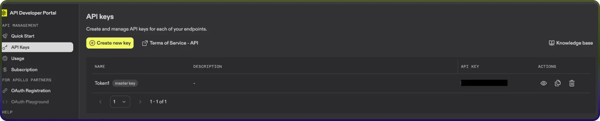

# Apollo AI connector

Source: https://www.unifyapps.com/docs/unify-integrations/apollo-ai
Section: integrations

---

# Apollo

Apollo empowers sales and revenue teams to supercharge prospecting and growth with AI-driven B2B data intelligence, delivering accurate contact and company insights at scale. Specializing in verified emails, phone numbers, and account data enriched with technographics and intent signals, Apollo streamlines outbound campaigns, automates personalized outreach, and accelerates pipeline velocity through secure, high-volume API integrations and intuitive workflows.

### Authentication :

Integrating your application with Apollo unlocks powerful B2B lead generation, enriched contact data, and automated sales engagement workflows. Before starting, ensure you have the following information:

`Connection Name`: Choose a meaningful name for your connection. This name helps you identify the connection within your application or integration settings. It could be something descriptive like “MyAppApolloIntegration”.

### API Token Based:

1. Log in to your Apollo.io account.
2. Navigate to the Admin settings and click on Integrations.
3. Open Apps and navigate to the API keys section.
4. Click on create new keys and provide a name for the token.
5. Copy the generated token for authentication purposes.

### **ACTIONS :**

| **Action Name** | **Descriptions** |
|---|---|
| `Bulk organization enrichment` | Enriches organization information in bulk. |
| `Bulk people enrichment` | Enriches people information in bulk. |
| `Check email stats` | Retrieves detailed stats for a specific outreach email in Apollo |
| `Create account` | Creates a new account in Apollo |
| `Create contact` | Creates a new contact in Apollo |
| `Create opportunity` | Creates a new opportunity in Apollo |
| `Create task` | Creates a new task in Apollo |
| `View an Account` | Retrieves details for a specific account in Apollo using its account ID |
| `View a contact` | Retrieve details of a contact from Apollo using the contact ID |
| `Get list of users` | Gets information for all of the users (teammates) in Apollo |
| `List account stages` | Retrieves the list of account stages available in Apollo account |
| `List all deals` | Retrieves all deals created in the Apollo account |
| `List contact stages` | Retrieves the list of contact stages available in Apollo account |
| `Organization enrichment` | Enriches a organization's information |
| `People enrichment` | Enriches a person’s information |
| `Search Accounts` | Searches for accounts in Apollo |
| `Search contacts` | Searches for contacts in Apollo |
| `Search for Calls` | Searches for calls made or received in Apollo |
| `Search outreach emails` | Searches outreach emails created or sent in Apollo |
| `Search organizations` | Searches for organizations in Apollo |
| `Search People` | Searches for people in Apollo |
| `Search Sequences` | Searched for sequences in Apollo |
| `Search tasks` | Searches for tasks in Apollo |
| `Update account` | Updates an account in Apollo |
| `Update contact` | Updates a contact in Apollo |
| `Update opportunity` | Updates an opportunity in Apollo |
