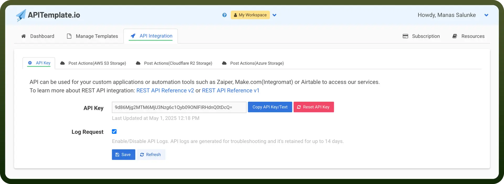

# Archive API

Source: https://www.unifyapps.com/docs/unify-integrations/archive-api
Section: integrations

---

Archive API enables automated compression and extraction of files through programmatic access. It supports ZIP operations via direct uploads or file URLs, streamlining file management at scale.

Facilitates efficient, code-driven file packaging and unpacking across systems without manual intervention.

## Authentication

Before you begin, make sure you have the following information:

- `Connection Name`: Select a descriptive name for your connection, like "MyAppArchiveAPIIntegration". This helps in easily identifying the connection within your application or integration settings.
- `Authentication Type`**:** Archive API supports API Key for authentication.

### API Key Based Authentication

1. Log in to your Archive API account.
2. Just after logging in, you will be directed to the page with the secret.
3. Copy that secret and store it securely to prevent unauthorized access.

  

## Actions

| Actions | Description |
|---|---|
| `Compress files` | Converts files into a ZIP archive |
| `Compress files` | Converts files into a ZIP archive |
| `Compress files using URLs` | Converts files into a ZIP archive using file URLs |
| `Extract archive` | Extracts files from a ZIP archive |
