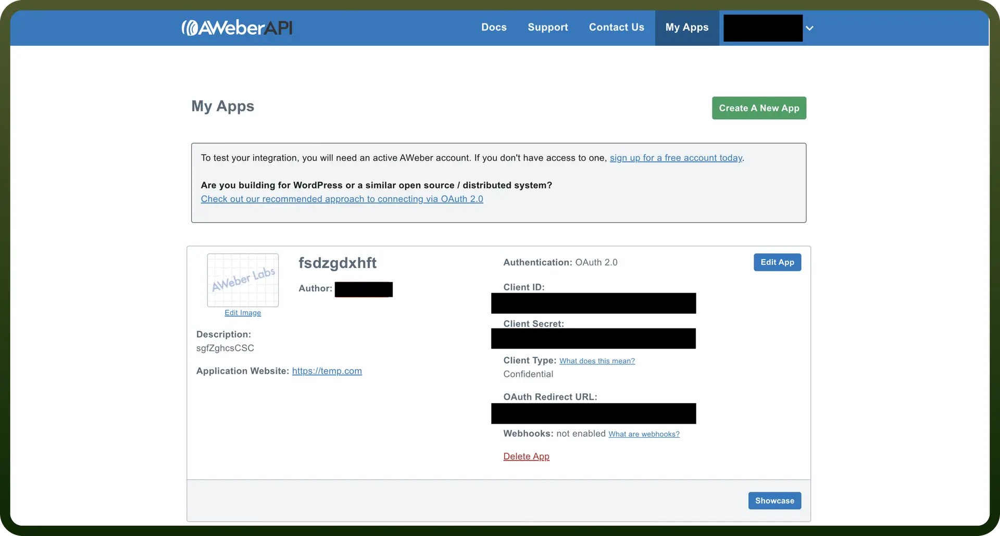

# AWeber connector

Source: https://www.unifyapps.com/docs/unify-integrations/aweber
Section: integrations

---

AWeber.com is a leading email marketing and automation platform, enabling businesses to design, send, and track email campaigns seamlessly. It provides tools for building subscriber lists, creating engaging email content, and analyzing campaign performance.

Connecting your application to AWeber enables seamless access to email marketing functionalities.

## Authentication

Before you begin, ensure you have the following:

- `Connection Name`**:** Choose a descriptive name for your connection. For example, "MyAppAWeberIntegration".
- `Authentication Type`**:** AWeber uses OAuth 2.0 for secure authentication.

### OAuth 2.0 Based Authentication

1. Log in to your AWeber Developer account at [https://auth.aweber.com](https://auth.aweber.com/).
2. Navigate to the `Apps` section in the developer portal and click `Create New App`.
3. Provide a name for your app and a description and specify the Redirect URI for your app. This is the URI where AWeber will send the authorization code after user consent.
4. After creating the app, you will receive:
  - Client ID
  - Client Secret
5. Treat these credentials as highly confidential, as they provide access to the AWeber API.

  

6. Implement the OAuth 2.0 flow in your application:
  - Redirect users to AWeber's authorization URL for consent.
  - Capture the authorization code from the redirect response.
  - Exchange the authorization code for an access token and refresh token using AWeber's token endpoint.
7. Use the access token in your API requests to authenticate and interact with AWeber resources.

## Actions

| Actions | Description |
|---|---|
| `Create Subscriber` | Creates a new subscriber in Aweber |
| `Fetch account Details` | Fetches account details in Aweber |
| `Find Lists` | Finds a list by name in Aweber |
| `Get Accounts` | Gets all accounts in Aweber |
| `Get Subscriber` | Finds a subscriber by email or name in Aweber |
| `Unsubscribe email` | Unsubscribes an email from a list in Aweber |
| `Update Subscriber` | Updates a subscriber in Aweber |

## Triggers

| Triggers | Description |
|---|---|
| `New Field` | Triggers when a new custom field is added to a list in Aweber |
| `New List` | Triggers when a new list is added to an account in Aweber |
| `New account` | Triggers when a new account is added in Aweber |
| `New subscriber` | Triggers when a new subscriber is added to a list in Aweber |
