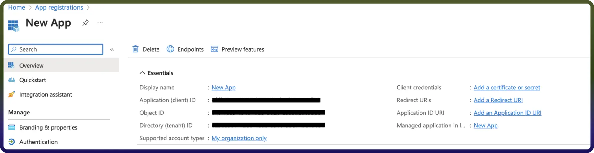

# Azure Blob connector

Source: https://www.unifyapps.com/docs/unify-integrations/azure-blob
Section: integrations

---

Azure Blob Storage enables teams and applications to store and manage unstructured data such as documents, images, videos, backups, and logs at massive scale within the Microsoft cloud. By integrating your application with Azure Blob Storage, you can securely upload, download, and organize data using containers and blobs, while supporting high availability and durable storage for enterprise workloads.

## Authentication :

Integrating your application with Azure Blob Storage enables efficient and scalable storage solutions for unstructured data, such as images, videos, and documents. Ensure you have the following information ready for a seamless integration process:

`Connection Name:` Choose a meaningful name for your connection. This helps you easily identify it within your application or integration settings.It could be something descriptive like "MyAppAzureBlobIntegration". 
`Authentication Type:` Azure Blob supports Client Credential Based Authentication method.

### Client credentials Based:

1. Login into the Microsoft Azure Portal by clicking [here](https://portal.azure.com/).
2. In the search Bar, search for App Registration and then Click on new Registration.
3. Provide the Name and supported account types and register your app.
4. The **Client ID** refers to the Application(client) ID
5. Click on “Add a credential or scope” to generate the **client secret.**
6. Use these credentials for further authentication purposes**.**

## Actions

| **Action Name** | **Description** |
|---|---|
| `Copy blob` | Copies a blob in Azure Blob |
| `Create container` | Creates a container to store blobs in Azure Blob |
| `Delete blob` | Deletes a blob in Azure Blob |
| `Download blob contents` | Downloads the contents of a blob from Azure Blob |
| `Get blob` | Retrieves a blob from Azure Blob |
| `Get blob properties` | Retrieves all properties of a blob, including metadata, from Azure Blob |
| `Get container properties` | Gets container properties in storage account from Azure Blob |
| `List blobs` | Lists blobs in a container in Azure Blob |
| `Upload blob` | Uploads a blob to Azure Blob |

## Triggers

| **Trigger Name** | **Description** |
|---|---|
| `On new event` | Triggers when  a new Azure Blob Storage event is received |
