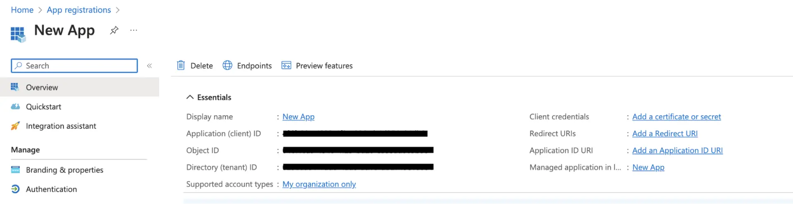

# Azure Bot connector

Source: https://www.unifyapps.com/docs/unify-integrations/azure-bot
Section: integrations

---

## **Azure Bot**

Azure Bot Service helps teams collaborate more effectively by enabling conversational experiences inside Microsoft Teams. By integrating your application with Azure Bot, you can automate conversations, streamline communication, share files, and trigger productivity-enhancing workflows all within teams. Azure Bot leverages Microsoft’s secure cloud infrastructure and integrates seamlessly with Azure Active Directory for authentication.

### **Authentication :**

Integrating your application with Azure Bot enables secure communication with Microsoft Teams and allows your app to interact with users through bots. Before starting, ensure you have the following information ready:

**Connection Name:** Choose a meaningful name for your connection. This helps you easily identify it   within your application or integration settings.It could be something descriptive like "MyAppAzureBotIntegration".

**Client credentials Based:**

- Login into the Microsoft Azure Portal by clicking [here](https://portal.azure.com/).
- In the search Bar, search for App Registration and then Click on new Registration.
- Provide the Name and supported account types and register your app.
- The **Client ID** refers to the Application(client) ID
- The **Tenant ID** refers to the Directory (Tenant) ID
- Click on “Add a credential or scope” to generate the **client secret.**
- Use these credentials for further authentication purposes**.**

### **Actions**

| **Action Name** | **Description** |
|---|---|
| **Get user access token via MS Teams SSO** | Retrieves user access token via MS Teams SSO |
| **Send message** | Send message |
| **Send typing activity** | Send typing activity by Azure Bot |

### **Triggers**

| **Trigger Name** | **Description** |
|---|---|
| **On invoke activity** | Triggers when an invoke event is received in Azure Bot |
| **On new message** | Triggers when a new message event is triggered in Azure Bot |
