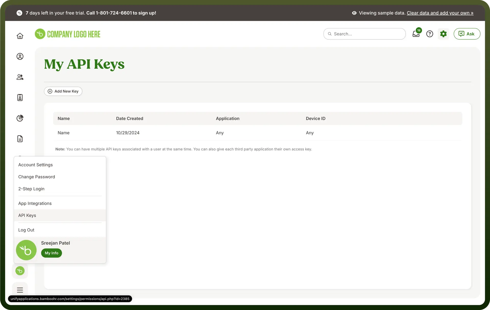
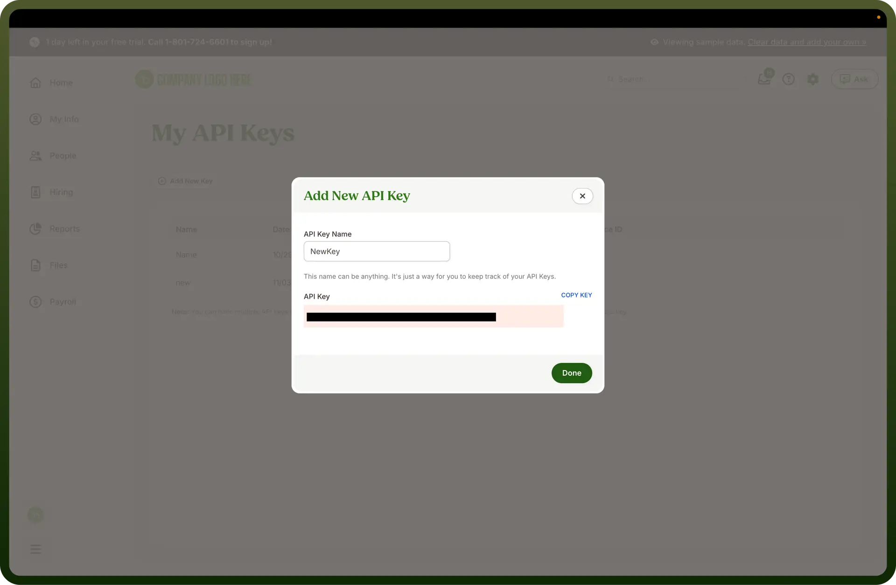

# BambooHR connector

Source: https://www.unifyapps.com/docs/unify-integrations/bamboohr
Section: integrations

---

BambooHR allows you to track hours worked, manage benefits enrollment, and run payroll all from a single platform.

Connecting your application to a BambooHR account enables integration of HR workflows, automation, and employee data management, enhancing productivity and ensuring all HR processes are kept organized and compliant.

## Authentication

Ensure you have the following information ready for a seamless integration process:

- `Connection Name`: Select a descriptive name for your connection, like "MyAppBambooHRIntegration". This helps in easily identifying the connection within your application or integration settings.
- `Authentication Type`: BambooHR supports API Token for authentication. This method ensures secure access to BambooHR’s functionalities and data.

### API Token Based Authentication

- To generate an API key, log into the account and navigate to the profile icon located in the bottom-left corner.

  

- Select the “`API Keys`” in the option. Click on “`Generate Key`” button to generate the new API key.

  

- Copy the generated API Key and use it to create a new connection.
- Treat this API Key with high confidentiality, as it allows access to your account.

## Actions

| **Actions** | **Description** |
|---|---|
| `Create employee` | Create a new employee in BambooHR |
| `Create/update time-off request status` | Adds or updates a time-off request in BambooHR |
| `Create custom employee report` | Create a custom employee report in BambooHR |
| `Create table record of employee` | Create table record of employee in BambooHR |
| `Delete table record` | Delete table record of employee in BambooHR |
| `Get Time Off Balances of an Employee` | Get Time Off Balances of an Employee |
| `Get Company employee report by ID` | Get company employee report by ID in BambooHR |
| `List employees in directory` | List employees in BambooHR |
| `List time off requests` | Lists all time-off requests occuring between two specific dates in BambooHR |
| `Change time-off request status` | Change the status of a time-off request in BambooHR |
| `Update table record of employee` | Update table record of employee in BambooHR |

## Triggers

| **Triggers** | **Description** |
|---|---|
| `New Employee (real-time)` | New Employee in BambooHR |
| `On employee created or updated` | Triggers when an employee is created or updated in BambooHR |
| `Schedule custom employee report` | Schedule custom employee report fetch from BambooHR |
