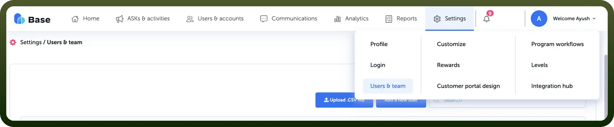
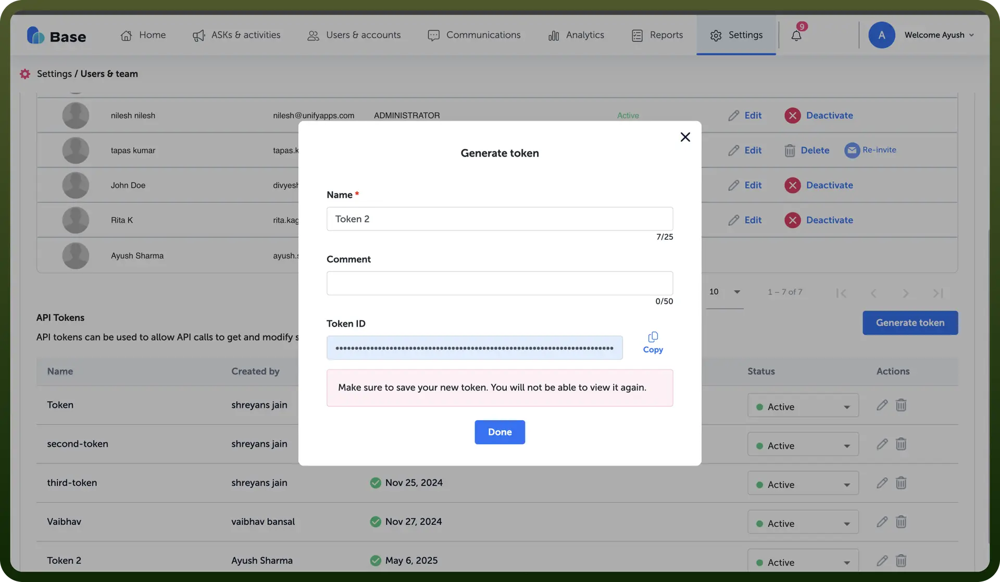

# Base AI Integration

Source: https://www.unifyapps.com/docs/unify-integrations/base-ai
Section: integrations

---

Base.ai is a customer-led growth platform that leverages AI to enhance post-sales engagement, advocacy, and revenue growth by unifying customer data and automating lifecycle marketing. Its all-in-one solution empowers B2B teams to scale customer references, drive upsells, and foster loyalty through personalized, data-driven interactions.

Integrating Base.ai helps B2B teams boost upsells, retention, and advocacy by automating personalized customer engagement using unified data.

## Authentication

Before you begin, make sure you have the following information:

- `Connection Name`: Select a descriptive name for your connection, like "MyAppBaseAiIntegration". This helps in easily identifying the connection within your application or integration settings.
- `Authentication Type`**:** Base.ai supports API tokens for authentication.

### API Token Based Authentication

1. Login to your [Base.ai](http://base.ai) account.
2. Navigate to the top right corner and click on "`Settings`" -> "`Uses & Team`"

  

3. Click on "`Generate token`"
4. Provide the details like "`Name`" and "`Comment`" and click on "`Generate token`"
5. Copy the token and store it securely to prevent unauthorized access.

  

## Actions

| Actions | Description |
|---|---|
| `Create a user` | Creates a user in Base AI |
| `Create advocate custom object attributes` | Creates a batch of advocate custom object attributes in Base AI |
| `Delete a user by email` | Deletes a user by email in Base AI |
| `Delete advocate custom object attributes` | Deletes a batch of advocate custom object attributes in Base AI |
| `Delete user by ID` | Deletes a user by ID in Base AI |
| `Grant points to advocate by API` | Grants points to advocate by API in Base AI |
| `Import contacts by contact ID` | Imports contacts by contact ID in Base AI |
| `Import contacts by email` | Imports contacts by email in Base AI |
| `List accounts` | Lists accounts in Base AI |
| `List advocates` | Lists advocates in Base AI |
| `List custom attributes` | Get list of all custom attributes from Base AI |
| `List custom object attributes` | Lists custom object attributes in Base AI |
| `List opportunities` | Lists opportunities in Base AI |
| `List users` | Lists users in Base AI |
| `Notify when advocate completes an ASK` | Notifies when an advocate completes an ASK in Base AI |
| `Read reference request form settings` | Reads reference request form settings in Base AI |
| `Read submitted reference requests` | Reads the submitted reference requests in Base AI |
| `Read submitted reference requests by UUID` | Reads the submitted reference requests by UUID in Base AI |
| `Read the reference advocates` | Reads the reference advocates in Base AI |
| `Submit a reference request in managed or p2p mode` | Submits a reference request in managed or p2p mode in Base AI |
| `Trigger user's activity` | Triggers user's activities in Base AI |
| `Update account custom attribute` | Updates account custom attribute in Base AI |
| `Update advocate custom attributes` | Updates advocate custom attributes in Base AI |
| `Update advocate custom object attributes` | Updates a batch of advocate custom object attributes in Base AI |
| `Upsert opportunity` | Insert/update opportunity’s native and custom attributes in Base AI |

## Triggers

| Triggers | Description |
|---|---|
| `New advocate` | Triggers when an advocate is created in Base AI |
| `New or updated account` | Triggers when an account is created or updated in Base AI |
| `New or updated opportunity` | Triggers when an opportunity is created or updated in Base AI |
| `New user` | Triggers when a user is created in Base AI |
