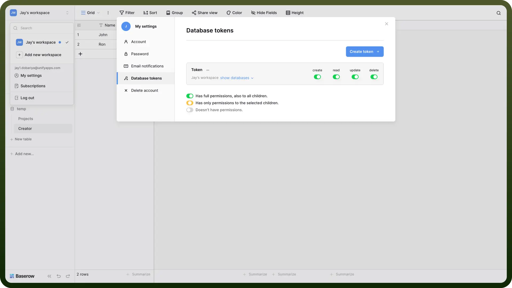

# Baserow connector

Source: https://www.unifyapps.com/docs/unify-integrations/baserow
Section: integrations

---

Baserow is an open-source no-code database platform that lets you build, manage and collaborate on structured data with ease. It offers flexible table views, real-time collaboration and powerful API integrations for custom workflows.

Integrating your application with Baserow allows you to manage databases efficiently, set permissions and authenticate API requests securely.

## Authentication

Before you begin, make sure you have the following information:

- `Connection Name`: Select a descriptive name for your connection, like "MyAppBaseIntegration". This helps in easily identifying the connection within your application or integration settings.
- `Authentication Type`**:** Baserow supports API tokens for authentication.

### API Token Based Authentication

- Go to your workspace -> `My Settings` -> `Database Tokens` → Click on '`Create Token`' : Go to your workspace -> '`My Settings`'-> '`Database Tokens`'-> '`Create Token`'.
- Assign permissions at the table level (eg. create, read, update, and delete).
- Retrieve Your Token and keep your token confidential to prevent unauthorized access.

  

## Actions

| Actions | Description |
|---|---|
| `Create row` | Creates a row in Baserow |
| `Delete row` | Deletes a row in Baserow |
| `Get row` | Gets a row in Baserow |
| `List rows` | Gets a list of rows from Baserow |
| `Update row` | Updates a row in Baserow |

## Triggers

| Triggers | Description |
|---|---|
| `Row created` | Triggers when a new row is created in Baserow |
| `Row deleted` | Triggers when a row is deleted in Baserow |
| `Row updated` | Triggers when a row is updated in Baserow |
