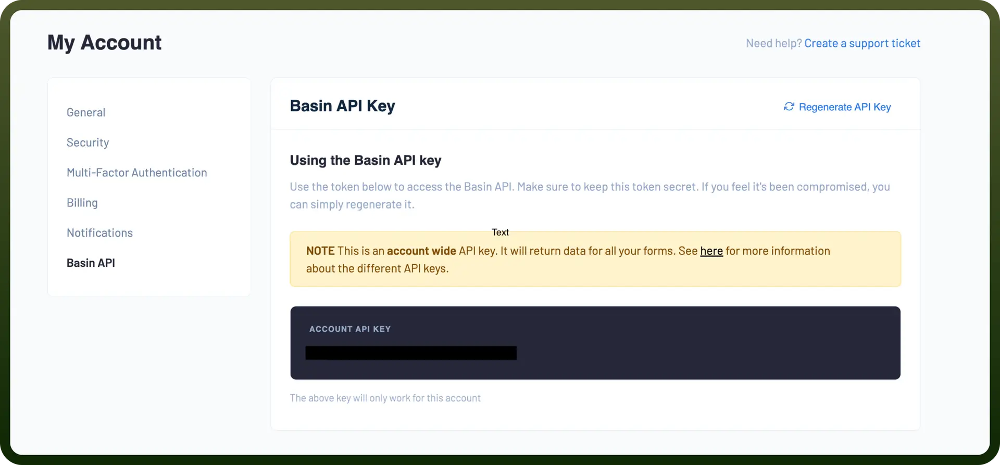

# Basin

Source: https://www.unifyapps.com/docs/unify-integrations/basin
Section: integrations

---

**Basin** is a no-code backend tool designed to handle form submissions, automation, and workflows without server setup. It supports developers and marketers by simplifying form management across websites.

Integrating basin helps seamlessly capture, manage, and route form data without writing backend code, boosting speed and scalability for web projects.

## Authentication

Before you begin, make sure you have the following information:

- `Connection Name`: Select a descriptive name for your connection, like "MyAppBasinIntegration". This helps in easily identifying the connection within your application or integration settings.
- `Authentication Type`**:** Basin supports API Key authentication.

### API Key Based Authentication

- Log into your Basin account.
- Navigate to the "`My Account`" section and then go to the "`Basin API`" tab to locate your API key.
- Copy and securely store this to prevent unauthorised access.

## Actions Supported

| **Actions** | **Description** |
|---|---|
| `Create form` | Creates a new form in Basin |
| `Create project` | Creates a new project in Basin |
| `Delete form` | Deletes a form in Basin |
| `Delete project` | Deletes a project in Basin |
| `Delete submission` | Deletes a submission in Basin |
| `Get form` | Gets a form in Basin |
| `Get project` | Gets a project in Basin |
| `Get submission` | Gets a submission in Basin |
| `Update form` | Updates a form in Basin |
| `Update project` | Updates a project in Basin |
| `Update submission` | Updates a submission in Basin |

## Triggers Supported

| Triggers | Description |
|---|---|
| `New submission` | Triggers when a new submission is received for a form in Basin. |
