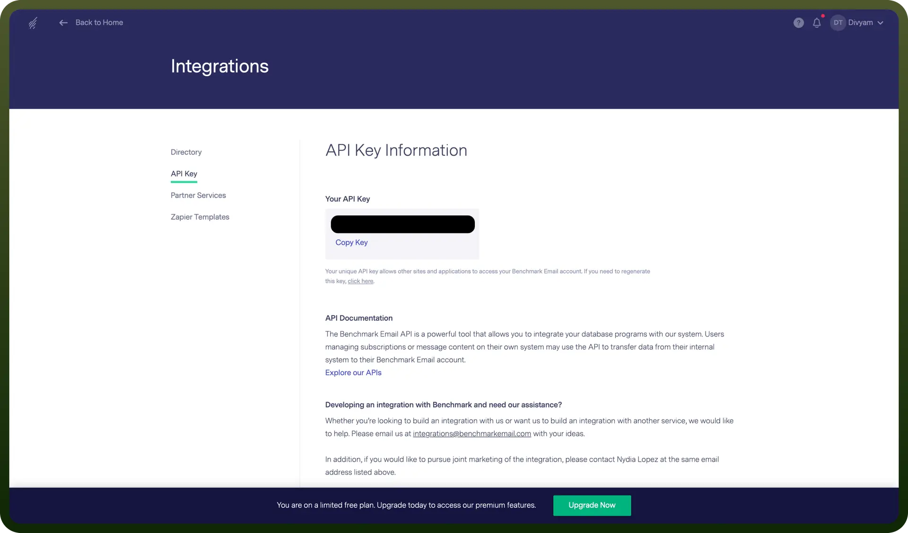

# Benchmark Email integration | connect with UnifyApps

Source: https://www.unifyapps.com/docs/unify-integrations/benchmark-email
Section: integrations

---

Benchmark Email is an email marketing platform that helps businesses create, automate, and analyze email campaigns with ease. It offers drag-and-drop editing, automation tools, and detailed analytics for optimizing engagement.

Integrating Benchmark Email with your application enhances email marketing, audience management, and overall campaign effectiveness.

### Authentication

Before integrating Benchmark Email, ensure you have the following information:

- `Connection Name`**:** Choose a descriptive name for your Benchmark Email connection to help identify it within your application or integration settings. A meaningful name, like "MyAppBenchmarkIntegration," helps maintain organization, especially when managing multiple integrations.
- `Authentication Type`**:** Benchmark Email provides you with API Key type of authentication.

### API Key Authentication

1. Log in to your Benchmark Email account.
2. Navigate to the Integrations page after clicking on your profile.
3. Locate the "`API Key`" tab.
4. Copy the API key and paste it here.

  

## Actions

| Actions | Description |
|---|---|
| `Add contact` | Adds a contact to a specific list in your account in Benchmark Email. |
| `Remove contact` | Removes a contact from the specified list in Benchmark Email. |
| `Update contact` | Updates a contact in a specific list in your account in Benchmark Email. |

## Triggers

| Triggers | Description |
|---|---|
| `Contact created` | Triggers when a new contact is added in a list in Benchmark Email. |
| `List added polling` | This trigger checks if a new list is added in Benchmark Email. |
| `Segment contact added polling` | This trigger checks if a new contact is added to a segment in your account in Benchmark Email. |
