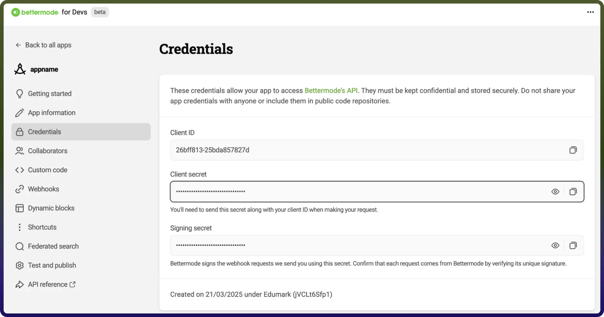

# Bettermode connector

Source: https://www.unifyapps.com/docs/unify-integrations/bettermode
Section: integrations

---

Integrating your application with Better Mode enhances intelligent automation by enabling smarter responses, improved contextual understanding, and more accurate task execution within a unified environment. Better Mode empowers teams to streamline complex workflows, optimize decision-making, and deliver more reliable AI-driven outcomes by combining enhanced reasoning, adaptive processing, and seamless system integration in one powerful interface.

## Authentication:

Integrating your application with **Bettermode** enables intelligent automation, enhanced contextual processing, and dynamic workflow optimization across your systems. Before you begin, ensure you have the following information:

`Connection Name` : Choose a meaningful name for your connection. This name helps you identify the connection within your application or integration settings. It could be something descriptive like "MyAppBettermodeIntegration".

### OAuth Based Authentication:

1. Bettermode Community Admin Access: To create an app, you must be an administrator of at least one Bettermode community.
2. Create a Bettermode App:

| **Action Name** | **Description** |
|---|---|
| `Add member to space` | Adds a selection of members to a space in Bettermode |
| `Assign badge` | Assigns a badge to a member of the community in Bettermode |
| `Create member` | Creates member in Bettermode |
| `Create post` | Creates a new post in a space in Bettermode |
| `Create space` | Creates a new space within a network in Bettermode |
| `Delete member` | Deletes member from Bettermode |
| `Get member` | Retrieves member from Bettermode |
| `Revoke badge` | Revokes a badge from a member of the community in Bettermode |
| `Search members` | Searches members in Bettermode |
| `Update member` | Updates member in Bettermode |
