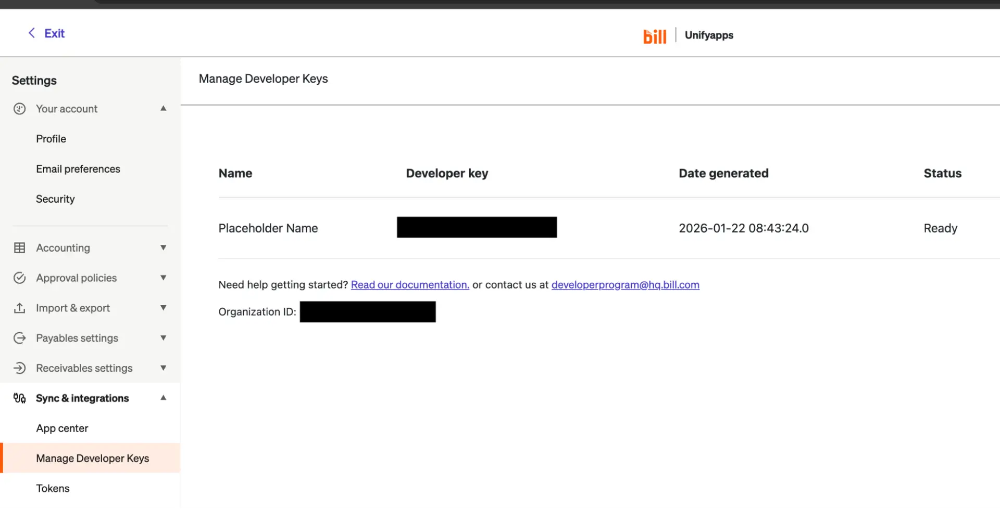

# Bill connector

Source: https://www.unifyapps.com/docs/unify-integrations/bill
Section: integrations

---

# Bill

Integrating your application with Bill enables seamless financial automation, bill payments, and expense management. Bill’s API allows you to create, approve, schedule, and track bills and payments programmatically, streamlining accounts payable and receivable workflows. With powerful approval workflows, real-time payment status, and automated reconciliation, Bill enhances operational efficiency while ensuring accuracy, compliance, and financial visibility across teams.

### **Authentication:**

Integrating your application with Bill unlocks automated financial operations, simplified payment processing, and efficient approval management. Before you begin, ensure you have the following information:

`Connection Name` : Choose a meaningful name for your connection. This name helps you identify the connection within your application or integration settings. It could be something descriptive like "MyAppBillIntegration".

`Sandbox environment`: Select the environment of your Bill account.

`Username`: Enter your Bill account login email address as the username.

`Authentication Type` : Select the type of authentication for connecting to your Bill account:

- API Token
- Password

### API Token based :

1. Log in to your Bill account and go to Settings.
2. Navigate to **Sync & Integrations** and click **Manage Developer Keys**.
3. Click **Generate Developer Key** and securely save the generated key, this will be used as your Developer key.
4. Note the Organization ID displayed below the generated developer key.
5. Click the **Tokens** section below Manage Developer Keys.
6. Click New to create a new sync token.
7. Enter a name (use your login email address) and click Save.
8. Copy and securely store the generated token for authentication purposes.

### Password Based :

1. Log in to your Bill account and go to Settings.
2. Navigate to **Sync & Integrations** and click **Manage Developer Keys**.
3. Click **Generate Developer Key** and securely save the generated key, this will be used as your Developer key.
4. Note the Organization ID displayed below the generated developer key.
5. Use your login password as the password.
6. Use these credentials for authentication purposes.

### ACTIONS **:**

| **Action Name** | **Description** |
|---|---|
| `Create a bill` | Creates a bill in Bill |
| `Create invoice` | Creates an invoice in Bill |
| `Create multiple bills` | Creates multiple bills in Bill |
| `Create multiple vendors` | Creates multiple vendors in Bill |
| `Create vendor` | Creates a vendor in Bill |
| `Download bill attachment` | Downloads a bill attachment from Bill |
| `Get bill` | Retrieves a bill from Bill |
| `Get bill attachment` | Retrieves a bill attachment from Bill |
| `Get invoice` | Retrieves an invoice from Bill |
| `Get payment details` | Retrieves payment details from Bill |
| `Get vendor` | Retrieves a vendor from Bill |
| `List bill` | Retrieves all the bills from Bill |
| `List invoices` | Retrieves all the invoices from Bill |
| `List vendors` | Retrieves all the vendors from Bill |
| `Replace bill` | Replaces a bill in Bill |
| `Replace invoice` | Replaces an invoice in Bill |
| `Send invoice` | Sends an invoice in Bill |
| `Update bills` | Updates a bill in Bill |
| `Update invoice` | Updates an invoice in Bill |
| `Update vendor` | Updates a vendor in Bill |

### TRIGGERS :

| **Trigger Name** | **Description** |
|---|---|
| **New approved bill** | Triggers when a new bill is approved in Bill |
| **On new payment** | Triggers when a new payment is made in Bill |
