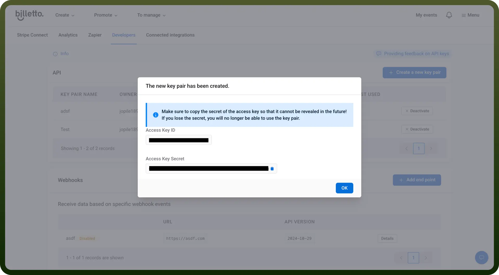

# Billetto connector

Source: https://www.unifyapps.com/docs/unify-integrations/billetto
Section: integrations

---

**Billetto** is a self-service event ticketing platform that enables organizers to set up events, sell tickets, and manage attendees online. It provides tools for event promotion, real-time analytics, and access control.

Integrating Billetto simplifies event data handling by syncing attendee, order, and event updates with your internal systems or automation workflows.

## Authentication

Before you begin, make sure you have the following information:

- `Connection Name`: Select a descriptive name for your connection, like "MyAppBillettoIntegration". This helps in easily identifying the connection within your application or integration settings.
- `Authentication Type`**:** Select the type of authentication for connecting to your Billetto account.
  - API Key
  - OAuth

### API Key Based Authentication

- Login to your Billetto account.
- Navigate to `Menu` -> `Integrate` -> `Developers`.
- Click on Create a new key pair to generate.
- Copy the API key and store it securely to prevent unauthorized access.

> **Note:** In the Redirect URL section paste the following link [https://webhooks-global.ext-alb.qa.unifyapps.com/api/connector-auth-callback/oauth](https://webhooks-global.ext-alb.qa.unifyapps.com/api/connector-auth-callback/oauth).

### OAuth Based Authentication

- Mail your details like application name and redirect url to the support system of Billetto at `support@billetto.com` and they will provide you the client id and client secret for your application.
- After getting the details, you can authorize the connection by providing client id, client secret, api key and api secret.
- Use Api token as Api Keypair and access token as Bearer token, both in the headers in order to register the webhook.

## Actions

| Actions | Description |
|---|---|
| `List attendees` | Lists attendees in Billetto |
| `List events` | Lists events in Billetto |
| `List events` | Lists events in Billetto (duplicate) |
| `List orders` | Lists orders in Billetto |
| `Retrieve attendee` | Retrieves attendee in Billetto |
| `Retrieve event` | Retrieves event in Billetto |
| `Retrieve orders` | Retrieves order in Billetto |

## Triggers

| Triggers | Description |
|---|---|
| `Attendee cancelled` | Triggers when an attendee is cancelled in Billetto. |
| `Attendee generated` | Triggers when an attendee is generated in Billetto. |
| `Attendee registered` | Triggers when an attendee is registered in Billetto. |
| `Attendee scanned` | Triggers when an attendee is scanned in Billetto. |
| `Attendee updated` | Triggers when an attendee is updated in Billetto. |
| `Event cancelled` | Triggers when an event is cancelled in Billetto. |
| `Event completed` | Triggers when an event is completed in Billetto. |
| `Event created` | Triggers when a new event is created in Billetto. |
| `Event published` | Triggers when a new event is published in Billetto. |
| `Event unpublished` | Triggers when a new event is unpublished in Billetto. |
| `Event updated` | Triggers when an event is updated in Billetto. |
