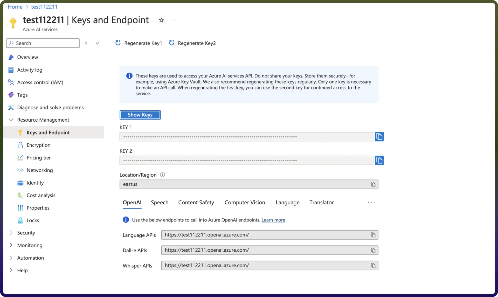

# Bing search connector

Source: https://www.unifyapps.com/docs/unify-integrations/bing-search
Section: integrations

---

Integrating your application with **Bing Search** transforms your data strategy by centralizing massive web, image, and video datasets into a high-performance, unified API. Bing Search enables teams to execute complex analytical queries in seconds, leverage real-time web grounding for AI models, and drive actionable insights—all while maintaining enterprise-grade security and seamless scalability across the Microsoft Azure ecosystem.

### **Authentication:**

Integrating your application with **Bing Search** enables automated real-time web research, factual grounding, and dynamic information retrieval workflows. Leveraging the Microsoft Azure ecosystem, this integration allows teams to execute complex queries and pull high-quality web data to power AI-driven insights and RAG applications.

- `Connection Name`: Choose a name that uniquely identifies this connection within your application or settings, like "MyBingsearchConnection". This is crucial for managing multiple connections or integrations.
- `Service Endpoint:` This is the endpoint URL where your AI services are hosted
- `Ocp-Apim-Subscription-Key`: This subscription key provides access to your Azure AI services.

##### **1. Create a Bing Search Resource in Azure**

To start, you must have an active Azure subscription to create your search resource and receive your keys.

1. Sign in to the[Azure Portal](https://www.google.com/search?q=https://portal.azure.com).
2. Click `"Create a resource"` and search for **"Bing Search"**.
3. Select `"Bing Search v7"`, choose your pricing tier (such as the Free F0 or Standard S1), and click `Create`.

##### **2. Retrieve Your Access Credentials**

Once the resource is deployed, you can access your unique security keys.

1. Navigate to your new Bing Search resource.
2. In the left-hand menu under **Resource Management**, select **"Keys and Endpoint"**.

  

3. Copy either **Key 1** or **Key 2**. These serve as your Ocp-Apim-Subscription-Key for all API calls

##### **3. Transition to AI Grounding (2026 Update)**

As of 2026, Microsoft is retiring the standalone Bing Search APIs in favor of **Azure AI Foundry**.

- `Retirement Date`**:** August 11, 2026.
- `New Workflow` :Teams are encouraged to transition to "Grounding with Bing Search" within the Azure AI ecosystem for more advanced RAG capabilities.

## Actions  :

| **Action Name** | **Description** |
|---|---|
| `Entity search` | Perform an entity search in Bing Search |
| `Image search` | Perform an image search in Bing Search |
| `News search` | Perform a news search in Bing Search |
| `Trending image search` | Perform a trending image search in Bing Search |
| `Trending news search` | Perform a trending news search in Bing Search |
| `Trending video search` | Perform a trending video search in Bing Search |
| `Video search` | Perform a video search in Bing Search |
| `Visual search` | Perform a visual search in Bing Search |
| `Web search` | Perform a web search in Bing Search |
