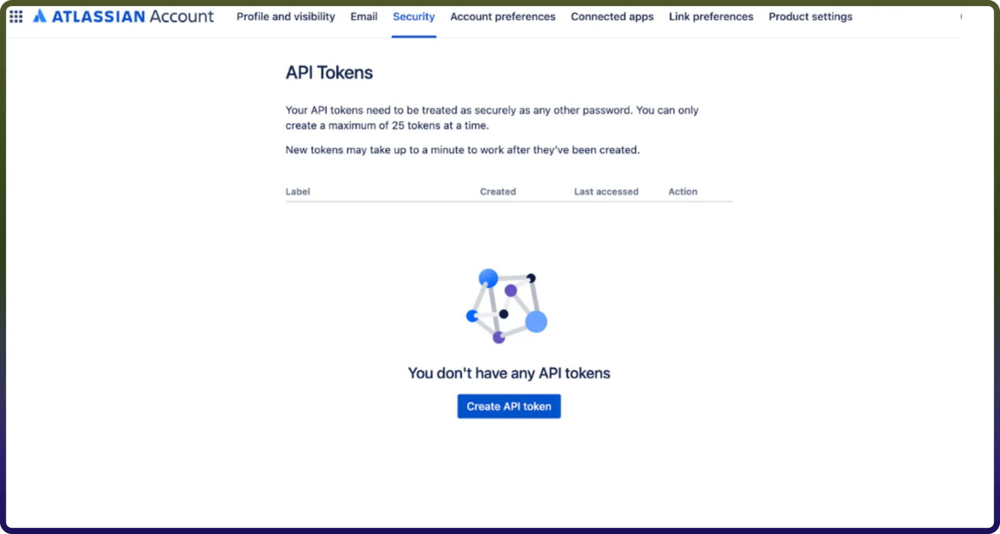

# Bitbucket connector

Source: https://www.unifyapps.com/docs/unify-integrations/bitbucket
Section: integrations

---

Bitbucket is a Git-based source code management solution designed for teams to collaborate on code, manage repositories, and streamline development workflows. Bitbucket Server provides secure, self-hosted infrastructure and powerful REST APIs that enable seamless integration with external systems for automation, reporting, and DevOps processes.

## Authentication

Integrating your application with Bitbucket Server enables secure access to repositories, projects, users, and other resources through Bitbucket REST APIs. 
 Before starting, ensure you have the following information:

- `Connection Name` **:** Choose a meaningful name for your connection. This name helps identify the connection within your application or integration settings, such as MyAppBitBucketIntegration.
- `Hostname`**:** Enter the hostname of your Bitbucket server. For example, if the url in the browser is http://host:port/context/rest/api-name/api-version, the host name would be http://host:port.
- `Authentication Type`**:** Select the authentication method you want to use. Supported authentication types:
- API Token
- Basic Authentication

### API Token Based:

1. Log in to your Atlassian account.
2. Navigate to the API token management page [https://id.atlassian.com/manage/api-tokens](https://id.atlassian.com/manage/api-tokens)
3. In the API token section, click on create API token. Ensure to keep this key secure as it grants access to Bitbucket's services and is billed based on usage.

  

### Basic Authentication:

1. Log in to your Bitbucket Server.
2. Use your Bitbucket **username** in the Username field.
3. Use your Bitbucket **account password** in the Password field.

## **ACTIONS :**

| **Action Name** | **Description** |
|---|---|
| `Add pull request comment` | Adds a comment to a pull request in Bitbucket |
| `Create pull request` | Creates a pull request in a repository in Bitbucket |
| `Delete pull request` | Deletes a pull request by ID in a repository in Bitbucket |
| `Get file content` | Gets file content in a repository in Bitbucket |
| `Get pull request` | Gets a pull request by ID in a repository in Bitbucket |
| `Get pull request comment` | Gets a comment by ID in a pull request in Bitbucket |
| `Get raw content of a file` | Gets raw content of a file in a repository in Bitbucket |
| `List files` | Lists files in a repository in Bitbucket |
| `List files in a path` | Lists files in a path in Bitbucket |
| `List global users` | Lists users with global permission in Bitbucket |
| `List project users` | Lists users with permission to a project in Bitbucket |
| `List projects` | Lists projects in Bitbucket |
| `List pull requests` | Lists pull requests in a repository in Bitbucket |
| `List repositories` | Lists repositories in a project in Bitbucket |
| `List repository users` | Lists users with permission to a repository in Bitbucket |
| **Update pull request** | Updates a pull request by ID in a repository in Bitbucket |
| **Update pull request comment** | Updates a comment by ID on a pull request in Bitbucket |
