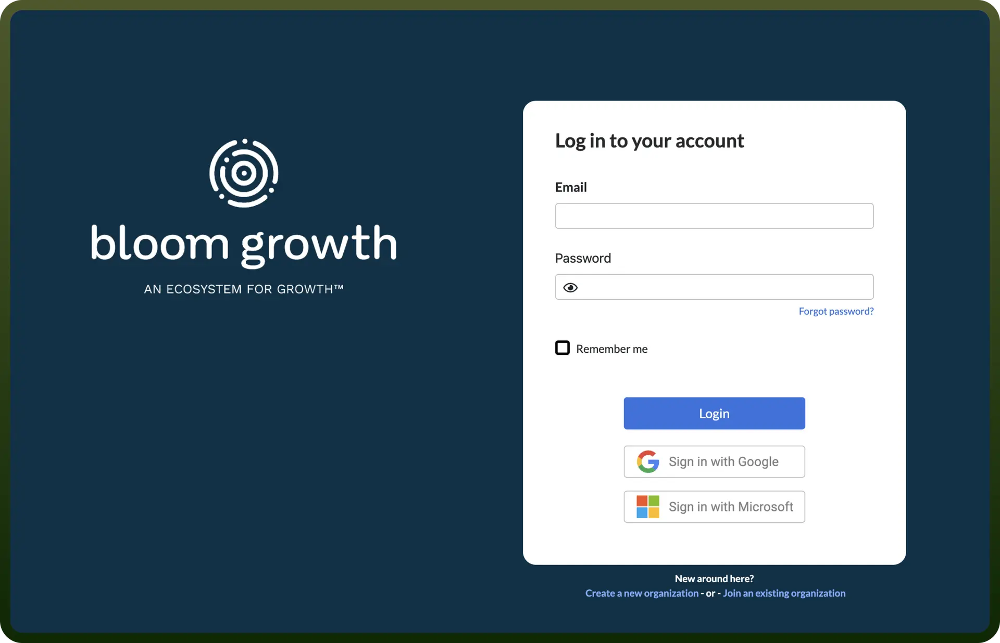

# Bloom Growth integration

Source: https://www.unifyapps.com/docs/unify-integrations/bloom-growth
Section: integrations

---

Bloom Growth is a business management and team accountability software that helps organizations set goals, track progress, and improve meetings. It offers tools for strategic planning, task management, and team collaboration.

Integrating Bloom Growth enhances team accountability, streamlines goal tracking, and improves meeting efficiency for better business outcomes.

## Authentication

Before you begin, make sure you have the following information:

- `Connection Name`**:** Choose a descriptive name for your connection, such as "MyAppBloomGrowthIntegration".
- `Authentication Type`**:** Bloom Growth uses a username-password authentication flow.

### Username Password Based Authentication

- Go to the [Bloom Growth Signup Page](https://www.bloomgrowth.com/signup).
- Use your email address as your username during registration.

  

## Actions

| Actions | Description |
|---|---|
| `Create a personal to-do` | Creates a personal to-do in Bloom Growth. |
| `Create issue` | Creates an issue in Bloom Growth. |
| `Get current week` | Gets the current week number from Bloom Growth. |
| `Update current metric` | Updates the metric for the current week in Bloom Growth. |
| `Update goal` | Updates a goal's data in Bloom Growth. |
| `Update metric` | Updates a metric in Bloom Growth. |
| `Update metric` | Updates a metric's value in Bloom Growth. |
| `Update to-do` | Updates a to-do in Bloom Growth. |
| `Update to-do completion` | Updates a to-do's completion status in Bloom Growth. |
