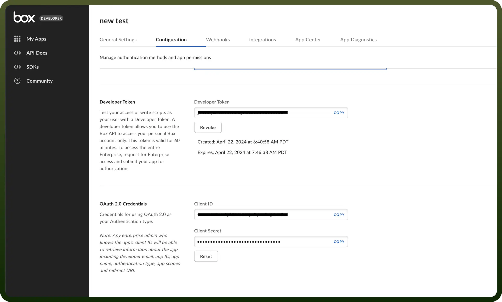

# Box connector

Source: https://www.unifyapps.com/docs/unify-integrations/box
Section: integrations

---

**Box** is a cloud-based content management and collaboration platform that enables secure file storage, sharing, and workflow automation. It offers enterprise-grade security, compliance, and integrations with various business applications.

Integrating with **Box** enhances secure file storage, seamless collaboration, and workflow automation within your application.

## Authentication

Before you begin, make sure you have the following information:

- `Connection Name`: Select a descriptive name for your connection, like "MyAppBoxIntegration". This helps in easily identifying the connection within your application or integration settings.
- `Authentication Type`**:** Box supports OAuth 2.0 for authentication. This method ensures secure access to Box’s functionalities and data.

### OAuth 2.0 Authentication

- Login into https://app.box.com/developers/console or create a new account if you don’t have existing account.
- In the My apps Section, Click on “`Create New App`” and create a custom App
- Provide the name and Purpose to the app and click on Next button.
- Select the authentication method(use OAuth 2.0) and click on “`Create App`”
- Once the app is created, Navigate to the configuration tab and within OAuth 2.0 Credential section, you’ll find the Client ID and Client Secret required for the authentication.

  

## Actions Supported

| **Actions** | **Description** |
|---|---|
| `Add comment to file` | Adds a comment to a file in Box |
| `Add comment to file` | Gets file comments from Box |
| `Cancel sign request` | Cancels a sign request in Box |
| `Copy a file or folder` | Copies a file or folder in Box |
| `Create collaboration` | Creates collaboration in Box |
| `Create file metadata` | Creates metadata in a file in Box |
| `Create file shared link` | Creates a shared link for a file in Box |
| `Create folder` | Creates a new folder in Box |
| `Create folder shared link` | Creates a shared link for a folder in Box |
| `Create sign request` | Creates a sign request in Box |
| `Delete file metadata` | Deletes metadata in a file in Box |
| `Delete file or folder` | Deletes a file or folder in Box |
| `Download file` | Downloads a file from Box |
| `Get download URL` | Gets the download URL of a file from Box |
| `Get sign request` | Gets a sign request from Box |
| `List folder items` | Gets files and folders in a specific folder in Box |
| `List sign requests` | Gets sign requests from Box |
| `Rename or move a file or folder` | Renames or moves a file or folder in Box |
| `Resend sign request` | Resends a sign request in Box |
| `Search files or folders` | Searches for files and folders in Box |
| `Update file metadata` | Updates metadata in a file in Box |
| `Upload a file using content or URL` | Uploads a file to Box |

## Triggers Supported

| **Triggers** | **Description** |
|---|---|
| `Box File Updates Polling` | Triggers when a file updates in a specific folder in Box |
| `Box Folder Updates Polling` | Triggers when a folder is updated in a specific folder in Box |
| `Box Metadata Update Polling` | Triggers when metadata is updated in a specific folder in Box |
| `Box Sign Event Update Polling` | Triggers when a sign event updates in a specific folder in Box |
| `On New File/Folder Event in a Specific Folder in Box` | Triggers when a new file/folder is created in a specific folder in Box |
