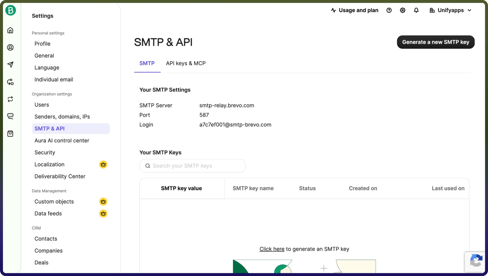

# Brevo connector

Source: https://www.unifyapps.com/docs/unify-integrations/brevo
Section: integrations

---

Integrating your application with Brevo enhances customer communication and marketing automation by enabling you to manage email campaigns, transactional messaging, and contact data within a single platform. Brevo provides APIs to handle email delivery, SMS campaigns, and audience segmentation efficiently, helping businesses engage customers effectively and streamline their communication workflows.

## Authentication:

Connecting your application to Brevo streamlines customer engagement through automated email and SMS campaigns, contact management, and real-time communication tracking. Before you begin, ensure you have the following information:

`Connection Name :` Choose a meaningful name for your connection. This name helps you identify the connection within your application or integration settings. It could be something descriptive like "MyAppBrevoIntegration".

### API Token Based:

1. Log in to your Brevo account.
2. Click on your profile icon in the top-right corner.
3. Navigate to SMTP & API.
4. Click on Generate a new API key, provide a name, and click Generate.
5. Copy the generated API key and use it for further authentication purposes.

## Actions

| **Action Name** | **Description** |
|---|---|
| `Check permission` | Check permissions of a user in Brevo |
| `Create company` | Creates a company in Brevo |
| `Create contact` | Creates a contact in Brevo |
| `Create new sender` | Creates a new sender in Brevo |
| `Delete company` | Delete company in Brevo |
| `Delete contact` | Delete contact in Brevo |
| `Delete sender` | Delete sender in Brevo |
| `Get all contact` | Gets a contact in Brevo |
| `Get all companies` | Gets all companies in Brevo |
| `Get company` | Get company in Brevo |
| `Get contact details` | Gets contact details in Brevo |
| `List all senders` | Gets list of senders in Brevo |
| `List users` | Lists users in Brevo |
| `Update company` | Updates company in Brevo |
| `Update contact` | Updates contact in Brevo |
| `Update sender` | Updates sender in Brevo |
