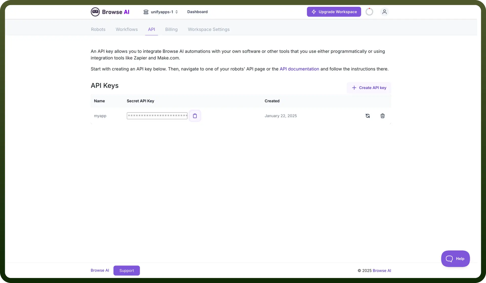

# Browse AI connector

Source: https://www.unifyapps.com/docs/unify-integrations/browse-ai
Section: integrations

---

Browse AI is a no-code web automation tool that allows users to extract and monitor data from websites effortlessly. It enables automated web scraping, data collection, and tracking without requiring programming skills.

Integrating your application with Browse AI enhances your data extraction and automation capabilities.

## Authentication

Before you begin, make sure you have the following information:

- `Connection Name`**:** Choose a meaningful name for your connection. This name helps you identify the connection within your application or integration settings. It could be something descriptive like "MyAppBrowseAIIntegration".
- `Authentication Type`**:** Browse AI uses API Key Authentication.

### API Key Based Authentication

1. Log in to your Browse AI account.
2. Navigate to the dashboard where you can create and manage your robots and workflows.
3. Navigate to the API section in the dashboard.
4. Click on "`create API Key`" or the equivalent option to create a new API key.
5. Store the API key securely, treating it like a password as it provides access to your Browse AI account.

  

## Actions

| Actions | Description |
|---|---|
| `Create monitor` | Creates a monitor of a robot in Browse AI |
| `Delete monitor` | Deletes a monitor of a robot in Browse AI |
| `Get all robots` | Gets all robots in Browse AI |
| `Get robot by ID` | Gets a robot of that ID in Browse AI |
| `Get tasks by robot` | Gets all tasks by robot in Browse AI |
| `Retrieve a task of a robot` | Retrieves a task by taskID of a robot in Browse AI |
| `Retrieve robot monitor` | Retrieves monitor by monitorID of a robot in Browse AI |
| `Retrieve robot monitors` | Retrieves all monitors of a robot in Browse AI |
| `Run a robot` | Runs a robot in Browse AI |
| `Update a monitor of a robot` | Updates a monitor of a robot in Browse AI |

## Triggers

| Triggers | Description |
|---|---|
| `Task is finished` | Triggers when a task is finished in Browse AI |
