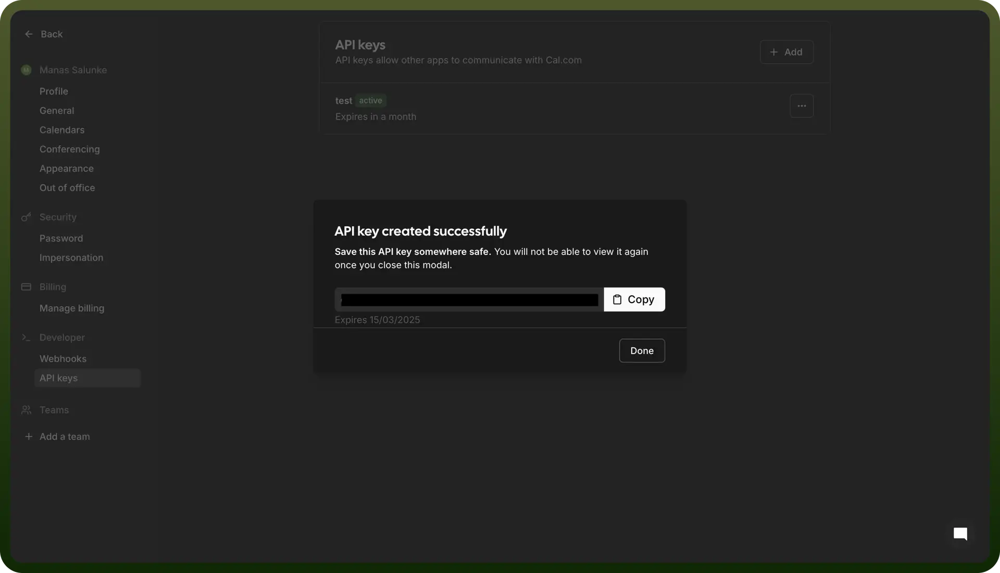

# Cal.com connector

Source: https://www.unifyapps.com/docs/unify-integrations/cal-com
Section: integrations

---

Cal.com is an open-source scheduling platform that simplifies booking meetings by integrating with calendars and automation tools. It offers customizable scheduling links, team coordination, and API access for seamless appointment management.

Integrating your application with Cal allows you to streamline scheduling, manage appointments, and enhance your productivity.

## Authentication

Before you begin, make sure you have the following information:

- `Connection Name`**:** Select a descriptive name for your connection, like "MyAppCalIntegration". This helps in easily identifying the connection within your application or integration settings.
- `Authentication Type`**:** Cal.com supports API Token for authentication. This method ensures secure access to Cal.com’s functionalities and data.

### Access Token Based Authentication

- Login to your Cal.com account and click on settings in the bottom left of the navigation panel. Navigate to the API section and click on it.
- Click on the “`Create new token`” button.
- Provide a name and the required scopes for performing actions based on your use case and click on “`Create Token`”.
- Treat this token with high confidentiality, as it allows access to your Cal.com account.

  

## Actions

| Actions | Description |
|---|---|
| `Create availability` | Create a new availability for a schedule on Cal |
| `Create event type` | Create a new event type on Cal |
| `Create schedule` | Create a new schedule on Cal |
| `Delete availability` | Delete an existing availability on Cal |
| `Delete event type` | Delete an existing event type on Cal |
| `Delete schedule` | Delete an existing schedule on Cal |
| `Edit event type` | Edit an existing event type on Cal |
| `Edit schedule` | Edit an existing schedule on Cal |
| `Find event type` | Search for an event using an eventID on Cal |
| `Get all event types` | Get list of all event types on Cal |
| `Get all schedules` | Get list of all schedules on Cal |

## Triggers

| Triggers | Description |
|---|---|
| `Booking created` | Triggers when a new booking is created on Cal |
| `Booking deleted` | Triggers when a booking is cancelled on Cal |
| `Booking rescheduled` | Triggers when a booking is rescheduled on Cal |
| `Meeting ended` | Triggers after a meeting ends on Cal |
| `Meeting started` | Triggers when a meeting starts on Cal |
| `Out of office created` | Triggers when a new Out Of Office entry is created on Cal |
