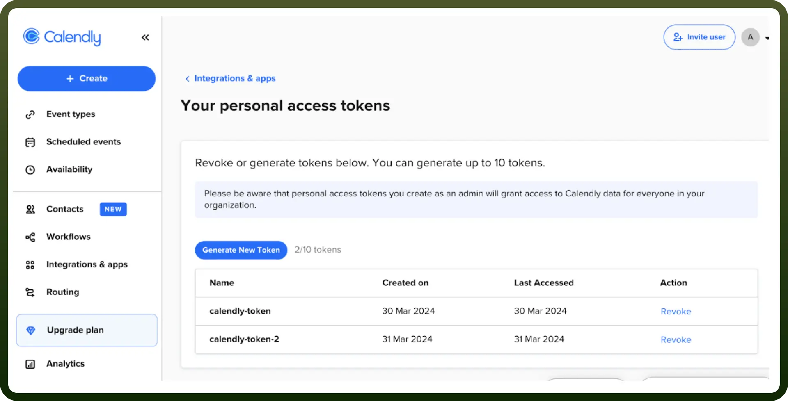
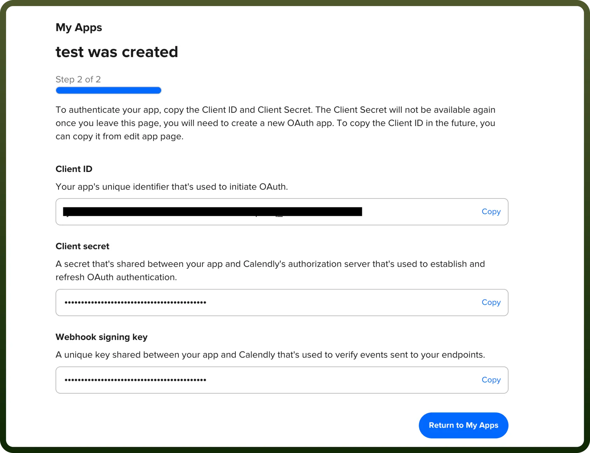
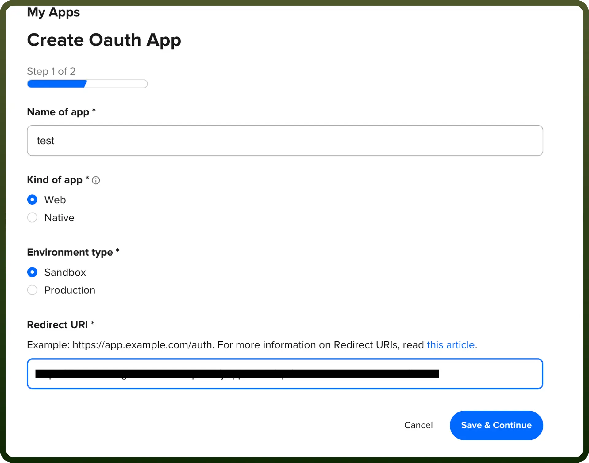

# Calendly connector

Source: https://www.unifyapps.com/docs/unify-integrations/calendly
Section: integrations

---

Calendly is an online scheduling platform that simplifies appointment booking by allowing users to share their availability and let others book directly. It integrates with calendars, automates reminders, and eliminates back-and-forth emails.

Using Calendly for scheduling and meeting management can streamline your organization’s workflow and improve productivity. You can securely integrate it into your applications using either API keys or OAuth, depending on your specific needs.

## Authentication

Before you begin, make sure you have the following information:

- `Connection Name`**:** Select a descriptive name for your connection, like 'MyAppCalendlyIntegration'. This helps easily identify the connection within your application or integration settings.
- `Authentication Type`**:** calendly.com supports API tokens and OAuth 2.0 Authentication for authentication.

### Personal Access Token Authentication

- Click on the "`Integrations & Apps`" in the left navigation menu of your Calendly home page.
- In the "`All Integrations`" section, select "`API and Webhooks`".
- Navigate to your personal API token.
- Generate a new API key or use an existing one if available. Ensure to keep this key secure as it grants access to Calendly's services, and usage is billed accordingly.

  

### OAuth 2.0 Authentication

- `Client Id`: Input the Client ID provided after registering your application with Calendly. You can obtain this from the Calendly Developer Portal after setting up your app.
- `Client Secret`: Enter your Client Secret, which is provided alongside the Client ID upon registering your application in the Calendly Developer Portal. Keep this information secure.

  

  

## Actions

| Actions | Description |
|---|---|
| `Create single-use scheduling link` | Creates a one-time scheduling link in Calendly. |
| `Invite user to organization` | Invites a user to your organization in Calendly. |
| `List event types` | Lists event types in Calendly. |
| `List user availability schedules` | Lists availability schedules of users in Calendly. |

## Triggers

| Actions | Description |
|---|---|
| `New Event` | Triggers on a new event in Calendly (e.g., when an invitee is created) |
