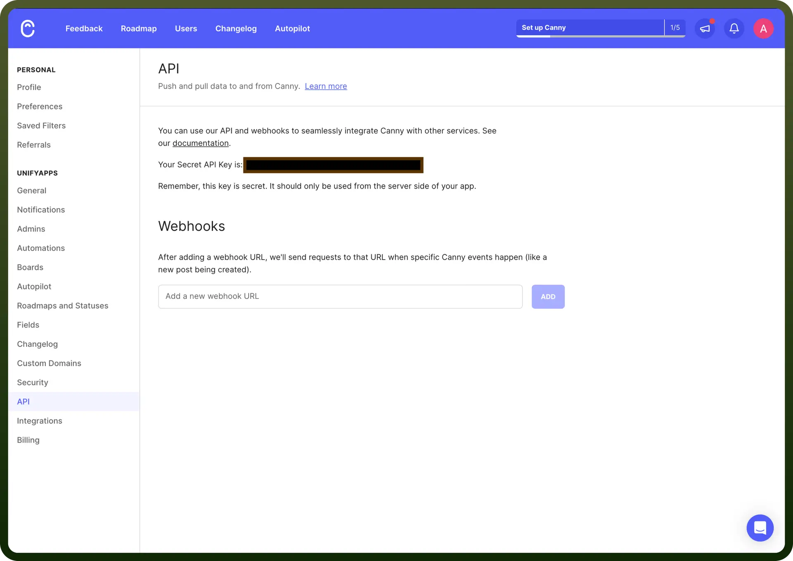

# Canny.io connector

Source: https://www.unifyapps.com/docs/unify-integrations/canny-io
Section: integrations

---

​Canny is a customer feedback management platform that helps businesses collect, analyze, and prioritize user feedback to inform product decisions. It offers tools for feature request tracking, public roadmaps, and changelogs, enabling teams to close the feedback loop efficiently.

Integrating your application with Canny.io allows you to collect, manage, and analyze user feedback efficiently.

## Authentication

Before you begin, ensure you have the following:

- `Connection Name`: Select a descriptive name for your connection, like "MyAppCannyIntegration". This helps in easily identifying the connection within your application or integration settings.
- `Authentication Type`**:** Canny supports API tokens for authentication.

### API Key Based Authentication

1. Sign up or log in to your Canny.io account by visiting the [Canny.io dashboard](https://canny.io/).
2. Navigate to the API settings section in your account settings.
3. Access it by clicking on your profile icon and selecting '`API`' from the dropdown menu.
4. Copy the generated API Key and securely store it, as it allows access to your Canny.io account.

  

## Actions

| Actions | Description |
|---|---|
| `Change post status` | Changes the status of a post in Canny.io. |
| `Create comment` | Creates a comment in a post in Canny.io. |
| `Create or update a user` | Creates or updates a user in Canny.io. |
| `Create post` | Creates a post in Canny.io. |
| `Find post` | Finds a post in Canny.io. |
| `Scan with Autopilot` | Adds a conversation to the autopilot processing queue. |

## Triggers

| Triggers | Description |
|---|---|
| `Change post status` | Triggers when a post status is changed in Canny.io |
| `Create Comment` | Triggers when a new comment is created in Canny.io |
| `Create Post` | Triggers when a new post is created in Canny.io |
| `New vote` | Triggers when a new vote is added to a post |
| `Tag Added to Post` | Triggers when a tag is added to a post in Canny.io |
