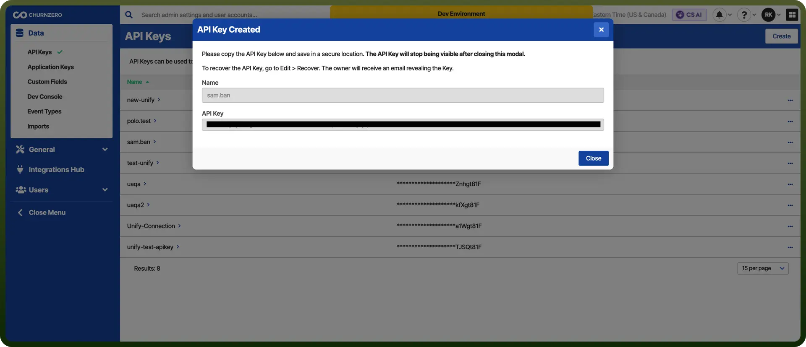

# ChurnZero Integration

Source: https://www.unifyapps.com/docs/unify-integrations/churnzero
Section: integrations

---

ChurnZero is a customer success platform designed to help subscription-based businesses reduce churn and increase customer retention. It provides real-time insights, in-app communication tools, and automation to proactively engage with customers.

By integrating with CRMs and product data, ChurnZero enables teams to track usage, health scores, and customer journeys effectively.

## Authentication

Before you begin, make sure you have the following information:

- `Connection Name`: Select a descriptive name for your connection, like "MyChurnSetup". This helps in easily identifying the connection within your application or integration settings.
- `Authentication Type`**:** ChurnZero supports Auth token based authentication.

### Auth Token Based Authentication

- Go to https://app.churnzero.net and sign in with your admin credentials.
- Click your profile icon in the top-right corner and select "`Admin`" from the dropdown menu.
- In the left-hand menu, navigate to "`API Keys`" under the Integrations section.
- Click "`Add API Key`" or similar button and enter a name for the key.
- Choose the required scopes or permissions based on your use case.
- Click "`Generate`" then copy and securely store the key, as it won’t be shown again.

  

## Actions

| **Actions** | **Description** |
|---|---|
| `Increment an attribute value on an account or contact` | Increments an attribute value on an account or contact in ChurnZero (Attribute must be a number). |
| `Set an attribute on an account or contact` | Sets an attribute on an account or contact in ChurnZero |
| `Update the standard fields of an account or a contact` | Updates the standard fields of an account or contact in ChurnZero |
