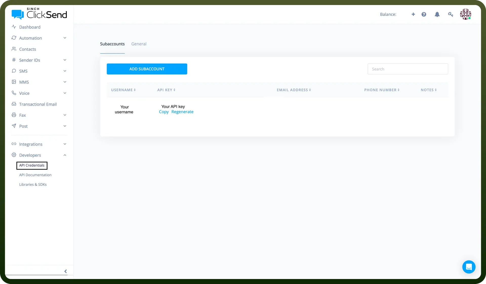

# ClickSend connector

Source: https://www.unifyapps.com/docs/unify-integrations/clicksend
Section: integrations

---

ClickSend is a cloud-based communication platform that enables businesses to send SMS, email, voice, and fax messages globally. It offers APIs and automation tools to streamline marketing, alerts, and customer engagement.

Integrating your application with ClickSend allows you to send SMS, emails and MMS programmatically.

## Authentication

Before you begin, make sure you have the following information:

- `Connection Name`**:** Select a descriptive name for your connection, like "MyAppClicksendntegration". This helps in easily identifying the connection within your application or integration settings.
- `Authentication Type`**:** Clicksend provides API key authentication.

### API Key Based Authentication

1. Login to your account in ClickSend.
2. Navigate to the Developers section of the left navigation menu and click on the API Credentials.
3. Copy the key and store it securely as it provides access to your clicksend account.

  

## Actions

| Actions | Description |
|---|---|
| `Create contact` | Creates a new contact in a specific list in Clicksend |
| `Create list` | Creates a new contact list in Clicksend |
| `Delete contact` | Deletes an existing contact in Clicksend |
| `Delete list` | Deletes an existing list in Clicksend |
| `Search contact by email in a list` | Searches a contact by email in a specific list in Clicksend |
| `Search contact by first name` | Searches a contact in a specific list by first name in Clicksend |
| `Search contact by phone number in a list` | Searches a contact in a specific list by phone number in Clicksend |
| `Search list` | Searches a contact list by name in Clicksend |
| `Send MMS` | Sends MMS to recipients in Clicksend |
| `Send MMS campaign` | Sends MMS campaign to a list in Clicksend |
| `Send SMS` | Sends SMS to recipients in Clicksend |
| `Send SMS campaign` | Sends SMS campaign to a contact list in Clicksend |
| `Send SMS to a contact list` | Sends SMS to a contact list in Clicksend |
| `Send email` | Sends email to recipients in Clicksend |
| `Update contact` | Updates an existing contact in Clicksend |

## Triggers

| Triggers | Description |
|---|---|
| `On new incoming SMS` | Triggers when a new SMS comes in Clicksend |
