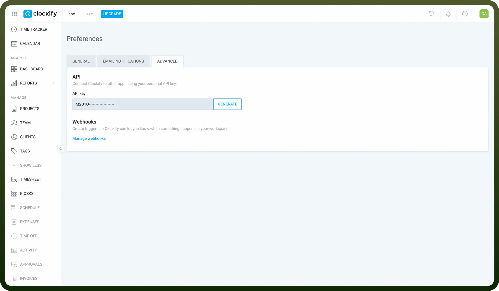

# Clockify connector

Source: https://www.unifyapps.com/docs/unify-integrations/clockify
Section: integrations

---

Clockify is a free time tracking software that helps teams and individuals log work hours, track productivity, and manage projects. It offers features like timesheets, reports, and integrations to streamline time management.

Integrating your application with Clockify allows for efficient time tracking and management, enabling seamless synchronization of work hours, projects, and team collaboration.

## Authentication

Before you begin, make sure you have the following information:

- `Connection Name`: Choose a meaningful name for your connection, such as "MyAppClockifyIntegration".
- `Authentication Type`: Clockify supports the API Key authentication method.

### API Key Based Authentication

1. Login to your Clockify account at [https://clockify.me/](https://clockify.me/).
2. Navigate to the user settings by clicking on your profile in the top-right corner.
3. Select "`API`" from the menu.
4. Copy the API key displayed in your account and store it securely as it provides access to your clockify account.

  

## Actions

| Actions | Description |
|---|---|
| `Create client` | Creates a new client in Clockify |
| `Create project` | Creates a new project in Clockify |
| `Create tag` | Creates a new tag in Clockify |
| `Create task` | Creates a new task in Clockify |
| `Create time entry` | Creates a new time entry in Clockify |
| `Find client` | Finds clients in Clockify |
| `Find clients` | Finds clients in Clockify |
| `Find project` | Finds project by ID in Clockify |
| `Find running timer` | Finds running timer in Clockify |
| `Find tags` | Finds tags in Clockify |
| `Find task` | Finds task in Clockify |
| `Find time entry` | Finds time entry in Clockify |

## Triggers

| Triggers | Description |
|---|---|
| `New Client` | Triggers when a new client is added to a workspace |
| `New Project` | Triggers when a new project is added to a workspace |
| `New Tag` | Triggers when a new tag is added to a workspace |
| `New Task` | Triggers when a new task is added to a project on a specified workspace |
| `New Time Entry` | Triggers when a new time entry is added |
