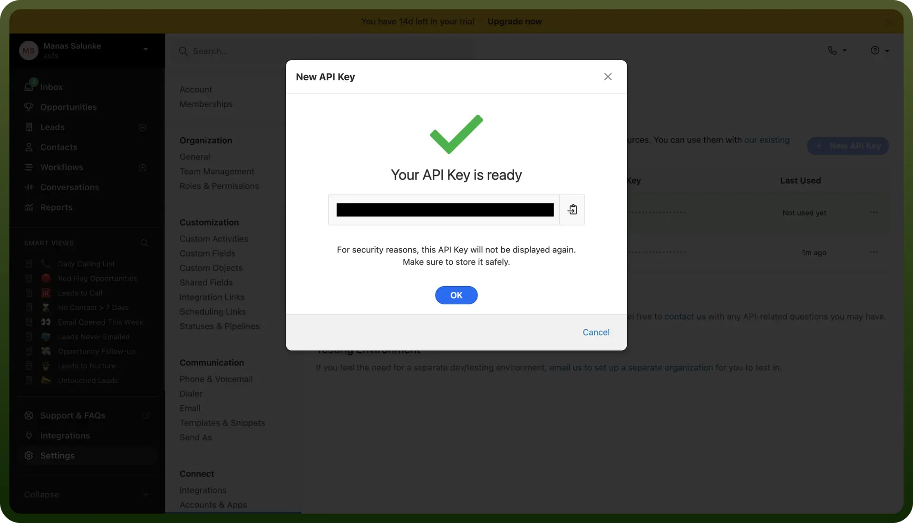

# Close CRM connector

Source: https://www.unifyapps.com/docs/unify-integrations/close-crm
Section: integrations

---

Close CRM is a sales engagement platform designed to help teams streamline outreach with built-in calling, email automation, and pipeline management. It focuses on improving productivity and closing deals faster with automation and analytics.

Integrating your application with Close CRM enhances your sales and customer relationship management capabilities by enabling streamlined lead management, automated workflows, and detailed analytics.

## Authentication

Before you begin, make sure you have the following information:

- `Connection Name`**:** Choose a meaningful name for your connection. This name helps you identify the connection within your application or integration settings. It could be something descriptive like "MyAppCloseCRMIntegration".
- `Authentication Type`**:** Close CRM provides API Key authentication.

### **API Key Based**

1. Log in to your Close CRM account.
2. Navigate to `Settings` in the left-hand menu and select Developer inside the connect section.
3. Select `API Key` from top and click on it.
4. Enter a descriptive name for the API key.
5. Click `Create API Key`.

  

6. Copy the generated API key immediately, as it won’t be fully visible again after you leave the page.
7. Store the API key securely, treating it like a password.

## **Actions**

| Actions | Description |
|---|---|
| `Create call` | Creates a call in Close CRM |
| `Create contact` | Creates a contact in Close CRM |
| `Create email` | Creates an email in Close CRM |
| `Create lead` | Creates a lead in Close CRM |
| `Create note` | Creates a note in Close CRM |
| `Get activity custom field` | Gets an activity custom field from Close CRM |
| `Get call` | Gets a call from Close CRM |
| `Get contact` | Gets a contact from Close CRM |
| `Get email` | Gets an email from Close CRM |
| `Get email thread` | Gets an email thread from Close CRM |
| `Get group` | Gets a group from Close CRM |
| `Get lead` | Gets a lead from Close CRM |
| `Get meeting` | Gets a meeting from Close CRM |
| `Get note` | Gets a note from Close CRM |
| `Get opportunity` | Gets an opportunity from Close CRM |
| `Get opportunity custom field` | Gets an opportunity custom field from Close CRM |
| `Get task` | Gets a task from Close CRM |
| `Get user` | Gets a user with the same organization from Close CRM |
| `Merge lead` | Merges two leads in Close CRM |
| `Update note` | Updates a note in Close CRM |
