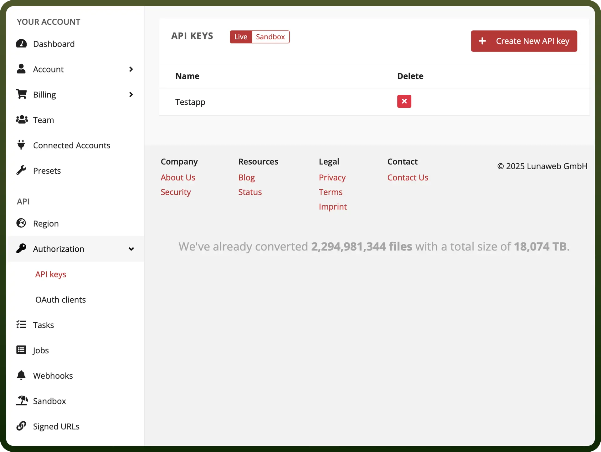
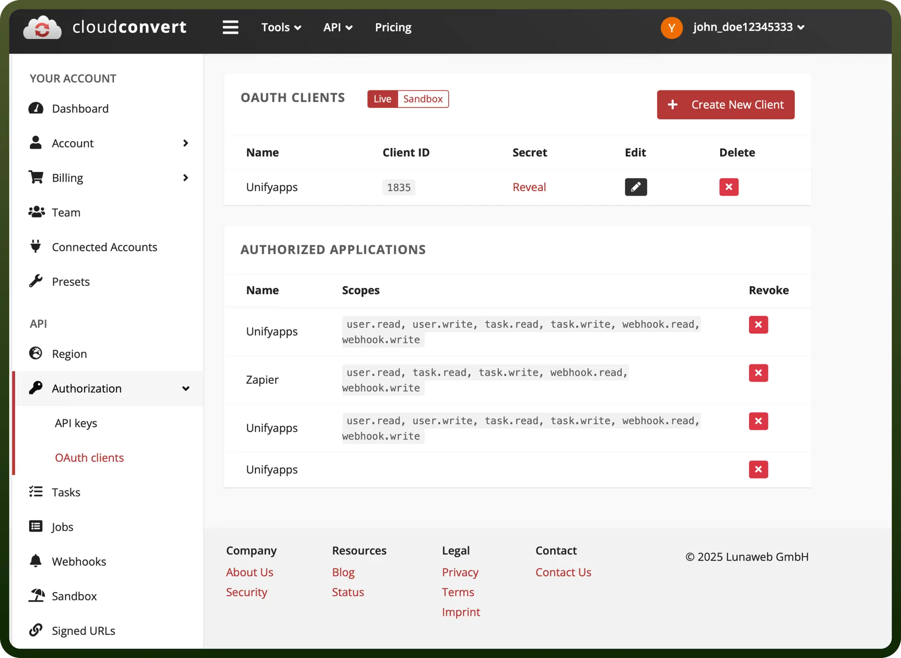

# Cloud Convert

Source: https://www.unifyapps.com/docs/unify-integrations/cloud-convert
Section: integrations

---

CloudConvert is a versatile file conversion platform that enables businesses and individuals to convert files across a wide range of formats effortlessly. It supports audio, video, document, image, spreadsheet, and eBook conversions, ensuring compatibility and efficiency.

Integrating CloudConvert simplifies file management, enhances productivity, and reduces manual effort by providing seamless tools for automated file conversions, format compatibility, and efficient processing

## Authentication

Before you begin, make sure you have the following information:

- `Connection Name`: Select a descriptive name for your connection, like "MyAppCloudConvertIntegration". This helps in easily identifying the connection within your application or integration settings.
- `Authentication Type`**:** Select the type of authentication for connecting to your confluence account:
  - API token
  - OAuth

### API Token Authentication

- Sign in or Register for Your CloudConvert Account
- Navigate to the API Dashboard**.** Click on your profile or account menu and select `API`**.**
- In the API Dashboard, click on `Create API Key` or a similar option. Provide a name for your API key to identify its purpose.
- Configure the API key by assigning permissions based on your app's requirements (e.g., file conversion, storage, webhook setup).
- Once created, save your API key securely. Use it in your integration to authenticate and access CloudConvert services.

  

### OAUTH 2.0 Authentication

- Navigate to the API Dashboard**.** Go to your `API Dashboard` by clicking on your profile or account settings.
- In the API section, locate the option to `Create a New Client` or `Register an Application`. Provide a name for your app.
- Add the `Redirect URIs` where the OAuth server will redirect users after authorization. These should match the URLs in your app where you will handle the OAuth flow.
- Specify the `scopes` for your application (e.g., access to file conversions, webhook setups, etc.) to define what your app can do with CloudConvert.
- Once your app is registered, you will receive a `Client ID` and `Client Secret`. Keep these credentials secure, as they are used to authenticate your app.

  

## Actions

| Actions | Description |
|---|---|
| `Cancel task` | Cancel task in Cloud Convert |
| `Create archive` | Create archive in Cloud Convert |
| `Create capture website tasks` | Create capture website tasks in Cloud Convert |
| `Create convert task` | Create convert task in Cloud Convert |
| `Create job` | Create job in Cloud Convert |
| `Create merge PDF` | Create merge PDF in Cloud Convert |
| `Create optimize tasks` | Create optimize tasks in Cloud Convert |
| `Create thumbnail tasks` | Create thumbnail tasks in Cloud Convert |
| `Create watermark tasks` | Create watermark tasks in Cloud Convert |
| `Delete job` | Delete job in Cloud Convert |
| `Execute commands` | Execute commands in Cloud Convert |
| `List jobs` | List jobs in Cloud Convert |
| `List possible operations` | List possible operations in Cloud Convert |
| `List supported formats` | List supported formats in Cloud Convert |
| `List tasks` | List tasks in Cloud Convert |
| `Show job` | Show job in Cloud Convert |
| `Show task` | Show task in Cloud Convert |

## Triggers

| Triggers | Description |
|---|---|
| `On job created` | Triggers when a new Job is created in Cloud convert |
| `On job finished` | Triggers when a new job is finished in Cloud convert |
| `On job failed` | Triggers when a Job is failed in Cloud convert |
